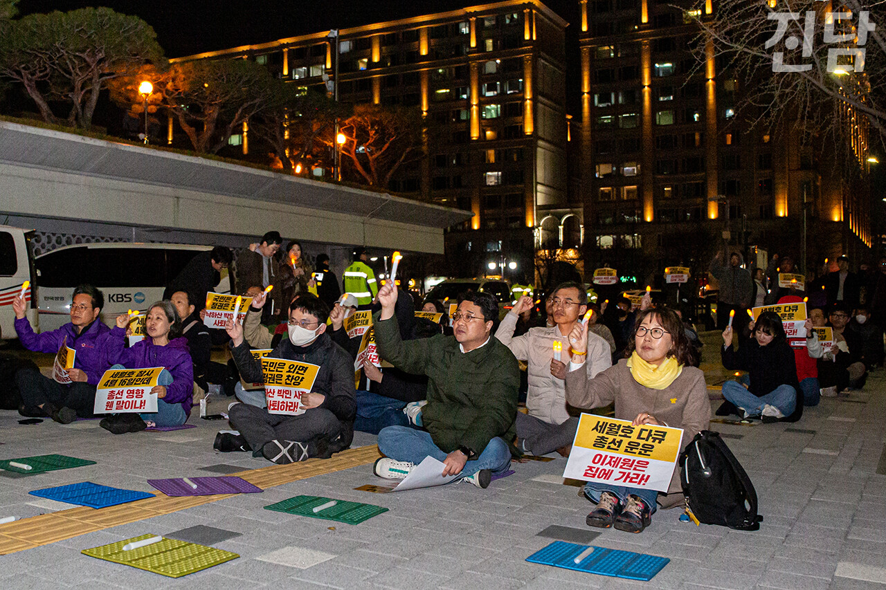
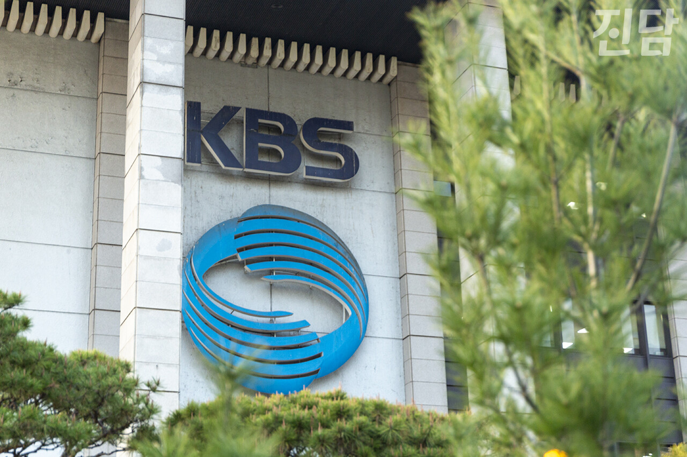
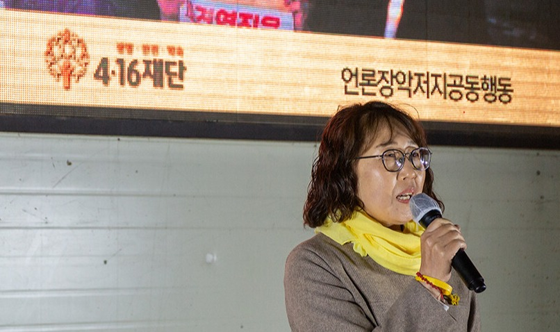
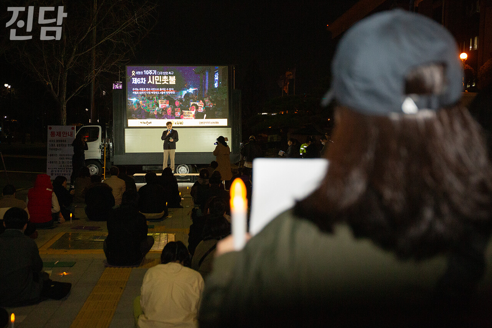
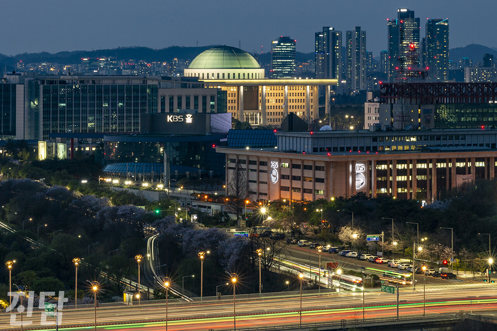
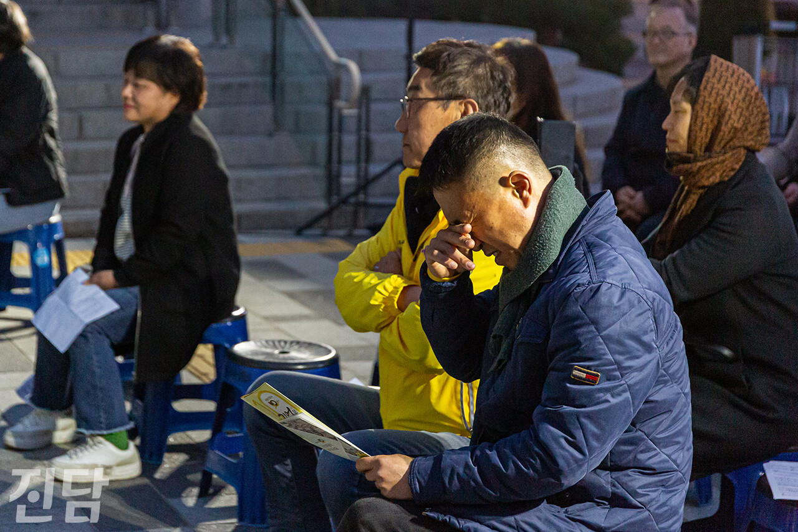

+++
title = '‘타임머신 논리’로 방영 밀려난 세월호 10주기 다큐멘터리'
date = 2024-04-10T01:06:34+09:00
categories = ["시사진담"]
tags = ["시사진담"]
keywords = ["세월호", "KBS", "한국방송", "다큐", "총선"]
description = "한국방송(KBS)에서 4월 세월호 참사 10주기를 맞아 제작 중이던 다큐멘터리 방영이 6월로 미뤄졌다. 이제원 KBS 제작1본부장이 총선 영향을 언급하며 방영 일정을 조정했으나 그 명분에 타당성이 부족하다는 지적이 나온다. 일각에서는 세월호 참사를 정쟁화한다는 비판도 제기된다.KBS는"
thumbnail = "1.jpg"
creator = "변준언 선임기자"
draft = false
+++

<figure>
  
  <figcaption>3월27일 서울 여의도 한국방송(KBS) 본관 앞에서 열린 세월호 참사 10주기 다큐멘터리 4월 방영 무산을 규탄하는 집회에 참석한 한 시민이 촛불을 들고 있다. 변준언 선임기자 byunjuneon@jindam.news 2024.03.27</figcaption>
</figure>

한국방송(KBS)에서 4월 세월호 참사 10주기를 맞아 제작 중이던 다큐멘터리 방영이 6월로 미뤄졌다. 이제원 KBS 제작1본부장이 총선 영향을 언급하며 방영 일정을 조정했으나 그 명분에 타당성이 부족하다는 지적이 나온다. 일각에서는 세월호 참사를 정쟁화한다는 비판도 제기된다.

KBS는 오는 18일 다큐멘터리 프로그램  <다큐인사이트-바람이 되어 살아낼게>(가칭·세월호 다큐)를 통해 세월호 참사 생존자의 외상 후 스트레스 장애(PTSD)를 다룰 예정이었다. 그러나 이 본부장이 "총선에 영향을 줄 수 있다"며 방영 일정 조정을 지시했다. 제작진이 '총선은 방영일보다 8일 빠른 4월10일'이라고 반박하자 "총선 전후로 한 두 달은 영향권"이라는 해명이 돌아온 것으로 알려졌다.

<figure>
  
  <figcaption>서울 여의도 한국방송(KBS) 본관에 부착된 KBS 로고. 변준언 선임기자 byunjuneon@jindam.news 2024.03.27</figcaption>
</figure>

세월호 다큐 불방 결정에 KBS 구성원들 사이에서 비판이 잇따르고 있다. 전국언론노동조합 KBS본부(KBS언론노조)는 “세월호는 피해자와 생존자, 유가족 나아가 전 국민의 마음속에 트라우마로 남아 있는 사회적 참사”라며 “이를 가지고 총선에 영향을 줄 수 있다며 방영을 막으려는 이 본부장이야말로 정치적 고려를 하고 있는 것 아닌가”라고 반문했다. <다큐인사이트> 소속 세월호 다큐 담당자인 조애진 PD는 지난 2월19일 서울 여의도 KBS 본관 앞에서 열린 기자회견에서 “제작 자율성 침해에 대한 TV 편성위원회 개최를 요구하겠다"고 사측 결정에 대한 대응 의사를 밝혔다.

그렇게 추진된 TV편성위원회는 2월27일 열릴 예정이었다. 그러나 지난 5일 KBS가 공개한 '3월 시청자위원회 회의록'에 따르면 제작진 측과 사측이 TV편성위원회 안건명에 '세월호 10주기'을 넣는 것을 두고 이견을 좁히지 못해 논의가 이뤄지지 못했다.

<figure>
  
  <figcaption>지난 3월27일 서울 여의도 한국방송(KBS) 본관 앞에서 열린 ‘세월호 10주기 다큐 방영 촉구 제6차 시민촛불’에서 세월호 참사 희생자인 고 진윤희(단원고 2학년9반)씨 어머니인 김순길 4.16세월호참사가족협의회 사무처장이 발언하고 있다. 변준언 선임기자 byunjuneon@jindam.news 2024.03.27</figcaption>
</figure>

시민사회에서도 세월호 다큐 불방이 부적절하다는 의견이 제기되고 있다. 민주언론시민연합은 성명을 통해 “세월호 사건은 국민 생명과 안전에 있어 국가의 역할과 존재를 묻고 안전사회의 중요성을 되새기게 한 사건”이라며 “‘국민의 방송’을 자처하는 공영방송 KBS는 어느 언론보다 더 적극적으로 세월호 참사를 기억하고 그 의미를 새기는 방송을 하는 것이 마땅한 도리”라고 세월호 다큐 방영의 타당성을 강조했다. 세월호 참사 희생자 고 진윤희(단원고 2학년 9반)씨의 어머니 김순길씨는 세월호 다큐 방영 연기 결정에 대해 "세월호 참사 피해자를 시민과 분리시키고 참사를 정쟁으로 만들고 있다"고 평가하며 유가족 입장에서 겪는 고립감을 드러냈다.

<figure>
  
  <figcaption>3월27일 서울 여의도 한국방송(KBS) 본사 앞에서 열린 세월호 참사 10주기 다큐멘터리 4월 방영 무산을 규탄하는 집회에 참석한 한 시민이 촛불을 들고 있다. 변준언 선임기자 byunjuneon@jindam.news 2024.03.27</figcaption>
</figure>

KBS 시청자청원 홈페이지에는 세월호 다큐 불방을 결정한 사측을 규탄하는 내용의 시청자 청원이 여럿 올라왔다. 관련 청원들이 받은 동의 수는 9일 기준 총 3천 건을 돌파했다. 그중 가장 많은 1,061건의 동의를 얻은 청원은 "불방 결정을 당장 철회하고, 세월호 10주기 다큐를 예정대로 4월에 방영하라"고 촉구했다. 그러나 KBS는 “해당 프로그램은 세월호 사건 10주기 방송이 아닌 대형참사 생존자들의 PTSD 극복 과정을 조명하고 이에 대한 사회적 관심을 높이기 위해 기획된 것”이라며 1월 말 새로 부임한 제작책임자가 해당 프로그램이 당초 기획 취지와 달리 세월호 생존자 위주로 제작되고 있음을 확인해 다른 참사 추가취재가 필요해 방송을 연기하게 됐다고 해명했다. 반면 KBS언론노조측은 세월호 다큐가 전임 제작1본부장 재임 당시 이미 시의성 아이템으로 4월 방영이 결정돼 있었다고 밝힌 바 있어 양측의 주장이 상충하고 있다. 한편 사측이 밝힌 의사결정이 통상적인 경우와 달리 이례적이었다는 관계자의 증언이 나온다. <시사IN> 보도에서 언급된 한 PD는 "전임 본부장과 팀·부장까지 확인했고 한창 제작 중인 방송을 이런 식으로 제지한 사례는 이전에 없었다”고 밝히며 세월호 다큐 방영 일정 조정 절차가 일반적이지 않았음을 설명했다.

<figure>
  
  <figcaption>제22대 국회의원 선거를 하루 앞둔 9일 저녁 서울 여의도에 위치한 한국방송(KBS)과 그 뒤로 보이는 국회의사당 모습. 변준언 선임기자 byunjuneon@jindam.news 2024.04.09</figcaption>
</figure>

이러한 상황을 두고 윤석열정부가 공영방송인 KBS를 장악해 정치적으로 이용하는 게 아니냐는 비판이 나온다. 지난달 27일 KBS 본사 앞에서 열린 ‘세월호 10주기 다큐 방영 촉구 제6차 시민촛불’에서 마이크를 잡은 대학언론인 안치윤(성공회대 미디어센터 편집국장)씨는 “4월18일 방영될 다큐가 시간을 거꾸로 달려 4월10일 끝나는 총선에 영향을 주는 것인가”라며 "총선에 영향을 줘도 훨씬 줬을 대통령 특별대담은 뻔뻔하게 방송해 놓고 참사 생존자들의 삶을 다룬 다큐멘터리는 정치적이라고 미루는 것은 어불성설"이라고 비판했다. 안씨가 말한 특별대담은 2월7일 KBS가 단독으로 제작·방영한 <KBS 특별대담 대통령실을 가다>를 뜻한다. 해당 프로그램은 진행자가 '김건희 여사 명품백 수수 의혹'을 축소하려는 듯한 발언을 해 논란을 빚은 바 있다. KBS는 특별대담을 설 연휴였던 2월10일 재방송했다. 이는 총선 2달 전으로 이 본부장의 논리에 따르면 '총선 앞 뒤 한 두 달 영향권'에 들어간다.

글·사진 : 변준언 선임기자 byunjuneon@jindam.news

<figure>
  
  <figcaption>3월27일 서울시의회 앞 세월호 기억공간 ‘기억과 빛’ 앞에서 열린 4.16기억문화제에 참석한 한 시민이 눈물을 닦고 있다. 이날 행사에서는 한국방송(KBS)의 세월호 10주기 다큐 불방 규탄 발언이 있었다. 변준언 선임기자 byunjuneon@jindam.news 2024.03.27</figcaption>
</figure>

