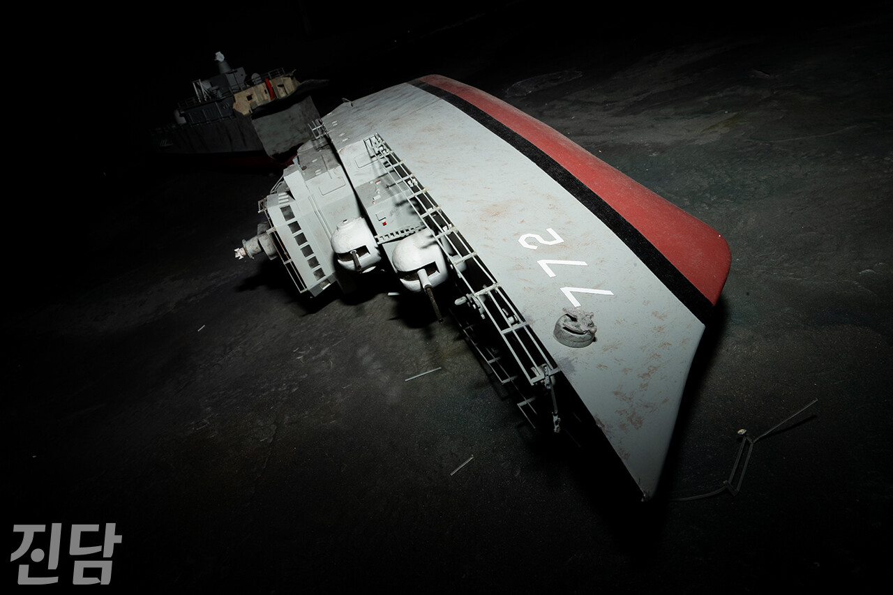
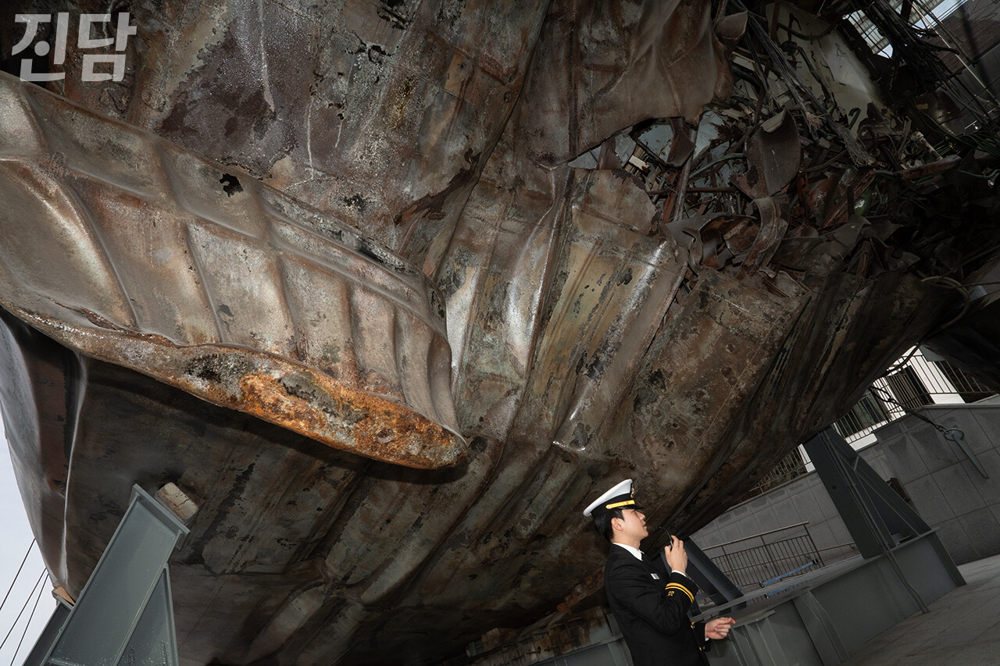
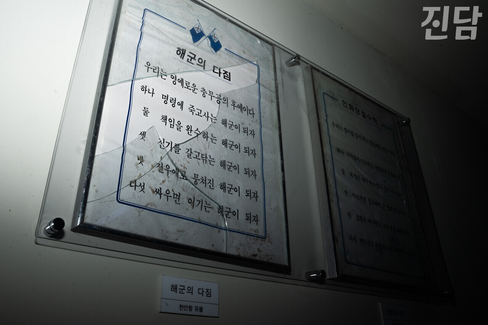

+++
title = "'천안함 막말' 묵인하는 정치권 ... 2차 가해는 현재진행형"
date = 2024-04-10T01:06:32+09:00
categories = ["시사진담"]
tags = ["시사진담"]
keywords = ["천안함", "총선", "민주당", "망언", "막말", "공천"]
description = "다가오는 10일 국회의원 총선거를 앞두고 정치권에선 '막말 후보'들을 둘러싼 파동이 일고 있다. 그중 과거 천안함 피격 사건(천안함 사건)과 관련해 막말을 한 후보들은 출마에 타격이 없는 모양새다. 더불어민주당 지도부는 천안함 사건에 대한 음모론 제기 등 막말한 후보들을 줄줄이 공천하"
thumbnail = "1.jpg"
creator = "김지현 선임기자"
draft = false
+++

<figure>
  
  <figcaption>임은재 선임기자 when@jindam.news</figcaption>
</figure>

다가오는 10일 국회의원 총선거를 앞두고 정치권에선 '막말 후보'들을 둘러싼 파동이 일고 있다. 그중 과거 천안함 피격 사건(천안함 사건)과 관련해 막말을 한 후보들은 출마에 타격이 없는 모양새다. 더불어민주당 지도부는 천안함 사건에 대한 음모론 제기 등 막말한 후보들을 줄줄이 공천하고 논란이 일자 오히려 공천 취소가 무리라며 일축했다. 해당 후보들은 선거 후보로 확정돼 출마한 상태다. “‘천안함 폭침’이라는 용어 쓰는 모든 언론은 가짜“(노종면 후보, 부평 갑), ”많은 희생자 낸 안보 실패의 가장 처참한 사례“(박선원 후보, 부평 을), ”함장 무슨 낯짝으로…부하 다 죽이고 어이가 없다“(권칠승 후보, 화성 병), ”군인이라면 경계 실패, 침략당한 책임감도 있다.“(장경태 후보, 동대문 을)

천안함 피격 사건의 원인은 ‘북한 잠수정의 어뢰 공격’이다. 이는 2010년 당시 민군 합동조사단의 조사를 통해 밝혀진 사실이다. 그러나 사고가 발생한 지 13년이 지났음에도 천안함 사건을 바라보는 정치권의 시선은 여전히 정치 논리와 진영 프레임에서 벗어나지 못하고 있다. 희생자 및 유가족, 생존자에 대한 예우를 최우선으로 해야 할 정치권의 도리가 아니다. 이는 희생자 및 유가족, 그리고 생존한 장병들에 대한 2차 가해다.

글=김지현 선임기자 likeblue@jindam.news  
사진=임은재 선임기자 when@jindam.news

<figure>
  
  <figcaption>임은재 선임기자 when@jindam.news</figcaption>
</figure>

<figure>
  
  <figcaption>임은재 선임기자 when@jindam.news</figcaption>
</figure>

