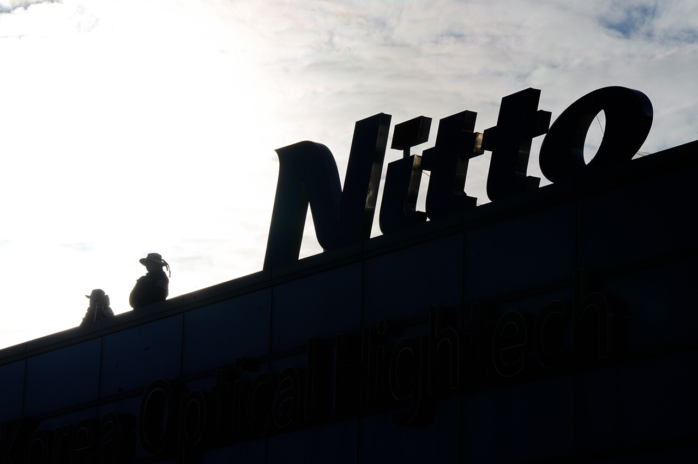
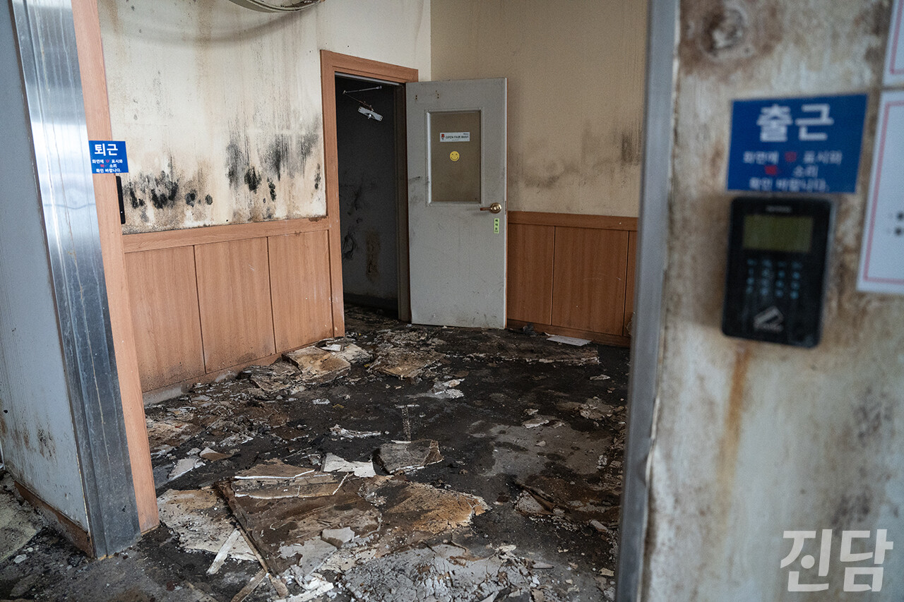
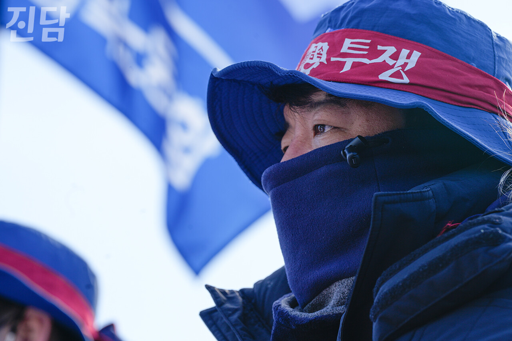

+++
title = '‘하루 950만원’ 강제금에도 일하고 싶어 공장 지켰다'
date = 2024-03-15T01:18:52+09:00
categories = ["시사진담"]
tags = ["시사진담"]
keywords = ["한국옵티칼하이테크", "닛토덴코", "한국닛토옵티칼", "고용승계", "고공농성"]
description = "“고용 승계되는 날 내려가겠다는 다짐으로 올라왔습니다. 그전까지는 내려갈 수 없습니다.” 굳은 다짐으로 공장 옥상에 오른 박정혜씨와 소현숙씨는 2개월째 땅에 발을 딛지 못하고 있다. 2022년 10월, 화재로 경북 구미 한국옵티칼하이테크 공장이 불탔다. 노동자들은 퇴직 권유와 해고로"
thumbnail = "1.jpg"
creator = "임은재 선임기자"
draft = false
+++

<figure>
  
  <figcaption>한국옵티칼하이테크 공장 옥상에서 고공농성 중인 소현숙씨와 박정혜씨가 아래를 내려다보고 있다. 임은재 선임기자 when@jindam.news 2024.02.16</figcaption>
</figure>

“고용 승계되는 날 내려가겠다는 다짐으로 올라왔습니다. 그전까지는 내려갈 수 없습니다.” 굳은 다짐으로 공장 옥상에 오른 박정혜씨와 소현숙씨는 2개월째 땅에 발을 딛지 못하고 있다. 2022년 10월, 화재로 경북 구미 한국옵티칼하이테크 공장이 불탔다. 노동자들은 퇴직 권유와 해고로 쫓겨나듯 일터를 떠나야 했다. 그로부터 약 1년 2개월의 시간이 흐른 2024년 1월 8일. 두 노동자가 고공 농성을 시작했다.

계속 일하고 싶었을 뿐인데

동료 직원이었던 박정혜씨와 소현숙씨는 일을 계속하고 싶었다. “누구보다도 열심히 일했다”고 자부하는 박씨는 같은 자세로 반복 작업을 하느라 안 아픈 데가 없다. 그럼에도 회사가 잘 되길 바라며 12년의 세월을 공장과 함께했다. 소씨는 작업하며 생긴 후유증으로 각막이 시도 때도 없이 찢어져 아팠지만 공장에서 꼬박 16년을 일했다. “ 화재 난 게 직원들 잘못도 아닌데 왜 한 순간에 내몰리듯 쫓겨나야 하나요. 회사와 함께 견뎌 준 직원들에게 이런 식으로 잔인하게 굴면 안 되는 거죠. 우리는 부품이 아니라 인간이잖아요.”

<figure>
  
  <figcaption>2022년 10월 발생한 화재로 불탄 경북 구미 한국옵티칼하이테크 공장 내부 모습. 임은재 선임기자 when@jindam.news 2024.02.03</figcaption>
</figure>

일본계 기업 닛토덴코는 국내에 ‘한국옵티칼하이테크’, ‘한국니토옵티칼’을 자회사로 두고 있다. 이 ‘쌍둥이 회사’들은 국내 기업에 반도체를 납품해 왔다. 210명 노동자의 생계를 짊어진 구미 한국옵티칼하이테크 공장이 불타자 닛토덴코는 물량을 경기 평택에 위치한 한국니토옵티칼 공장으로 이동시켰다. 구미에 같은 일을 하던 숙련된 노동자들이 있음에도 한국니토옵티칼은 그들을 채용하지 않고 30여 명의 새로운 직원을 채용했다. “저희는 그냥 바로 할 수 있는 사람들이잖아요. (신입으로) 들어가면 3개월 교육도 받아야 하거든요. 교육을 받는다고 해도 일에 숙달될 때까지는 시간도 걸리고요.” 박씨는 구미 공장 동료가 공정 인수인계를 위해 평택 공장에 다녀오는 일도 있었다고 덧붙였다.

‘일감이 평택 공장으로 이동했으니 그곳에서 계속 일하게 해 달라’는 노동자들의 요구가 받아들여지지 않은 건 두 회사가 법적으로 다르다는 이유에서였다. 하지만 업무와 설비가 유사해 물량 이동이 가능했던 점, 인수인계 등 교류 또한 있었다는 점을 고려했을 때 한국옵티칼하이테크 노동자들이 이러한 결정을 납득하기란 어려워 보인다. “고용승계라는 방법이 있는데 그 길을 택하지 않는 거잖아요. 회사를 위해서 정말 열심히 일했는데 이렇게 한순간에 버린다니요.” 박씨는 사측의 일방적인 해고 통보에 억울함을 감추지 못했다.

금전적 압박에 ‘일본어 반성문’ 요구까지

“저희한테 할 수 있는 압박은 그거거든요. 강제 집행이행금 부과. 공장 철거를 ‘방해’하면 하루 950만 원이 집행되는 거죠.” 박씨는 금전적 압박에 대한 부담감을 토로했다. “올바른 길을 가기 위해서라도 뭔가 하지 않으면 안 되겠다”는 마음에 공장에 남기로 했지만, 돌아온 것은 ‘빨간 딱지’에 대한 두려움뿐이다. 사측은 공장 철거를 방해한다는 이유로 지난 1월10일 노동조합 및 조합원 개인을 상대로 가처분을 제기했으며 이는 법원에서 받아들여졌다.

등을 돌린 ‘어제의 동료’는 사측의 입장을 대변해 매일 찾아온다. “회사 잘 되면 좋으니까 항상 ‘물량도 더 많이 받아오시라’고 했죠. 같이 으쌰으쌰 잘해보자고 이야기 나눴던 분이 이 회사를…공장을 무너뜨리고 우리를 내쫓으려고 매일 찾아오는 거예요. 현장에 오시면 항상 저한테 찾아와 이런저런 얘기도 하셨던 분이었어요. 가끔가다 밥도 사 주셨고요. 너무 마음 아프죠.”

<figure>
  
  <figcaption>행정대집행이 예고된 지난 2월 16일, 고용승계를 요구하는 노동자 11명 중 8명이 강제 철거 시도를 저지하고자 공장 출입구 앞 3m 높이 망루에 올랐다. 임은재 선임기자 when@jindam.news 2024.02.03</figcaption>
</figure>

고공농성 중인 두 사람을 제외한 9명의 노동자도 불탄 한국옵티칼하이테크 공장을 지키고 있다. “언제 끝날지 모르는 투쟁을 시작한 지 1년이 넘었어요. 집이 강제 경매로 넘어갈 날도 얼마 안 남았죠. 가족들이 느끼는 심리적인 부담은 얼마나 클까 미안하기도 하고….” 수도가 끊긴 노동조합 사무실에서 지내는 이지영씨는 공장 밖 가족들의 안부를 떠올리며 말끝을 흐렸다. 화재 이후 희망 퇴직금을 거부하고 고용승계를 요구한 노동자들은 총 17명으로, 긴 싸움이 이어지는 동안 6명이 압박을 이기지 못하고 사측과 합의했다. 이씨는 사측이 합의를 위한 ‘일본어 반성문’을 작성해 제출하라고 요구하기도 했다고 전했다.

“2023년 2월 해고 통보를 받은 이후 천막 농성도 해 보고 구미시청·산업단지공단에 면담 요청을 하기도 했어요. 관계 기관과 고용노동부에서도 해 줄 수 있는 게 없다고 외면하더라고요. 지방노동위원회와 중앙노동위원회에서도 패소했어요. 사측은 공장 해체 승인도 안 났는데 공장 철거를 방해한다며 가처분을 진행하기도 했고요.” 가처분이 집행되면 노동자 개인 재산에 대한 강제 경매가 진행될 수 있다. 노동자를 보호해 주지 못하는 법과 제도에 공장에 남은 11명 한국옵티칼하이테크 노동자의 속은 타들어 갈 뿐이다.

임은재 선임기자 when@jindam.news

