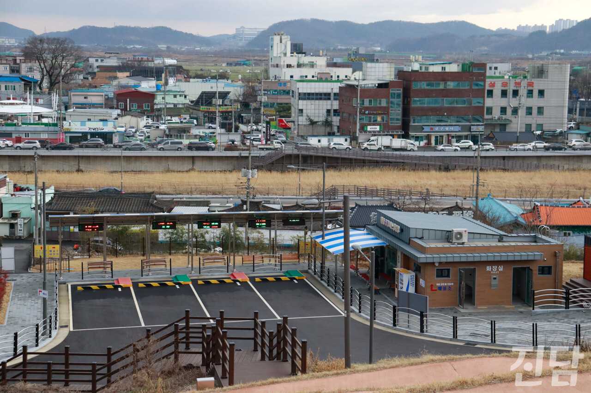
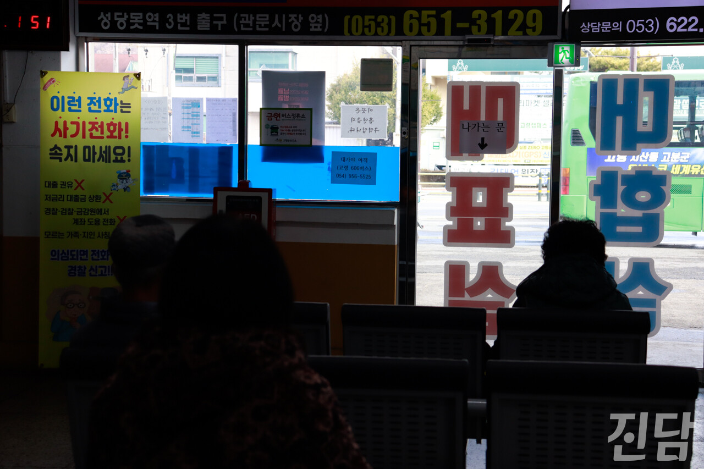
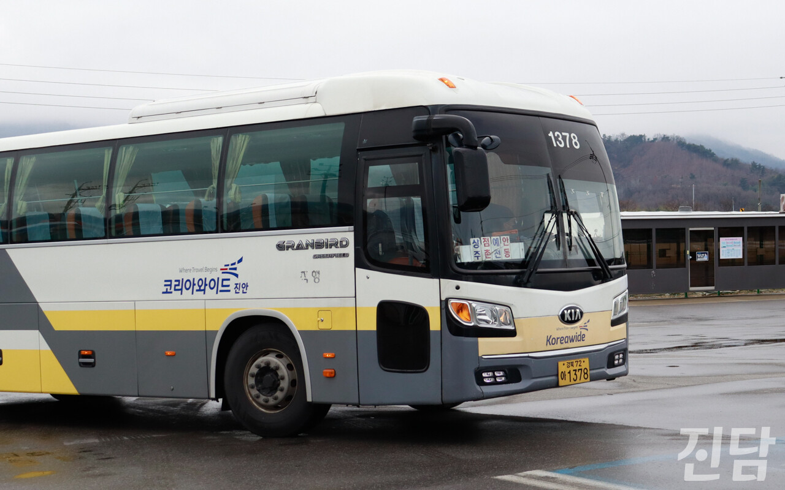

+++
title = '시외버스 축소로 발 묶인 지역 주민들'
date = 2024-03-14T17:42:12+09:00
categories = ["시사진담"]
tags = ["시사진담"]
keywords = ["시외버스", "터미널", "이동권", "성주", "고령", "달성", "경북"]
description = "“젊은 사람들은 승용차 타고 다니지 버스 안 타고 다닌다니까. 우리가 여기서 봐도 안타까워. 서울까지 올라가는데 빈 차 올라가 봐요. 어떤 날은 한 명 타고. 없는 날은 운전사 혼자 타고 갑니다.” 코로나19로 대폭 줄어든 시외버스 이용률은 노선 감축과 터미널 폐쇄라는 결과를 낳았다."
thumbnail = "1.jpg"
creator = "홍지원 기자"
draft = false
+++

## 경북 곳곳 '위기의 시외버스터미널'을 가다

“젊은 사람들은 승용차 타고 다니지 버스 안 타고 다닌다니까. 우리가 여기서 봐도 안타까워. 서울까지 올라가는데 빈 차 올라가 봐요. 어떤 날은 한 명 타고. 없는 날은 운전사 혼자 타고 갑니다.” 코로나19로 대폭 줄어든 시외버스 이용률은 노선 감축과 터미널 폐쇄라는 결과를 낳았다. 노선 감축은 지역 간 이동의 단절을 드러내는 지표이기도 하다. 특히 지방은 승용차 장거리 이동이 어려운 고령층이 주민의 다수를 차지한다. 그렇기에 시외버스 축소는 지방 거주자들의 이동에 영향을 미친다고 할 수 있으며, 이동성 저하로 지역 불균형을 가중하는 결과 또한 낳게 된다. 이러한 위기를 전하고자 대구·경북 곳곳의 시외버스터미널을 찾았다.

<figure>
  
  <figcaption>대구 달성 현풍공영버스정류장 전경. 정류장 뒤로 낮은 건물과 논밭이 보인다. 홍지원 기자 ziwonzip@jindam.news 2024.02.15</figcaption>
</figure>

대구 달성에 위치한 현풍공영버스정류장(현풍정류장)은 달성군이 운영하는 정류장이다. 원래는 개인이 운영하는 곳이었지만 경영난으로 군이 운영을 넘겨받게 됐다. 이곳은 작은 대합실과 버스 네 대가 겨우 설 수 있는 승강장으로 이뤄져 있다. 동대구역과 멀리 떨어진 곳에 사는 고령층이 현풍정류장의 주 이용객이다. 거동이 힘든 경우 기차 탑승을 위해 동대구역까지 이동하기도 쉽지 않다. 직원들이 대합실에 상주하며 무인 매표기 사용이 어려운 고령층 고객의 정류장 이용을 돕는다. 하루 이용객은 180명 언저리의 적은 숫자로 큰 수익을 기대하기는 힘들다. 정류장 운영관리를 하는 진해수씨는 현재도 승객이 점점 줄고 있기 때문에 노선을 증축하기는 어렵다고 말했다.

<figure>
  
  <figcaption>지난 2월 19일, 경북 고령시외버스터미널 대합실에서 승객들이 버스를 기다리고 있다. 홍지원 기자 ziwonzip@jindam.news 2024.02.19</figcaption>
</figure>

경북 고령의 한 낡은 건물에는 고령 시외버스정류장이 있다. 지난 2월 19일은 정류장 근처 시장에서 장이 열려 대구와 고령을 오가는 승객들로 대합실이 북적였다. 이용객 대부분이 노년층으로, 창구 앞에 선 줄에 비해 무인 매표기 앞은 한산하다. 매표 창구 위 배차시간표를 뒤덮은 흰 종이들은 더 이상 운영하지 않는 노선을 가리고 있다.

책가방을 멘 젊은 승객도 눈에 띄었다. 학원에 가기 위해 고령 성산면으로 가는 버스를 기다리는 이다빈양은 “(긴 배차 간격 때문에) 수업 시간 관련으로 큰 불편을 겪고 있다”며 수업 시간과 일정을 맞추기 쉽지 않아 기다리는 시간이 많다는 고충을 토로했다.

<figure>
  
  <figcaption>경북 임시성주버스정류장에 도착한 안동행 버스가 승객을 태우지 못한 채로 떠나고 있다. 홍지원 기자 ziwonzip@jindam.news 2024.02.19</figcaption>
</figure>

서울·안동행 버스가 오가는 경북 성주의 임시성주버스정류장은 이용객이 적으며 상주하는 관리자 없이 무인으로 운영된다. 서울행 버스가 하루에 두세 번 운행될 만큼 노선도 적다. 지역소멸 문제가 대두되는 현재, 시외버스 노선 감축은 불가피해 보인다. 한양대 도시공학과 고준호 교수는 “요금 수입에 의존하는 운수업의 경우 수요 부족은 곧 버스 운영에 필요한 재원확보 부족으로 볼 수 있다”며 운영비용 충당이 어려우면 시외버스터미널의 소멸은 예기된 수순이라 할 수 있으므로 정부의 적극적인 재정 지원이 필수라는 점을 강조했다.

글·사진=홍지원 기자 ziwonzip@jindam.news

