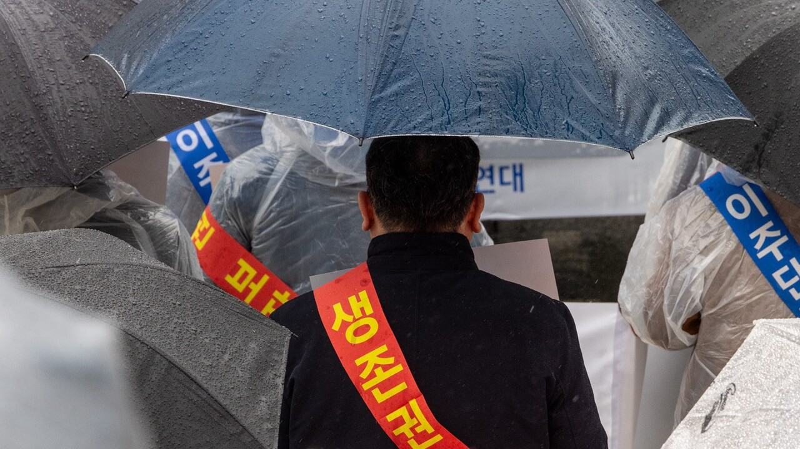
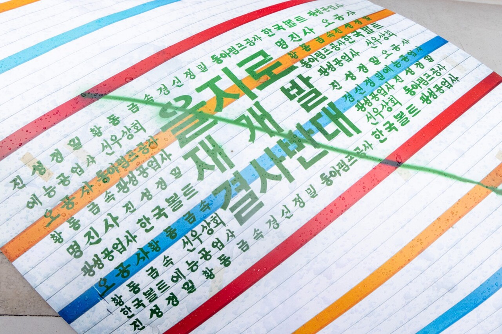
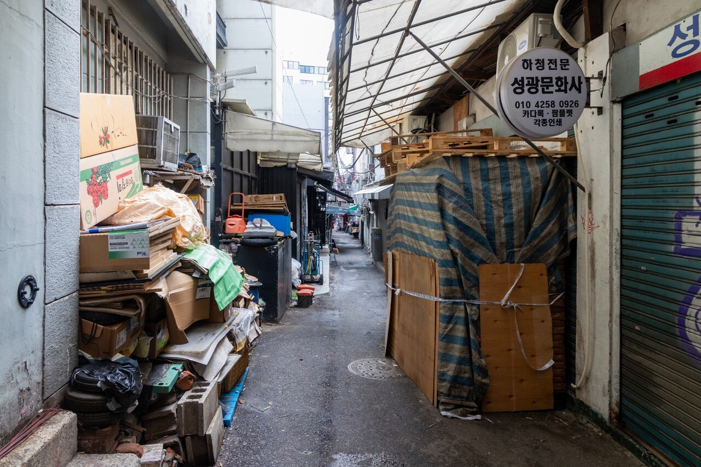

+++
title = '벼랑 끝 인쇄 골목··· 그들의 바람은 함께 사는 것'
date = 2024-03-13T20:43:29+09:00
categories = ["시사진담"]
tags = ["시사진담"]
keywords = ["인쇄", "을지로", "충무로", "재개발", "서울인쇄조합"]
description = "지난 2월 21일 서울 중구청 앞은 우비를 입고 우산을 쓴 사람들로 가득 찼다. 그들이 어깨에 두른 피켓에는 ‘생존권’이라는 단어가 크게 적혀 있었다. 세운재정비촉진지구 내 인쇄인 생존권 보장을 요구하기 위해 모인 것이었다. 그들은 ‘한데 모여 일할 수 있게’ 하는 공공의 대책 마련을"
thumbnail = "1.jpg"
creator = "김지현 선임기자"
draft = false
+++

<figure>
  
  <figcaption>서울인쇄정보산업협동조합, 인쇄인생존권수호대책위원회와 청계천을지로보호연대가 '인쇄인 생존권 수호를 위한 총궐기 대회'를 주최했다. 이날 모인 100여 명의 사람들은 재개발 대책이 지금의 인쇄업 현실에 턱없이 부족하다며 해결 방안 마련을 촉구했다. 이진숙 기자 newjinsook@jindam.news 2024.02.21</figcaption>
</figure>

지난 2월 21일 서울 중구청 앞은 우비를 입고 우산을 쓴 사람들로 가득 찼다. 그들이 어깨에 두른 피켓에는 ‘생존권’이라는 단어가 크게 적혀 있었다. 세운재정비촉진지구 내 인쇄인 생존권 보장을 요구하기 위해 모인 것이었다. 그들은 ‘한데 모여 일할 수 있게’ 하는 공공의 대책 마련을 촉구했다.

“우리가 을지로다!”

서울시와 중구는 종묘부터 퇴계로까지 연결되는 재개발 대상 지역의 산업 보존 정책을 펼쳐왔다. 그러나 2022년 이후 서울시장과 중구청장이 바뀌며 정책의 방향이 달라졌다. 서울시인쇄정보산업협동조합(서울인쇄조합)에 따르면 서울메이커스파크·인쇄스마트앵커 등 이미 수립됐으나 변경안에서 빠진 정책들도 있다. 이에 인쇄업계는 세운지구 공원과 녹지를 조성한다면 신성상가와 진양상가 지하 2,3층을 인쇄단지로 개발할 것을 요구하고 있다. 여한균 조양커뮤니케이션 대표는 “물론 살아가는데 녹지도 중요하다. 하지만 우리가 수십 년 일궈온 현장에 대한 일방적인 통보 행위가 오늘 우리를 모이게 했다.”며 분통을 터트렸다.

지난 1월 10일 서울시가 밝힌 공공임대상가 조성안은 세운재정비촉진계획 변경안에 따른 것으로 인쇄업체를 위한 시설은 220여 호에 불과하다. 김윤중 서울인쇄조합 이사장은 “서울시가 밝힌 대안은 현실과 괴리가 너무 크다. 재개발 전에 이주단지 조성이 필요하다”며 우려를 표했다.

인쇄업이 흩어질 수 없는 이유

“뭉치면 살고 흩어지면 죽는다!” 중구청 앞을 가득 메운 외침이다.『인쇄인 생존권 수호를 위한 총궐기대회』에 참여한 이들은 ‘흩어지면 죽는다’는 문장에 더욱 목청을 높였다. 해당 구호처럼, 인쇄업체는 모여 있어야 한다. 인쇄업 특성상 업체 간 상호 협업이 불가피하기 때문이다. 게다가 을지로, 충무로 일대 인쇄업체들은 95%가 영세 업체로, 그 중 대부분이 5인 미만 사업장이다. 사업 규모가 작은 만큼 ‘협업’은 더욱 절실하다. 실제 중구 일대 인쇄업체는 기획 디자인-프리프레스-인쇄-후가공 등 인쇄공정을 분업화한다. 각자의 역할을 다해 최고의 결과물을 만들어내는 셈이다.

퇴계로에서 약 40년을 일했다는 A씨는 10명 남짓한 종업원과 함께 인쇄업체를 운영한다. ‘내일모레 여든’ 이라는 그는 여느 때처럼 일하던 중 시위 참여를 위해 잠시 시간을 냈다. A씨는 인쇄 업체가 뭉쳐 있어야 한다고 말한다. “제본을 하는 집, 배송을 하는 집, 이렇게 다 분업을 해야 해. 인쇄 기계를 다 갖출 자본이 없으니까. 소규모 자원을 가지고 다 같이 모여서 하는 거지.” 대규모 사업자가 아닌 영세업체는 서로 얽히고설켜 살아갈 수밖에 없다는 말이다. “인쇄업은 갑이 아니라 을이야. 내 생산물에 내가 값을 매길 수가 없고 (상대방이) 주는 대로 받아야 돼. 그러니까 터전을 빼앗기면 우린 갈 곳이 없지. 그래서 대안을 달라는 거고….”

인쇄를 시작한 지 올해로 36년이 된 B씨도 ‘흩어지는 일’이 가장 걱정이다. 예관동에 터를 잡은 그는 무작정 개발을 반대하진 않는다. “(을지로 일대가) 노후화돼서 미관상 안 좋다는 건 이해해. 근데 여기서 일하는 사람들도 먹고살아야지. (재개발을 하려면) 대책이 있어야지.” 그가 바라는 건 오로지 ‘같이 사는 것’이다. 개발하는 건 좋으니 함께 생존할 수 있게 해 달라는 말이다. 그는 힘이 닿을 때까지 인쇄업을 책임질 계획이다. “요즘 애들은 모르겠지만, 우리는 한평생을 한 일을 쉽게 못 그만두지. 몸만 버텨주면 계속 일할 거야.”

<figure>
  
  <figcaption>'인쇄인 생존권 수호를 위한 총궐기 대회'에 등장한 포스터. 을지로 인쇄소를 이용하는 청년 디자이너들이 제작했다. 이진숙 기자 newjinsook@jindam.news 2024.02.21</figcaption>
</figure>

인쇄의 산실, 을지로는 지금

서울 중구의 을지로·충무로 일대 인쇄업체는 5500여 개. 종사자와 인쇄인의 가족은 약 10만 명이다. 이 지역의 인쇄산업은 자연발생적으로 만들어져 전국 최대의 규모를 자랑한다. 충무로 3가 60-1번지는 조선시대 활자 제조와 인쇄를 담당한 주자소가 있던 곳이기도 하다. 서울인쇄조합 오혜경 팀장은 ‘살아있는 역사’인 인쇄업을 대하는 지자체의 태도를 이해하지 못한다. “도심 제조업을 내보낸다는 건 말이 안 되죠. 인쇄업이 중구에서 가지는 역사적 가치도 있고요.” 재개발 자체를 반대하는 건 아니지만 인쇄업이 도심 밖으로 몰리지 않고 자리 잡을 수 있게 해야 한다는 말이다.

민주화 역사 속에도 인쇄업이 있었다. 오 팀장은 민주 항쟁이 한창이던 시절을 떠올렸다. “인쇄인들이 (유인물 등) 인쇄를 해서 쓰레기통에 몰래 두면 (민주화 운동하는) 사람들이 가져가고 그랬어요. 전태일 열사의 여동생이신 전순옥 의원께서 직접 들려주신 이야기죠.”

이 지역은 디자이너 등 다양한 예술가의 활동지이기도 하다. 을지로 일대의 공간에서 작업하는 미술 작가 최민경 씨는 재개발 사업 전 확실한 대책이 필요함을 주장했다. “도시는 다 같이 사용하는 곳인데 재개발 계획 단계부터 인쇄업자같은 원주민의 입장이 반영되지 않고 무척 일방적이죠.”

오 팀장은 인쇄업이 다양한 문화와 접목될 여지도 크다는 점을 강조했다. 빠른 디지털화로 전성기 시절에 비해 인쇄 산업은 많이 축소됐지만 저력은 여전하다는 말이다. “물과 공기 빼고 인쇄할 수 없는 건 없어요. 인쇄업은 알고 보면 다양한 분야에서 우리 삶과 밀접하게 닿아있죠. (사람들이) 인쇄의 소중함을 잘 모르는 거죠.”

글=김지현 선임기자 likeblue@jindam.news  
사진=이진숙 기자 newjinsook@jindam.news

<figure>
  
  <figcaption>을지로3가역 일대 인쇄골목. 인쇄업체들은 분업을 위해 이 곳에 모여 있다. 재개발로 인쇄업체가 흩어진다면 원활한 인쇄사업이 어렵다. 이진숙 기자 newjinsook@jindam.news 2024.02.25</figcaption>
</figure>

