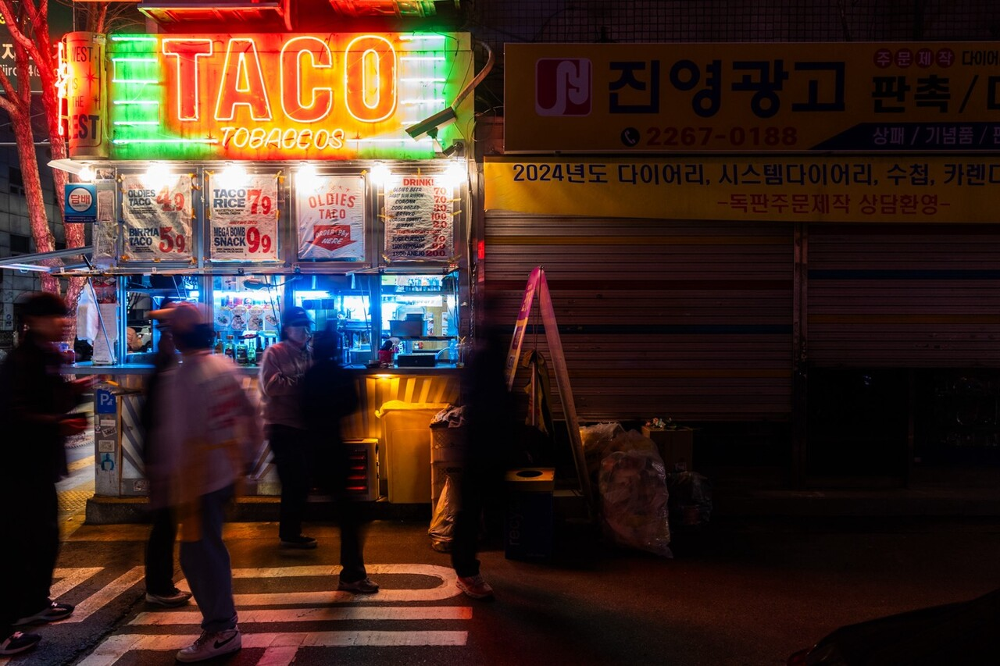
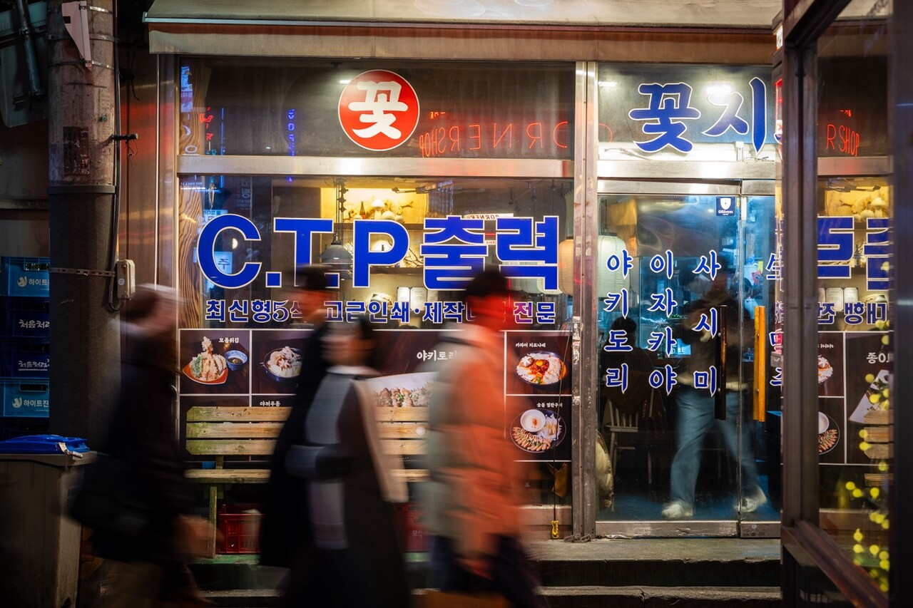
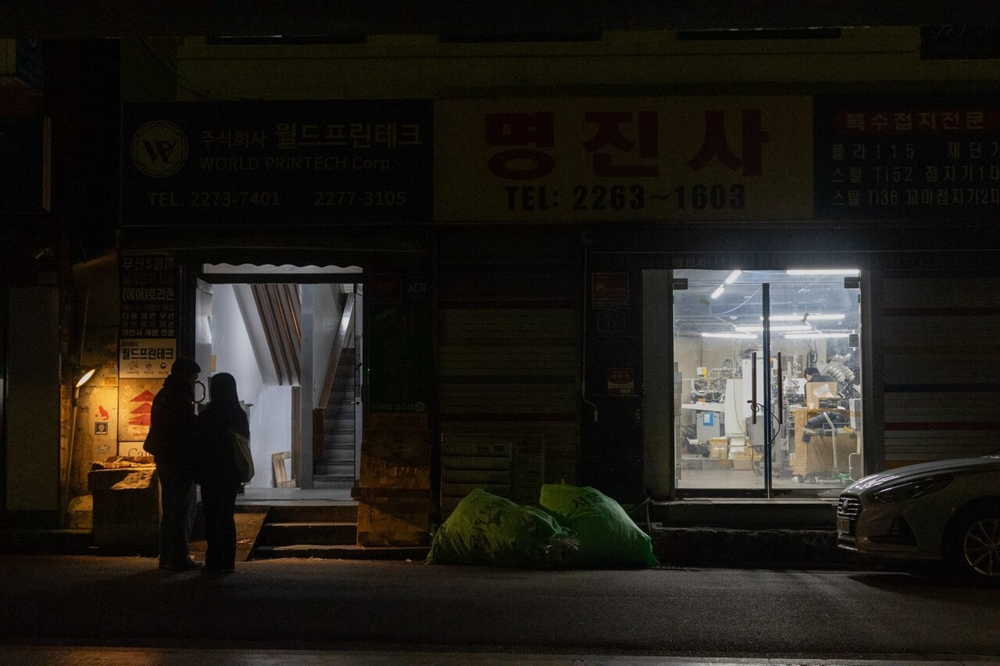

+++
title = "'불 꺼질 새 없는 '힙지로'지만··· 골목엔 여전히 '인쇄'가 있다"
date = 2024-03-13T20:43:29+09:00
categories = ["시사진담"]
tags = ["시사진담"]
keywords = ["을지로", "인쇄골목", "임대료"]
description = "철컥-, 철컥-, 철컥-.어느 일요일 오후 을지로 인쇄골목의 한 가게 앞. 분주하게 부딪히는 종이 소리에 이끌려 계단을 올랐다. 계단에서부터 산처럼 쌓인 인쇄물을 따라가니 따끈따끈한 인쇄물을 살피는 박 씨를 만날 수 있었다.박 씨는 을지로3가의 한 골목에서 24년을 일했다. 고등학교"
thumbnail = "1.jpg"
creator = "김지현 선임기자"
draft = false
+++

<figure>
  
  <figcaption>이진숙 기자 newjinsook@jindam.news 2024.02.25</figcaption>
</figure>

철컥-, 철컥-, 철컥-.

어느 일요일 오후 을지로 인쇄골목의 한 가게 앞. 분주하게 부딪히는 종이 소리에 이끌려 계단을 올랐다. 계단에서부터 산처럼 쌓인 인쇄물을 따라가니 따끈따끈한 인쇄물을 살피는 박 씨를 만날 수 있었다.

박 씨는 을지로3가의 한 골목에서 24년을 일했다. 고등학교 1학년 때부터 인쇄업을 시작해 어느덧 40년이 훌쩍 넘었다. 박 씨는 약 10년 전까지만 해도 4명의 직원과 함께 총 5명이서 일했다. 그러나 이제는 단둘이 모든 일을 해결한다. 코로나19 이후에는 기존에 있었던 기계 2대도 처분했다. 일감의 양은 줄지만 인건비는 끝을 모르고 올라서다. 박 씨는 80년대를 떠올렸다. “그때는 여기 인쇄 골목이 터질 듯 손님도 직원도 많았지. 지금 금요일 밤에 젊은이들이 많은 것처럼.”

<figure>
  
  <figcaption>최근 을지로 인쇄골목을 중심으로 '뉴트로' 감성의 식당과 카페들이 늘어나며 이를 찾는 사람들의 발걸음이 끊이지 않고 있다. 이진숙 기자 newjinsook@jindam.news 2024.02.25</figcaption>
</figure>

한편 그는 ‘젊은’ 인쇄업자들을 걱정한다. 4·50대 인쇄업자들의 일이 끊길까 우려하는 것이다. “술집이나 카페 생기고 임대료가 너무 올라서 정리한 가게가 진짜 많아요. 하루하루 버티는 1인 사업자가 많다 보니 버는 것에 비해 임대료가 감당이 안 되면 나갈 수밖에 없는 거죠.” 슬럼화된 지역에 카페 등이 입점하며 상권이 형성되고 SNS 등의 영향으로 임대료가 급증하는 젠트리피케이션(gentrification) 현상 중 하나다. 임대료를 감당할 수 없는 원주민이 쫓겨나는 것이다. ‘나는 오래 했다’고 말하는 그에게도 종이 냄새 대신 ‘SNS 핫플’로 채워지는 골목은 생경하다. “시대 흐름이 그렇구나 싶다가도 당연히 헛헛하지.”

을지로가 지금의 ‘힙지로’로 거듭나기까지. 단순히 ‘세대교체’라 칭하기엔 여전히 종이와, 땀과, 잉크가 지켜온 세월의 흔적이 선명하다. 인쇄는 단순 업종이 아니라 을지로의 1세대 ‘문화’이기 때문이다. 그는 끝까지 인쇄소를 지킬 예정이다. “할 수 있을 때까지 일해야지. 나이 먹고 관절이 안 좋아도 일하는 게 정말 즐거우니까.”

글=김지현 선임기자 likeblue@jindam.news사진=이진숙 기자 newjinsook@jindam.news

<figure>
  
  <figcaption>을지로3가역 일대는 힙지로라 불리며 젊은 세대에게 인기 있는 곳 중 하나다. 이진숙 기자 newjinsook@jindam.news 2024.02.25</figcaption>
</figure>

