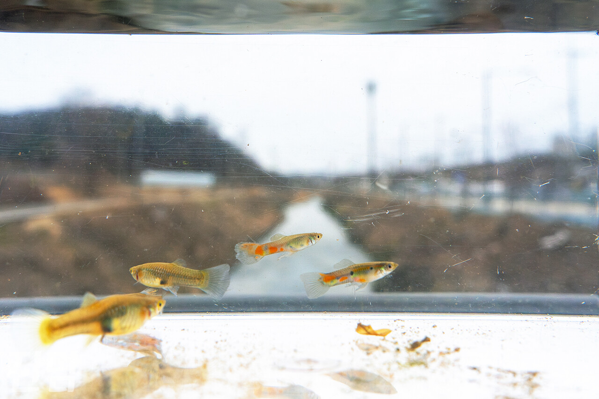
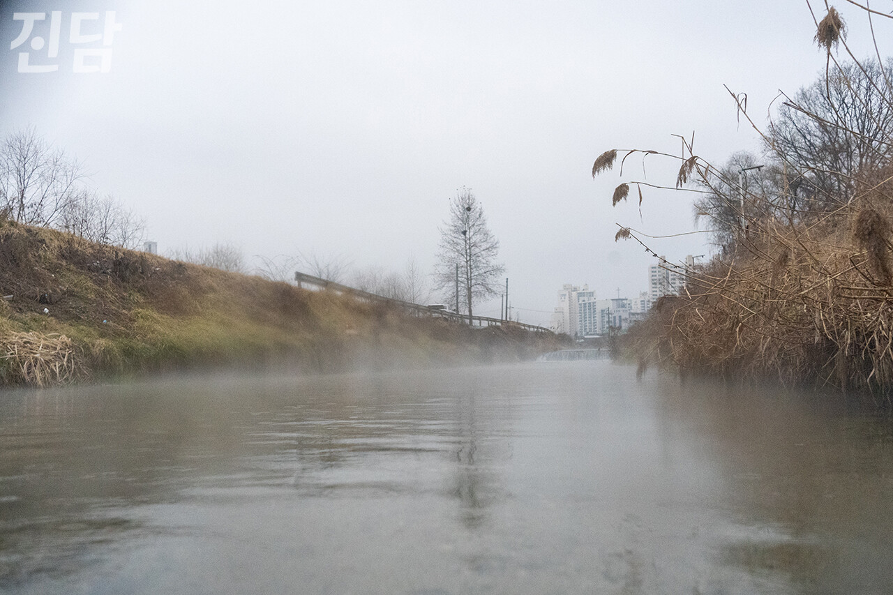
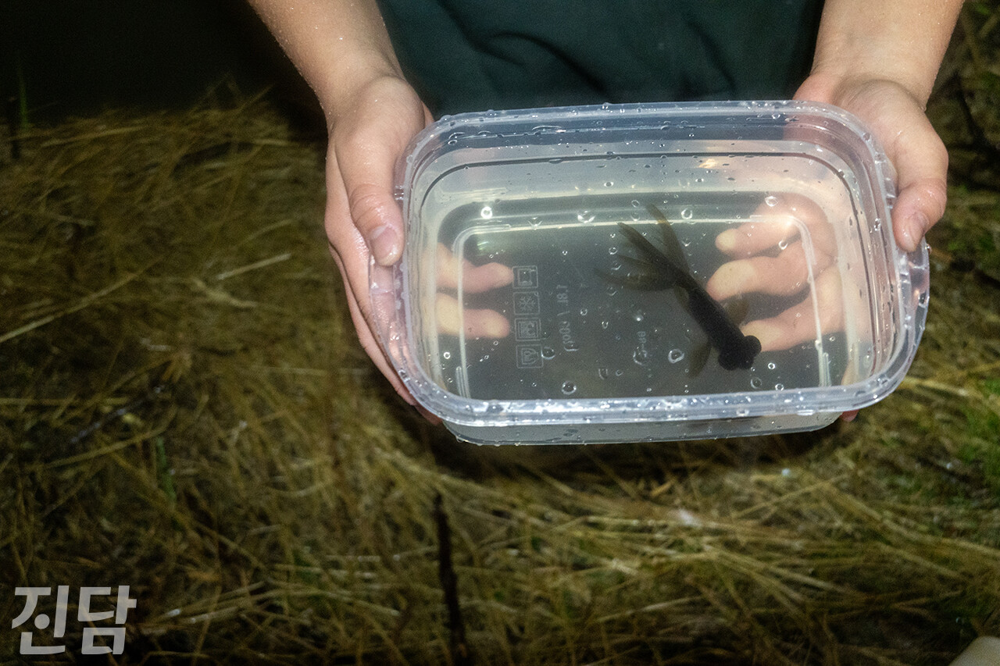
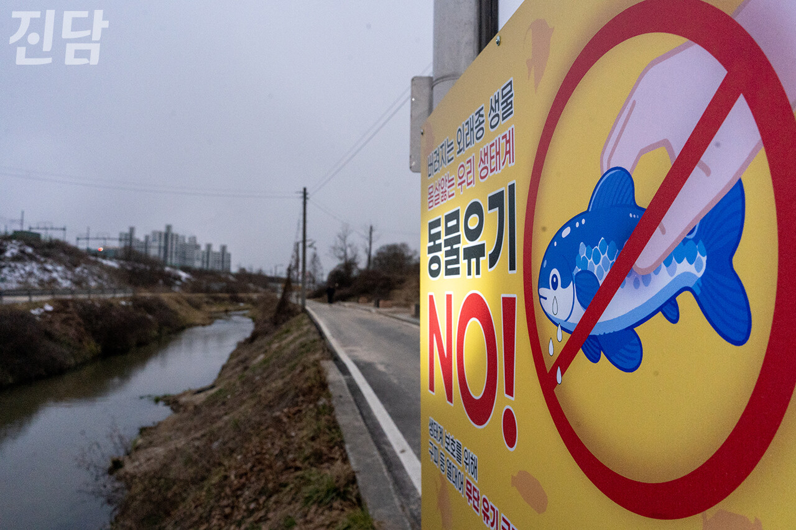

+++
title = '한겨울에도 수온 21.8℃… ‘한국의 아마존’ 된 이천 죽당천'
date = 2024-03-13T09:39:11+09:00
categories = ["시사진담"]
tags = ["시사진담"]
keywords = ["죽당천", "구피천", "외래종", "물고기", "관상어", "이천"]
description = "‘구피천’. 경기 이천 죽당천의 본명보다 유명한 별명이다. 국내에서 자생할 수 없는 외래종 물고기 ‘구피’가 번식하고 있기 때문이다. 최근에는 구피뿐만 아니라 다양한 외래종 생물들을 발견했다는 시민들의 목격담이 이어지고 있다. 이에  취재진이 직접 죽당천을 찾아 외래종 서식 현황을 살"
thumbnail = "1.jpg"
creator = "변준언 선임기자"
draft = false
+++

<figure>
  
  <figcaption>지난 2월24일 경기 이천 죽당천에서 '진담' 취재진이 채집한 구피들이 수조 속에서 헤엄치고 있다. 뒤로 보이는 풍경은 죽당천의 모습. 변준언 선임기자 byunjuneon@jindam.news 2024.02.24</figcaption>
</figure>

‘구피천’. 경기 이천 죽당천의 본명보다 유명한 별명이다. 국내에서 자생할 수 없는 외래종 물고기 ‘구피’가 번식하고 있기 때문이다. 최근에는 구피뿐만 아니라 다양한 외래종 생물들을 발견했다는 시민들의 목격담이 이어지고 있다. 이에 <진담> 취재진이 직접 죽당천을 찾아 외래종 서식 현황을 살폈다.

죽당천 물고기 66.1%가 구피··· 남은 33.9%에도 외래종 있다

<figure>
  
  <figcaption>지난 2월18일 오후 4시경 경기 이천 죽당천에 물안개가 피어오르고 있다. 변준언 선임기자 byunjuneon@jindam.news 2024.02.18</figcaption>
</figure>

지난 2월18일, <진담> 취재진이 찾은 죽당천 수면은 뿌연 물안개로 뒤덮여 있었다. 이 자욱한 물안개는 수온과 기온의 온도 차로 발생한다. 약 7.7℃의 겨울 날씨였지만 수온을 재 보니 약 21.8℃에 달하는 높은 온도임을 확인할 수 있었다. 18~28℃의 물에서 사는 구피의 서식 조건에 부합하는 온도다. 근처에 있는 SK하이닉스 반도체 공장에서 흘러나오는 따뜻한 물이 원인이다.

구피는 중남미 지역에 서식하는 난태생송사리과 담수 어류이다. 이들은 국내 하천에 자연적으로 유입될 수 없는 열대어다. 국립생태원의 「2019년 외래생물 정밀조사」(이하 19년도 정밀조사)는 “(구피는) 애완동물로 인기가 높은 만큼 자연환경에 버려지는 빈도가 높을 것으로 보인다”며 국내 하천에서 발견되는 구피의 유입 경로가 인위적 방류에 의한 것임을 시사했다.

구피는 번식력이 높기 때문에 빠른 속도로 개체 수가 늘어난다. 19년도 정밀조사에 따르면 죽당천에 서식하는 어류 1만 170마리 중 무려 66.1%인 6천717마리가 구피로 확인됐다. 실제로 <진담> 취재진이 2월 18일·23일·24일 총 3일간 죽당천 서식 어류를 관찰한 결과 구피가 대부분이었다.

<figure>
  
  <figcaption>지난 2월24일 경기 이천 죽당천에서 만난 권유중(17·경기 성남)군이 채집한 블랙툭눈금붕어. 변준언 선임기자 byunjuneon@jindam.news 2024.02.24</figcaption>
</figure>

다른 외래 생물들도 발견됐다. 취재진이 하천 바닥을 관찰하다 목격한 시클리드과 어류인 니그로페시어팀은 중앙아메리카 지역의 따뜻한 민물에 사는 열대어로 국내 하천에서 자연적으로 살아갈 수 없다. 채집 중인 시민들의 채집통 안에서는 금붕어도 숱하게 목격됐다. 역시 국내 하천에서 자연 발생할 수 없는 종이다.

계속 나타나는 ‘유입주의 생물’

죽당천에서 ‘유입주의 생물’을 목격했다는 증언도 잇따른다. 유입주의 생물이란 국내 생태계에 유입될 경우 해로울 수 있다고 판단되는 종을 일컫는 말로, 환경부 장관이 지정·고시한 생물을 말한다. 2023년 11월 유튜버 ‘TV생물도감’은 죽당천에서 마블가재를 발견했음을 알렸다. 국립생태원 김수환 선임연구원은 “마블가재는 성별과 관계없이 한 마리의 개체만으로도 번식이 가능한 ‘단성생식’을 하는 갑각류로, 소수 개체만 생존하더라도 개체수가 급격히 증가할 우려가 있다”며 마블가재의 생태계 교란 위험성을 경고했다.

2023년 11월 유튜버 ‘정브르’는 죽당천에서 아마존 비파(플래코)를 발견했다. 이들은 브라질·페루에 서식하며 성어의 몸 길이는 30~50cm에 달한다. 한국외래생물정보시스템에 따르면 아마존 비파는 곤충·치어 등을 잡아먹어 생물 다양성을 감소시킬 수 있다. 번식기에는 굴을 파고드는 습성이 있어 하천의 범람을 막기 위해 쌓은 둑방을 파괴해 안정성을 해칠 수 있다는 지적도 있다. 기생충에 대한 위험성도 제기된다. 아마존 비파에 기생하는 10여종 안팎의 기생충 중 일부는 사람의 점막·기도·후두에 달라붙어 감염을 일으킬 수 있다. 이처럼 생태계에 위협적인 생물종이 잇따라 발견됨에 따라 국립생태원은 마블가재 등 하천에 사는 외래생물들에 대한 정밀조사를 실시하고 있다.

외래종 유기로 전국이 ‘제2 죽당천’ 될 수 있다

외래종 창궐 사례는 다른 곳에서도 충분히 반복될 가능성이 있다. 19년도 정밀조사에 따르면 겨울에 따뜻한 물이 흐르는 등 열대성 외래종이 창궐할 수 있는 환경을 갖춘 곳은 죽당천을 제외하고도 국내에 두 곳이 더 있어 제2의 죽당천이 될 가능성이 있다. 죽당천처럼 특수한 환경이 아니더라도 유기된 생물의 서식 조건이 우리나라 환경이 일치하기만 한다면 전국 어디서든 외래종이 서식하게 될 수 있다.

유튜버 ‘드레뷰’는 2021년 12월 <제2의 구피천, 이렇게 된다면 정말 못 막습니다>는 영상을 올려서 ‘우리나라 하천에 일본의 관상어 메다카가 방류되면 급속도로 퍼져서 인간이 막을 수 없을 것’이라는 의견을 냈다. 메다카는 송사리 중에서 관상가치가 있는 개체를 선별해 교배시키는 과정을 반복하며 탄생했다. 즉 메다카는 송사리와 유전 형질은 달라도 같은 종이기 때문에 국내 생태계에 방류돼도 서식할 수 있음은 물론 야생 송사리와 교잡도 일어날 수 있다.

현재 일본에서는 야생 송사리를 멸종위기종으로 지정해 보호하고 있다. 기초생물학연구소 나루세 기요시 특임교수는 <KoKaNet> 기고에서 “야생 송사리 보호 연못에 가보면 (야생 송사리가 아닌) 메다카가 있다”며 지역 생태계에 적응된 야생 송사리의 유전자가 메다카와 섞이며 사라진 것이라고 설명했다. 우리나라 하천에 메다카가 방류된다면 야생 송사리도 같은 방식으로 사라질 수 있는 셈이다.

<figure>
  
  <figcaption>죽당천변에 이천시가 세워둔 ‘동물 유기 금지’를 알리는 팻말. 변준언 선임기자 byunjuneon@jindam.news 2024.02.24</figcaption>
</figure>

그러나 모든 외래종 유기를 법적으로 막을 수는 없다. 「생물다양성 보전 및 이용에 관한 법률」에서 방출을 제한하고 있는 종은 환경부가 지정한 생태계교란·위해우려 생물이다. 이에 해당하는 생태계교란 어종은 3종, 생태계위해우려 어종은 2종에 그쳐 대부분의 관상어는 무단 방류 제재 대상에 포함되지 않는다. 그럼에도 불구하고 외래생물 무단 방류를 손놓고 바라보고 있을 수는 없다. 김 선임연구원은 “외래종 도입은 생물다양성협약(CBD)에서 언급된 생물다양성에 심각한 훼손을 미치는 주요 요인 중 하나”라며 “국립생태원은 외래생물 무단방류를 막기 위해 다양한 홍보 활동과 교육을 진행하고 있다”고 해결책을 모색하고 있음을 밝혔다. 이천시는 죽당천 근처에 구피 등 동물 유기를 금지한다는 안내판을 세워 시민 계도를 실시하고 있다.

글·사진=변준언 선임기자 byunjuneon@jindam.news

#추천 영상

<iframe allow="accelerometer;  encrypted-media; gyroscope; picture-in-picture" allowfullscreen="" frameborder="0" height="400" src="https://www.youtube.com/embed/J4VPFm3YoTE" width="600"></iframe>

유튜버 'TV생물도감'이 업로드한 죽당천 탐어 영상. 영상 = TV생물도감

