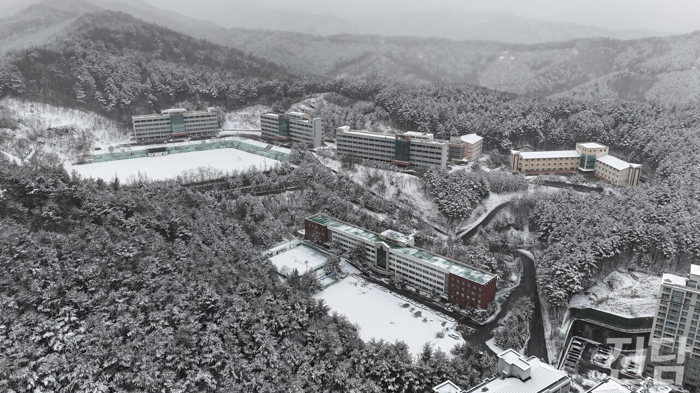
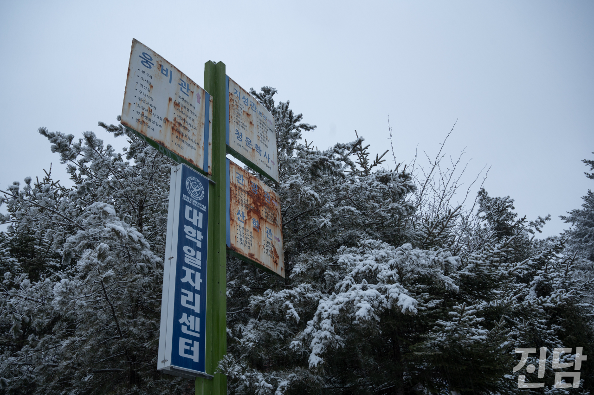
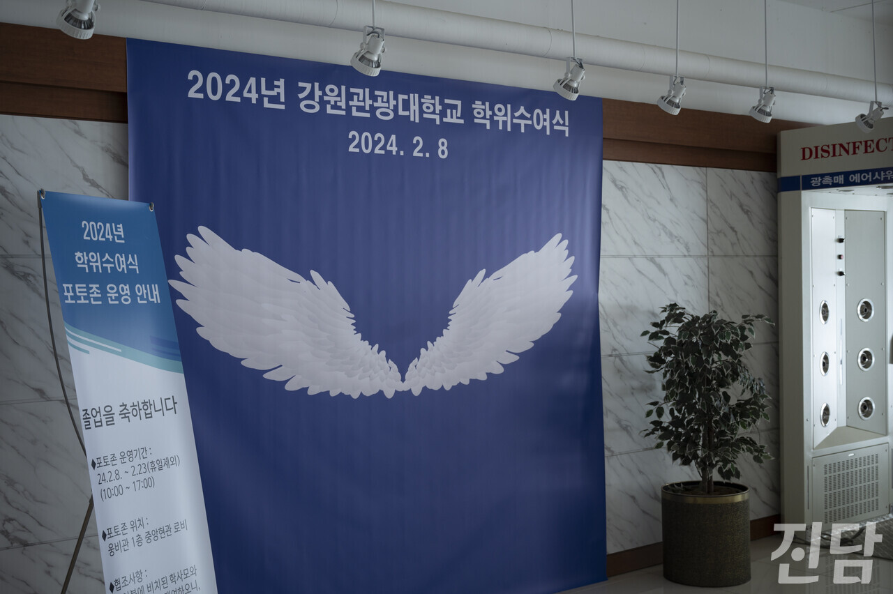
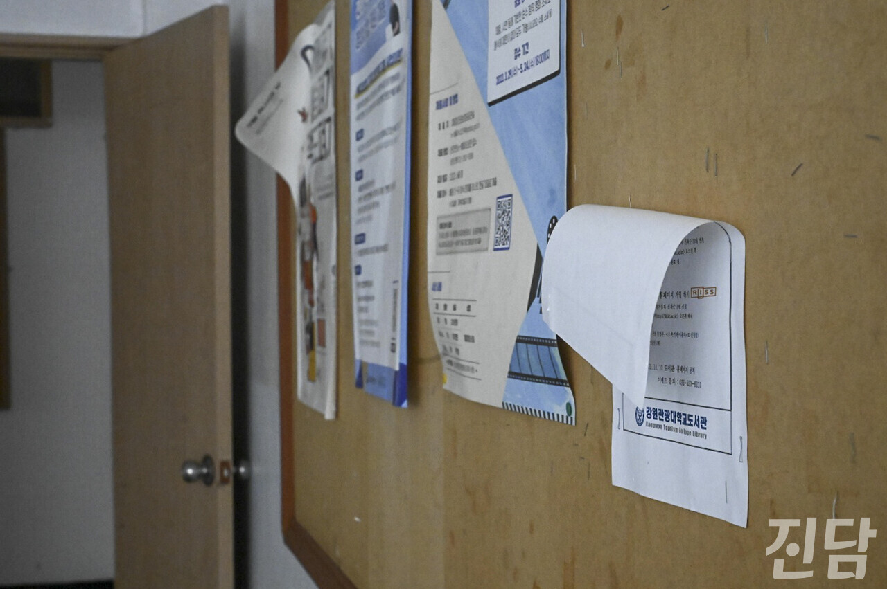
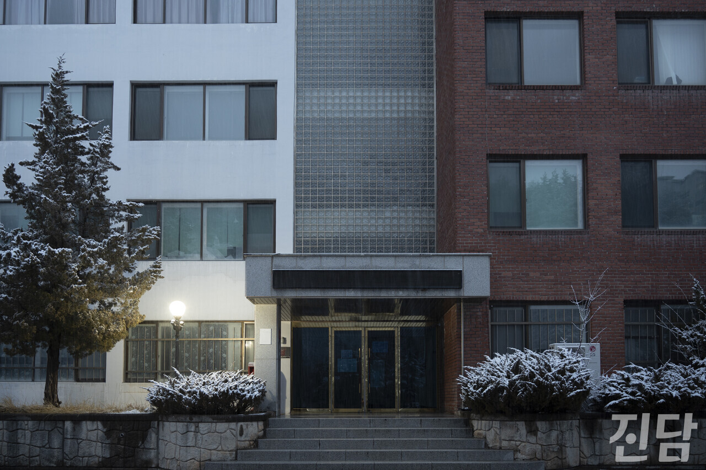

+++
title = "“폐광 이어서 폐교···” '지방소멸' 벼랑 끝에 선 태백"
date = 2024-03-12T23:08:53+09:00
categories = ["시사진담"]
tags = ["시사진담"]
keywords = ["강원관광대", "폐교", "학령인구감소", "태백", "지방소멸"]
description = "강원관광대는 한때 호텔카지노관광과 등 6개 학과를 운영했다.강원 태백에 위치한 강원관광대학교는 2월 29일부로 폐교됐다. 개교 29년 만의 일이다. 폐교를 앞둔 21일, 교직원들은 밤새 쌓인 눈을 치우느라 바빴지만 그들을 제외하면 캠퍼스를 지나다니는 사람은 찾아볼 수 없었다. 녹슨 이"
thumbnail = "1.jpg"
creator = "문준빈 기자"
draft = false
+++

<figure>
  
  <figcaption>폐교를 8일 앞둔 2월 21일 강원관광대학교 전경. 임은재 선임기자 when@jindam.news 2024.02.21</figcaption>
</figure>

강원관광대는 한때 호텔카지노관광과 등 6개 학과를 운영했다.강원 태백에 위치한 강원관광대학교는 2월 29일부로 폐교됐다. 개교 29년 만의 일이다. 폐교를 앞둔 21일, 교직원들은 밤새 쌓인 눈을 치우느라 바빴지만 그들을 제외하면 캠퍼스를 지나다니는 사람은 찾아볼 수 없었다. 녹슨 이정표에 나열된 여러 시설만이 과거 학생으로 북적이던 학교의 모습을 보여주는 듯했다. 하지만 2021년 간호학과를 제외한 모든 과가 폐과 절차를 밟았다.

<figure>
  
  <figcaption>강원관광대 캠퍼스에 있는 이정표에 카지노과 등 여러 학과가 적혀있다. 그러나 이 중 폐교 직전까지 운영 중인 학과는 간호학과뿐이었다. 문준빈 기자 moonready@jindam.news 2024.02.20</figcaption>
</figure>

간호학과가 사용하던 ‘웅비관’ 복도에는 전공 서적이 쌓여 있었지만 학생들의 모습을 찾아볼 순 없었다. 마지막 졸업생들을 위해 마련된 학위수여식 포토존은 찾는 이가 없어 썰렁하기만 했다.

<figure>
  
  <figcaption>강원관광대 마지막 졸업생들을 위해 웅비관에 차려진 포토존에는 조명조차 켜져 있지 않았다. 문준빈 기자 moonready@jindam.news</figcaption>
</figure>

강원관광대가 올해 1월 교육부에 폐교 의사를 밝힌 것은 지난해 9월 신입생 모집 중단 이후 약 4개월 만이다. 재적생 327명은 인근 대학으로 특별편입하게 되는데, 이중 대다수인 323명은 충북 음성에 위치한 강동대로 학적을 옮길 예정이다. 강동대는 강원관광대와 약 159km 떨어져 있으며, 이는 차량으로만 2시간 이상이 소요되는 먼 거리다.

<figure>
  
  <figcaption>강원관광대 ‘웅비관’ 내부에 남겨진 게시판. 포스터들이 아슬아슬하게 걸린 채 방치돼 있다. 문준빈 기자 moonready@jindam.news 2024.02.21</figcaption>
</figure>

폐교와 함께 남겨진 이들은 어떠한 변화를 겪었을까. 강원관광대 노동조합 최형태 지부장은 “하루아침에 직장을 잃으니, 뭘 해야 될지 모르는 공황상태가 왔다”며 착잡한 심경을 토로했다. 교직원들은 순식간에 실업자가 됐지만 책임지는 이는 없었다. 이직은 개인이 해결해야 할 문제가 됐다.

비단 학교 뿐 아니라 태백 전체가 폐교의 영향을 받고 있다. 학교 주변 상권은 쇠락해 간다. 상가 곳곳엔 임대 광고판이 붙어있었다. 폐교 소식에 일부 상인들이 가게를 내놨지만 그 자리에 선뜻 들어오고자 하는 이는 없다. 남아있는 상인들도 주 수요층인 학생이 사라진 상황에 걱정이 깊다. 학교 인근에서 커피숍을 운영 중인 정종희(50)씨는 “자주 들르는 단골 학생들이 꽤 있었어요. 새 학기에도 학생이 없다면 타격이 있겠죠”라며 고민을 전했다.

<figure>
  
  <figcaption>강원관광대 인근의 상가 건물에는 공실이 많아 ‘임대’ 광고판을 자주 볼 수 있었다. 문준빈 기자 moonready@jindam.news 2024.02.21</figcaption>
</figure>

태백 택시 기사들의 고민거리도 늘었다. 강원관광대 학생들이 통학하거나 시내로 이동할 때 택시를 주로 이용해 왔기 때문이다. 계속해서 감소하는 태백의 인구로 위축된 택시운송업은 엎친 데 덮친 격으로 주 이용객을 잃었다.

태백은 석탄 산업이 성황이던 1980년대 인구 10만 명 이상을 기록하기도 했지만, 2023년 인구는 3만 8천 명 선까지 내려앉았다. 지역 내 유일한 대학인 강원관광대 폐교에 이어 오는 6월에는 태백 마지막 탄광인 장성광업소가 폐광 수순을 밟는다. 지역 경제의 버팀목이 하나 둘 쓰러지고 있는 상황을 두고 강원관광대학교 살리기 비상대책위원회는 “마땅한 대안사업이 없는 것이 현실"이라며 "폐광에 이어 폐교까지 더해진다면 정주기반이 흔들릴 것”이라고 강원관광대 폐교가 불러올 지방소멸 가속화에 대한 위기감을 드러냈다.

문준빈 기자 moonready@jindam.news

<figure>
  
  <figcaption>학생들이 떠난 강원관광대 웅비관은 적막한 분위기만이 감돌았다. 문준빈 기자 moonready@jindam.news</figcaption>
</figure>

