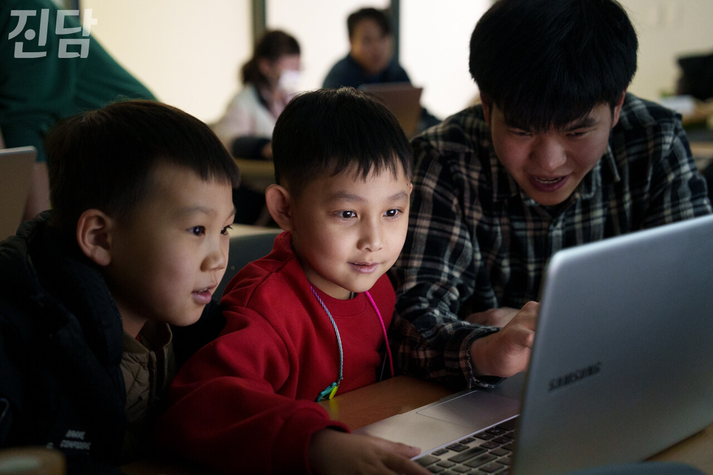
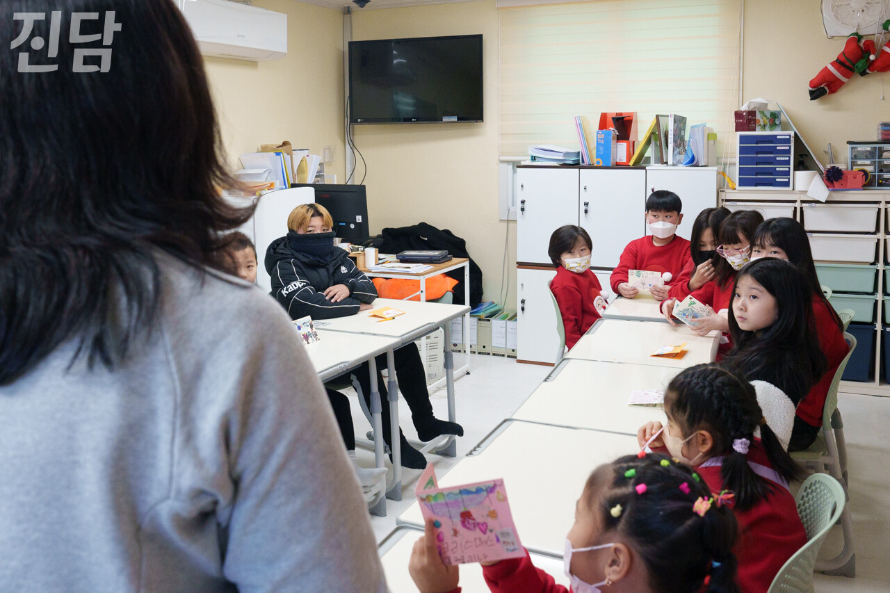
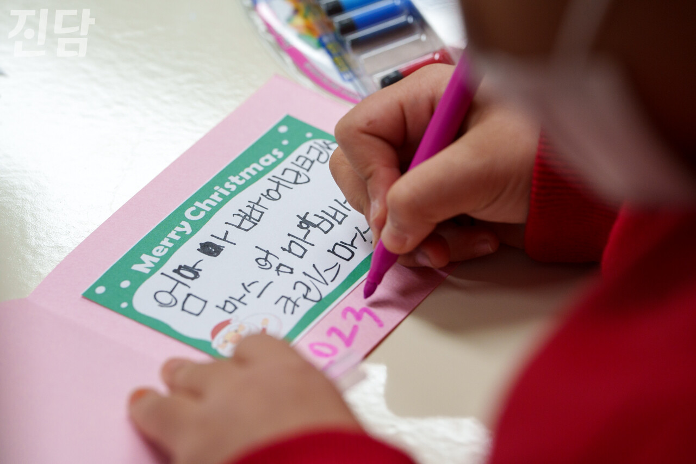
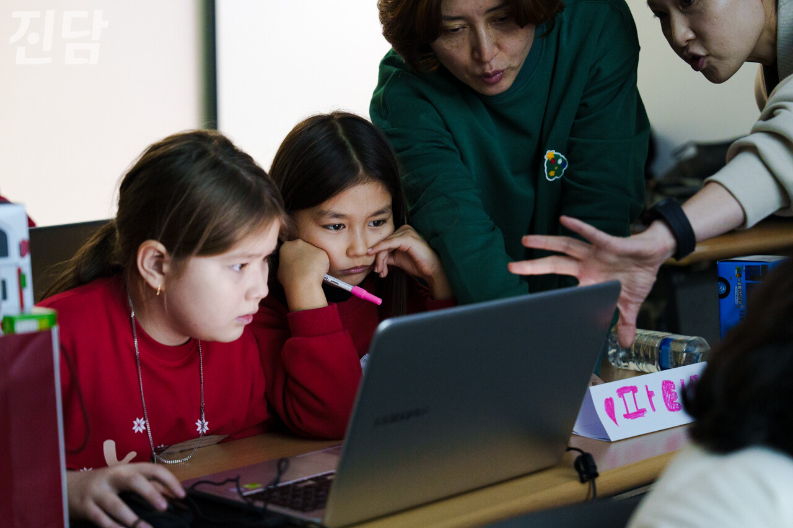
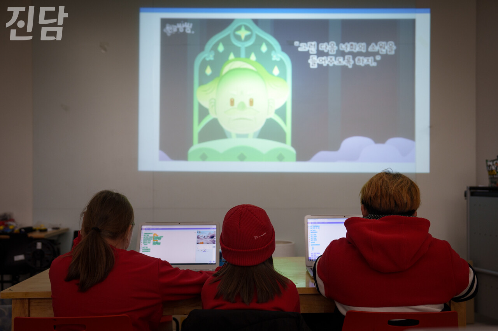
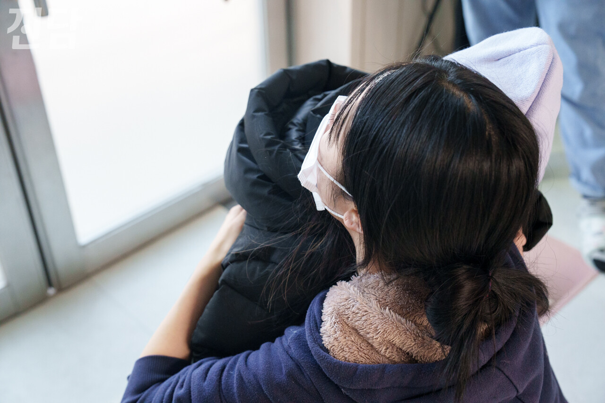

+++
title = '"한국어 못하니 진학 힘들어"  소외된 이주배경아동'
date = 2024-03-11T11:06:54+09:00
categories = ["시사진담"]
tags = ["시사진담"]
keywords = ["다함께돌봄센터", "안성시 다함께돌봄센터 1호점", "이주배경아동", "다문화", "고려인", "중앙아시아", "러시아", "카자흐스탄", "우즈베키스탄", "공적돌봄", "안성", "내리", "경희대 국제캠퍼스", "디지털새싹 캠프", "외리"]
description = '"초등학교 외국인 비율 84%" 이주배경아동으로 가득한 안성 내리 경기 안성 중앙대 다빈치캠퍼스 후문 쪽 자취촌 내리에서 큰 도로를 건너면 ‘외리’라고 불리는 마을이 있다. 외리는 공식적으로 존재하는 지명이 아니다. 중앙대 학생들은 그곳을 외리라고 부르지만 사실 그곳도 내리에 속한다.'
thumbnail = "1.jpg"
creator = "이종수 기자"
draft = false
+++

<figure>
  
  <figcaption>이주배경아동 김다니엘군(광덕초 1학년·우즈베키스탄)이 지난 1월 17일 경기 용인 경희대 국제캠퍼스에서 열린 디지털새싹 캠프에 참가해 코딩 교육을 받고 있다.</figcaption>
</figure>

"초등학교 외국인 비율 84%” 이주배경아동으로 가득한 안성 내리

경기 안성 중앙대 다빈치캠퍼스 후문 쪽 자취촌 내리에서 큰 도로를 건너면 ‘외리’라고 불리는 마을이 있다. 외리는 공식적으로 존재하는 지명이 아니다. 중앙대 학생들은 그곳을 외리라고 부르지만 사실 그곳도 내리에 속한다. 2021년 기준 내리가 있는 대덕면에는 고려인을 포함해 5,438명의 이주민이 살고 있고, 그중 이들의 자녀는 124명이다. 내리에 있는 광덕초등학교는 2023년 기준 외국인 비율이 84%에 달한다.

아동들은 ▲외국인이라는 불안정한 신분 ▲부족한 한국어 구사 능력 ▲한국인 가정과의 소득격차 ▲내리의 기반 시설 부족 등으로 인해 교육과 복지의 사각지대에 놓여있다. 이러한 사각지대 문제 해소를 위해 2021년 내리에 설립된 안성시 다함께돌봄센터 1호점에서 아동들을 만나봤다.

<figure>
  
  <figcaption>지난 12월 17일 경기 안성시 다함께돌봄센터 1호점에서 ‘크리스마스 카드 만들기’ 수업이 진행되고 있다.</figcaption>
</figure>

한국어 못하니 수업 따라가기 어려워.. ‘첩첩산중’

안성시 다함께돌봄센터 1호점(센터)에는 고려인 아동 25명, 한국인 아동 3명이 있다. 박진숙 센터장에 따르면 센터의 고려인 중 한국어로 원활한 소통이 가능한 아동은 5명에 불과하다.

고려인은 19세기 후반 한반도에서 일제강점기 혼란을 피해 연해주로, 다시 소련에 의해 중앙아시아로 이주한 한인을 이르는 말이다. 이들은 이주 과정에서 겪은 소련 정부의 민족의식 탄압으로 인해 우리말을 잃었다.

고려인 부모의 부족한 한국어 능력은 아동의 한국어 교육에도 악영향을 끼친다. 아동들은 집에서는 러시아어를 쓰고, 학교에서는 한국어로 수업을 듣는다. 때문에 한국어도 러시아어도 모두 제대로 읽고 쓸 수 없는 경우가 많다. 박 센터장은 "아이들이 러시아어로 말하지만, 러시아어로 글 쓸 줄 모르는 경우가 많다"고 전했다.

이러한 언어 문제로 인해 아동들은 학교에서 수업을 따라가는 데 어려움을 겪는다. 박 센터장은 아동들이 학년이 올라갈수록 수업에 따라가기 버거워하며, 고등학교 진학 후에는 학업을 중단하는 경우가 많다고 말했다. 교육부에 따르면 2021년 기준 이주배경학생의 대학 진학률은 40.5%로 전체 학생(71.5%) 대비 크게 낮게 나타났다.

<figure>
  
  <figcaption>한 아동이 부모님에게 한글로 크리스마스 카드를 쓰고 있다.</figcaption>
</figure>

생업 바쁜 부모, 대신 아동 돌보는 ‘다함께돌봄센터’

광덕초는 이르면 오후 1시, 늦어도 오후 3시에는 수업을 마친다. 허영훈 교사(전 광덕초)의 논문 「안성 내리에 거주하는 고려인 학생의 인식과 삶」에서는 "대부분 고려인 학생의 부모님은 생업으로 바쁘기에 아이들은 방과 후 교육적 사각지대에 놓여있다"며 "고려인 학생들은 방과 후 그리고 주말에 동생 돌보기와 집안일 또는 휴대폰 게임, 마을에 있는 공원에서 친구들과의 만남을 하고 있었다."고 한다.

도시의 아동은 방과 후 여러 학원을 다니는 경우가 많다. 하지만 내리에는 사교육 기관이 부족해서 학원을 가려면 광덕초에서 약 5.4km 떨어진 안성 시내로 나가야 한다. 박 센터장은 “센터에 태권도 학원을 다니는 아이가 세 명 있다”며 “그 학원은 학생이 세 명 이상 있어야 셔틀차량이 온다"고 말했다. 한 명이라도 학원을 그만두면 아이들은 태권도를 계속 배울 수 없다. 어렵게 시내 학원에 등록해도 언제까지 다닐 수 있을지 장담할 수 없는 셈이다.

이러한 문제를 해소하기 위해 센터는 안성시의 위탁을 받아 공적 돌봄 서비스를 시행하고 있다. 학기 중에는 오전 8시부터 오후 9시까지 운영되며, 방학 중에는 오전 8시부터 오후 8시까지 운영된다. 센터에서는 돌봄뿐 아니라 한글교실, 교과목 지도, 미술교실 등 여러 교육 프로그램을 진행하고 있다.

<figure>
  
  <figcaption>경기 안성시 다함께돌봄센터 1호점의 두 이주배경아동이 지난 1월 17일 경기 용인 경희대 국제캠퍼스에서 열린 디지털새싹 캠프에 참가해 코딩 교육을 받고 있다.</figcaption>
</figure>

<figure>
  
  <figcaption>센터의 아동들이 지난 1월 17일 경기 용인 경희대 국제캠퍼스에서 열린 디지털새싹 캠프에 참가해 코딩 교육을 받고 있다.</figcaption>
</figure>

외부와 협업 프로그램 진행하기도

1월 17일, 아동들은 오랜만에 안성 밖을 나섰다. 경기 용인 경희대 국제캠퍼스에서 열린 ‘디지털새싹 캠프’에 참여하기 위해서였다.

아동들은 교육용 프로그래밍 언어 ‘스크래치’를 이용해 코딩을 배우는 시간을 가졌다. 프로그램을 진행한 경희대 미래인재센터 정유정 교수(교육학 박사)는 “대규모 복지관의 경우 다문화 부모들이 아이들을 잘 보내지 않는 경향이 있다”며 “지역에 소규모의 돌봄센터가 더 많아져야 한다고 생각한다”고 말했다. 이날 통역으로 참여한 정영채씨(A대 러시아중앙아시아학과 졸업)와 도심하노바 아루잔씨(건국대 교육학과 상담심리 석사과정·카자흐스탄)는 한국 사람들은 다문화 학생을 하나의 덩어리로 뭉뚱그려 보는 경향이 있다며 학생들의 학년, 국적, 종교에 따른 차이를 이해하고 접근할 필요가 있다고 의견을 모았다.

<figure>
  
  <figcaption>대학생 멘토 황가연씨(평택대)가 센터에서 더 놀고 싶어 우는 이주 배경아동 아리아나양(광덕초 1학년·카자흐스탄)을 위로하고 있다.</figcaption>
</figure>

“급식비 없어 밥 걸러...” 아직 부족한 정책적 지원

박 센터장은 "센터에는 급식비 지원이 없다"며 "심지어 1년 전 겨울방학에는 대부분의 아이들이 식비 자부담을 부담스러워하며 끼니를 굶었다. 직접 음식을 해서 먹이고 싶었지만 제대로 된 화기시설, 영양사, 조리사 없이는 조리하지 못하게 되어있다"고 설명했다. 이어 박 센터장은 "지난 여름방학에는 아이들 밥을 먹이기 위해 여기저기에 도움을 요청했다. 시니어 클럽에서 도시락을 만들어주시고, 자원봉사자들이 김밥을 싸 오거나 해서 방학을 마쳤다"며 "하지만 이번 겨울방학이 또 고민이다"고 막막한 심경을 밝혔다.

박 센터장은 그간의 노력을 인정받아 2023년 경기도지사 표창을 받았고 같은 달 다함께돌봄센터 경기도협의회장이 됐다. 하지만 박 센터장은 아직 제도적, 정책적으로 부족한 부분이 많다고 말한다. 박 센터장은 “부모 중 한국인이 있는 경우는 가정 방문교사 지원 등 다문화 지원이 많다. 하지만 한국 국적을 취득하지 않은 고려인들은 복지 사각지대에 놓여있다”며 외국인 가정 아동 지원 필요성을 강조했다.

센터에서 수용할 수 있는 아동의 인원은 28명으로 한정돼 있다. 현재 9명의 아동이 센터를 이용하기 위해 대기 중이다. 이런 아동들은 방과 후 보호받지 못한 채 시간을 보낸다. 박 센터장은 아이들의 원활한 정착을 위해 ▲지속적 예산 지원 ▲내국인과 차별없는 복지 ▲급식비 전액 지원 ▲통역 강사 인건비 지원 등이 절실하다고 밝혔다.

글·사진 : 이종수 기자 rhiejongsu@jindam.news

