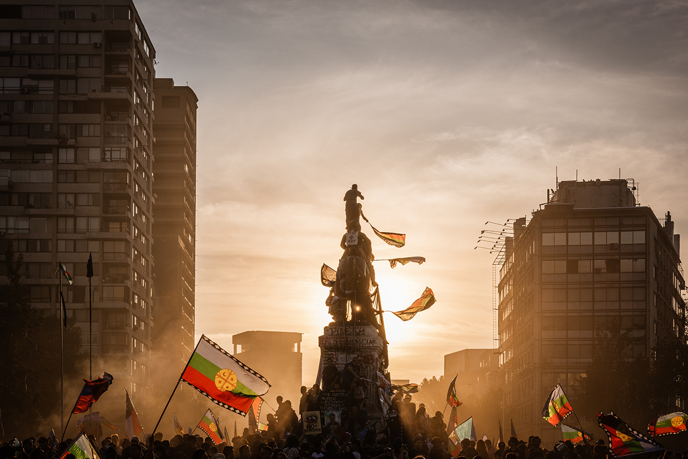
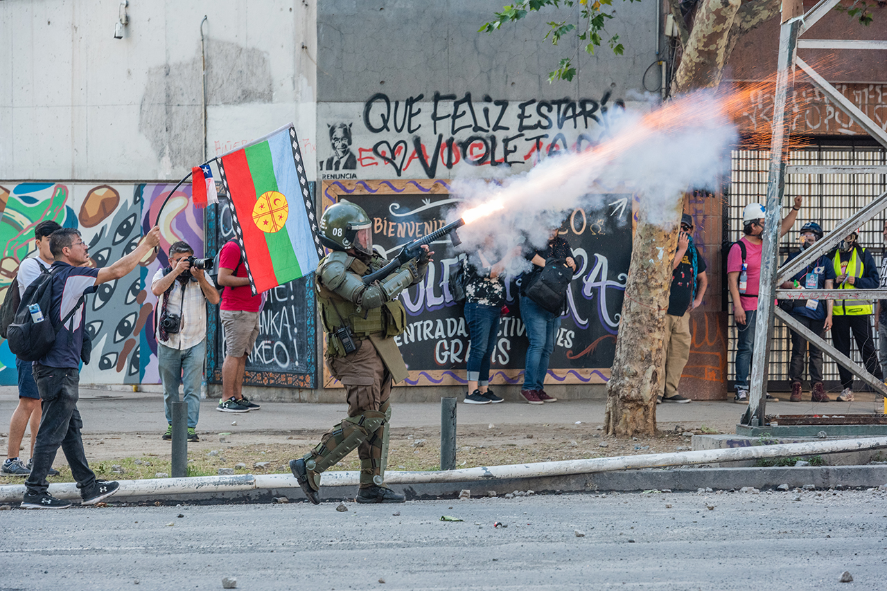
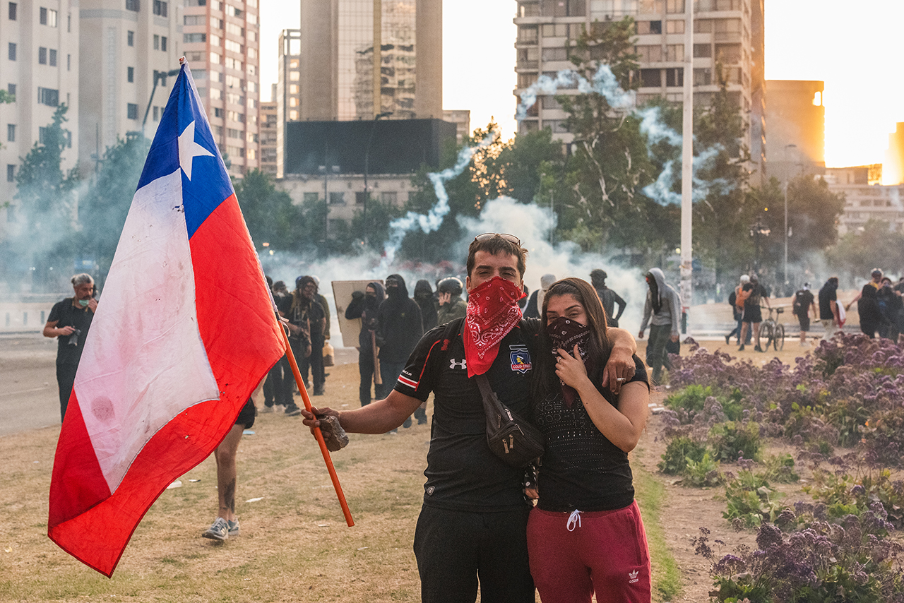
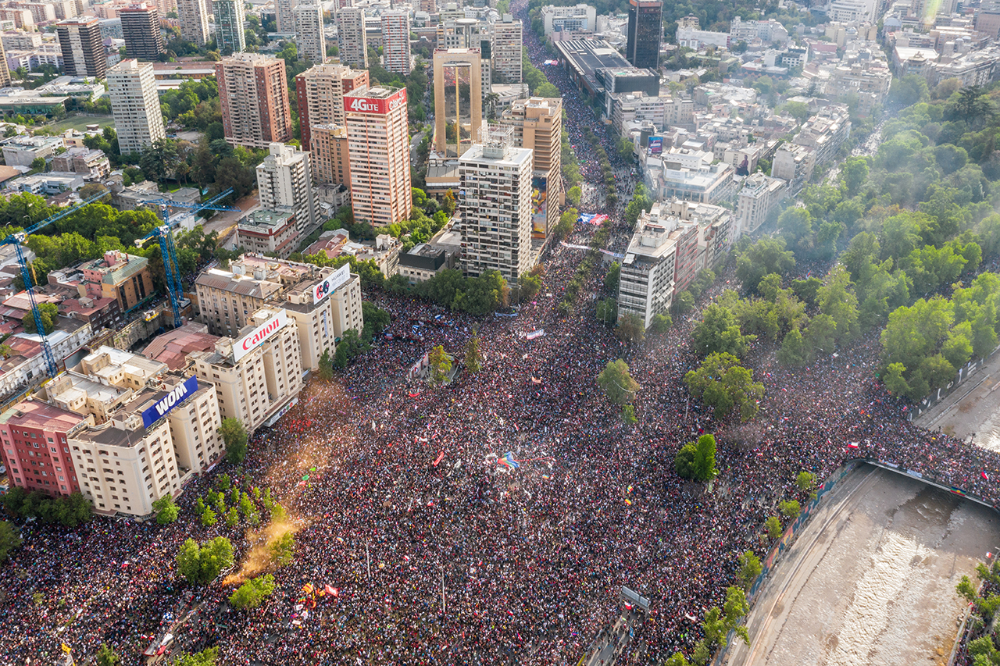
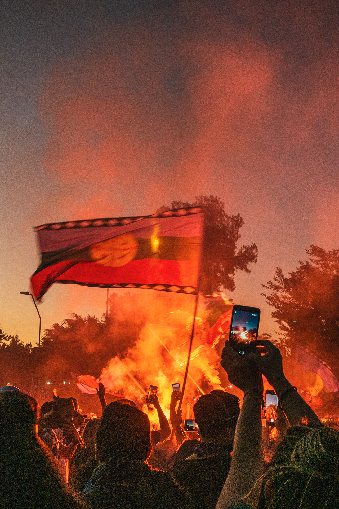

+++
title = '[갤러리진담] 칠레 시민 120만 명 광장으로 부른 Whats App'
date = 2024-03-17T00:35:00+09:00
categories = ["갤러리진담", "추천"]
tags = ["칠레", "Whats App"]
keywords = ["칠레", "Whats App"]
description = "칠레 시민 120만 명 광장으로 부른 Whats App"
thumbnail = "1.jpg"
creator = "변준언 선임기자"
draft = false
+++

<figure>
  
  <figcaption> 2019년 11월16일 칠레 산티아고 바케다노광장에서 지하철 요금 인상 발표로 촉발된 반정부 시위가 열리고 있다. 박비오 사진가는 “가운데 있는 구조물은 칠레의 전쟁 영웅 마누엘 바케다노의 동상으로 광장에서 사람이 올라갈 수 있는 가장 높은 곳”이라고 설명했다. 박비오 제공 </figcaption>
</figure>

“산티아고 지하철 요금 4% 인상” 2019년 가을 칠레 시민들의 반정부 시위는 그렇게 시작됐다. 시민들이 분노하며 거리로 나온 이유는 앞으로 더 내야 할 지하철 요금 몇 센트 때문만은 아니었다. 빈부격차를 심화한 신자유주의 정책에 대한 반감, 켜켜이 묵혀온 분노가 그들을 움직였다. 시민들은 당시 집권 중이던 우익 성향 대통령 세바스티안 피녜라의 하야를 요구했다.

그해 10월25일(현지시각) ‘칠레판 광화문광장’인 바케다노광장에는 120만 명이 모였고 이 집회는 칠레 역사상 최대 규모로 기록됐다. 24명 이상의 사망자가 나올 만큼 강도 높은 무력 진압이 이어졌으나 이미 기울어버린 여론을 통제할 수는 없었다. 결국 피녜라는 신자유주의 성향의 기존 헌법을 개헌하겠다고 약속하며 한발 물러섰다. 그렇게 개헌이 시작됐고 2021년 12월 대선에서는 독재 청산을 내세운 35세 청년 보리치가 대통령에 당선되며 정권교체가 이뤄졌다.

사진을 제공한 박비오 사진가는 당시 집회가 소셜 메신저 Whats App에서 조직됐기 때문에 다양한 계층의 일반 시민들이 자기 의사를 표현할 기회가 보장됐다고 평가했다. 당시 칠레를 포함한 13개국의 반정부 집회를 다룬 <이코노미스트>도 ‘집회가 투표 등과는 다른 대안적인 정치참여 기회가 돼서 시민들을 이끈다’고 보도했다. 또한 ‘재미’와 ‘연대감’도 집회 참여 결정에 중요한 역할을 한다며 소셜미디어가 이를 빠르게 대중화했다고 덧붙였다.

**사진=박비오 사진가·중앙대 첨단영상대학원 석사과정**  
**글=변준언 선임기자 byunjuneon@jindam.news**

<figure>
  
  <figcaption>2019년 11월7일 칠레 국가헌병대원이 산티아고 바케다노광장 근처에서 최루탄을 발사하고 있다. 박비오 사진가는 “집회가 시작하고 40일 동안은 매일 같이 최루탄이 발사됐다“고 증언했다. 박비오 제공 </figcaption>
</figure>

<figure>
  
  <figcaption> 2019년 11월5일 저녁 칠레 산티아고 바케다노광장에서 열린 그 날의 집회가 해산 국면에 접어든 시점, 참가자 두 명이 카메라 앞에 서서 포즈를 지어보이고 있다. 박비오 제공 </figcaption>
</figure>

<figure>
  
  <figcaption> 2019년 10월25일 칠레 산티아고 바케다노광장에서 열린 반정부 시위에 시민들이 참여하고 있다. '엘파이스' 보도에 따르면 이날 광장 주위에 모인 시민은 약 120만 명으로, 해당 집회는 칠레 역사상 가장 큰 규모의 집회로 기록됐다. 박비오 제공</figcaption>
</figure>

<figure>
  
  <figcaption>2019년 11월16일 칠레 산티아고 바케다노광장에서 시민들이 스마트폰 카메라로 조명탄이 타고 있는 모습을 촬영하고 있다. 박비오 제공</figcaption>
</figure>

\* \[갤러리진담\]은 사회를 바라보는 관점이 담긴 예술가들의 창작물을 소개하는 코너입니다. 기고 문의는 외부기고담당자(변준언 선임기자 byunjuneon@jindam.news)로 연락 바랍니다. 

