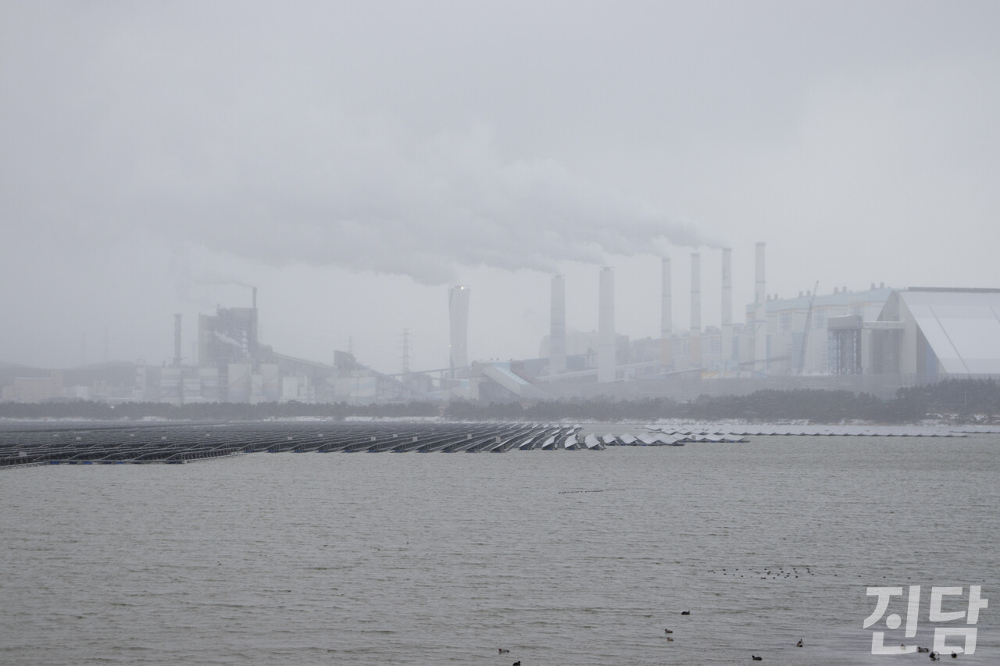

+++
title = '옆집, ‘미운 이웃’이 쫓겨난다면'
date = 2024-03-11T01:32:33+09:00
categories = ["시사진담"]
tags = ["시사진담"]
keywords = ["화력발전소", "태안", "정의로운 전환"]
description = "“우리야 솔직히 얘기해서 이거 없는 게 좋지. 근데 여기에 매달려서 먹고사는 사람들은....” 태안화력발전소와 5분도 채 떨어져 있지 않은 충남 태안 원북면 방갈리 주민 박병태(88)씨의 언성이 높아졌다. 옷을 널면 새까만 먼지가 붙을 만큼 심한 발전소의 공해에 매일 노출되는 박씨에게"
thumbnail = "1.jpg"
creator = "홍지원 기자"
draft = false
+++

<figure>
  
  <figcaption>충남 태안화력발전소 전경. 발전소에서 나온 연기가 흐린 하늘 속으로 솟아오르고 있다. 홍지원 기자 ziwonzip@jindam.news 2023.12.17</figcaption>
</figure>

“우리야 솔직히 얘기해서 이거 없는 게 좋지. 근데 여기에 매달려서 먹고사는 사람들은....” 태안화력발전소와 5분도 채 떨어져 있지 않은 충남 태안 원북면 방갈리 주민 박병태(88)씨의 언성이 높아졌다. 옷을 널면 새까만 먼지가 붙을 만큼 심한 발전소의 공해에 매일 노출되는 박씨에게 화력 발전소는 골칫덩이일 법도 하다. 그러나 박씨는 “ 사람이 여러 가지를 봐야 한다”고 말한다.태안화력발전소가 사라진다. 2025년 2기를 시작으로 총 6기의 발전소가 단계적으로 폐쇄 절차를 밟을 예정이다. 태안군은 이를 대체할 신재생에너지 사업을 추진하고 있지만 신재생에너지 산업에 필요한 인원은 기존 화력 발전소에 비해 훨씬 적다. 가장 먼저 일자리를 잃는 하청 비정규직 노동자들은 갈 곳이 없다.박씨는 발전소가 ‘국민의 기업’이라고 말한다. 그렇기에 발전소 노동자들의 생계가 신경 쓰인다. “그래도 그냥 없어지면 안 되지. 뭔가 하나 만들어주고 먹고 살 수 있게끔 해 줘야 할 거 아냐. 여기 사람들이 얼마나 왔다 갔다 하는데, 그 사람들 딸린 식구가 얼마냐 이거야.”사진 = 홍지원 기자 ziwonzip@jindam.news글 = 임은재 선임기자 when@jindam.news

“우리야 솔직히 얘기해서 이거 없는 게 좋지. 근데 여기에 매달려서 먹고사는 사람들은....” 태안화력발전소와 5분도 채 떨어져 있지 않은 충남 태안 원북면 방갈리 주민 박병태(88)씨의 언성이 높아졌다. 옷을 널면 새까만 먼지가 붙을 만큼 심한 발전소의 공해에 매일 노출되는 박씨에게 화력 발전소는 골칫덩이일 법도 하다. 그러나 박씨는 “ 사람이 여러 가지를 봐야 한다”고 말한다.

태안화력발전소가 사라진다. 2025년 2기를 시작으로 총 6기의 발전소가 단계적으로 폐쇄 절차를 밟을 예정이다. 태안군은 이를 대체할 신재생에너지 사업을 추진하고 있지만 신재생에너지 산업에 필요한 인원은 기존 화력 발전소에 비해 훨씬 적다. 가장 먼저 일자리를 잃는 하청 비정규직 노동자들은 갈 곳이 없다.

박씨는 발전소가 ‘국민의 기업’이라고 말한다. 그렇기에 발전소 노동자들의 생계가 신경 쓰인다. “그래도 그냥 없어지면 안 되지. 뭔가 하나 만들어주고 먹고 살 수 있게끔 해 줘야 할 거 아냐. 여기 사람들이 얼마나 왔다 갔다 하는데, 그 사람들 딸린 식구가 얼마냐 이거야.”

사진 = 홍지원 기자 ziwonzip@jindam.news  
글 = 임은재 선임기자 when@jindam.news

