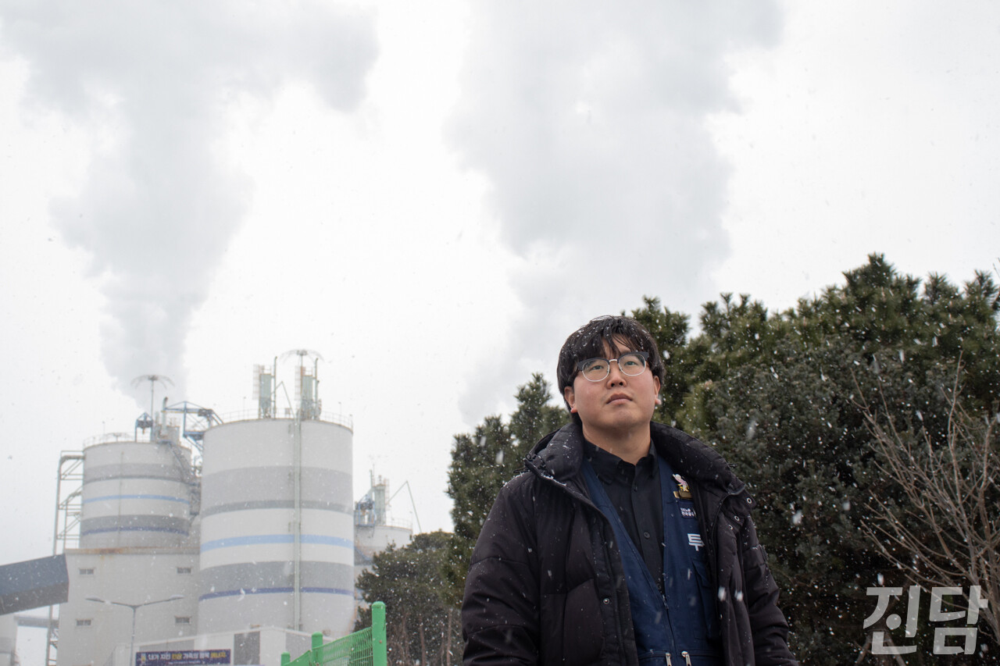

+++
title = '과정 빠진 정의, 갈 곳 없는 발전소 노동자들'
date = 2024-03-11T01:32:33+09:00
categories = ["시사진담"]
tags = ["시사진담"]
keywords = ["태안 화력발전소", "정의로운 전환", "노동"]
description = "화력 발전이 해롭다는 건 발전소 노동자 김영훈(30)씨가 제일 잘 안다. “여기 호흡기 질환, 난청 그리고 중이염, 귀와 관련된 질병 안 겪어본 사람 없을걸요. 코피가 나요. 귀에 생긴 혈전이 터져가지고 막 흘러내리는 거라고 하더라고요.” 그렇기에 김씨에게도 석탄 화력발전소 폐쇄는 ‘"
thumbnail = "1.jpg"
creator = "홍지원 기자"
draft = false
+++

<figure>
  
  <figcaption>충남 태안 화력발전소 노동자 김영훈(30)씨가 '진담'과 인터뷰 중 포즈를 취하고 있다. 홍지원 기자 ziwonzip@jindam.news 2023.12.17</figcaption>
</figure>

화력 발전이 해롭다는 건 발전소 노동자 김영훈(30)씨가 제일 잘 안다. “여기 호흡기 질환, 난청 그리고 중이염, 귀와 관련된 질병 안 겪어본 사람 없을걸요. 코피가 나요. 귀에 생긴 혈전이 터져가지고 막 흘러내리는 거라고 하더라고요.” 그렇기에 김씨에게도 석탄 화력발전소 폐쇄는 ‘거부할 수 없는 흐름’이다. 그러나 결과가 정의롭다고 해서 과정까지 정의롭다고 말할 수 있는 것은 아니다.

발전소 폐쇄 소식과 함께 김씨의 일상은 불안이 됐다.“매 순간 느껴요. 내년에 어떻게 될까. 내년까지 일할 수 있을까...” 불행 중 다행으로 12월에 종료 예정이었던 김씨의 근무 계약은 3월까지로 연장됐다. 해가 넘어가기 불과 일주일 전에 받은 통보다. “막 다가왔을 때 그때 알려줘요. 3월 이후의 상황은 또 모르는 거예요. 코앞에 닥쳤을 때쯤 나가라고 하면 막을 방법이 없어요.”

김씨가 태안에 들어온 건 지금으로부터 약 8년 전, 2016년이다. 처음에는 원룸에 살았지만 한 달에 몇십씩 나가는 월세가 버거워 터를 잡았다. 그런데 이제는 그 터를 또 두고 떠나야 한다. “태안은 화력 발전소에 일자리가 집중돼 있어요. 새로운 일자리를 찾아야 하는데, 여기는 발전소 아니면 골프장, 농사짓는 곳뿐이에요.”

그나마 관광 산업이 현실성 있는 대안으로 언급되지만 지금 상태에서는 현재와 같은 노동 조건에서 근무할 수 있는 일자리를 찾기는 어렵다. “관광 안내원을 하라고 한다거나, 배워보지도 않은 배를 갑자기 몰라고 하면 힘들죠.” 김씨에게는 고생해서 딴 전기 자격증과 8년간의 경력을 버리고 새로운 일자리를 찾아야 하는 현실이 막막하기만 하다. 여형범 연구위원(충남연구원 공간 환경연구실)은 다른 분야로 이직해야만 하는 발전소 노동자들이 겪는 어려움에 대해 “석탄화력발전산업 노동자들의 숙련기술에 대한 조사·분석이 이루어지지 않은 상태” 라고 지적했다.

원청노동자들의 경우 신재생에너지 사업·LNG 발전소 건설 및 운영 등으로 재배치된다. 하지만 김씨와 같이 퇴직이 불가피한 비정규직 노동자들의 상황은 다르다. 배치 시에 숙소가 제공되는 정규직과 달리, 비정규직 노동자들은 지낼 곳을 스스로 마련해야 했기에 이미 터를 잡아버린 일부 노동자의 경우 태안을 떠나기 힘든 상황에 놓여 있다. 힘들게 딴 자격증과 오랜 기간 쌓아 온 경력을 살려 이직할 수 있는 일자리는 태안 내에 사실상 없다. 여 연구위원은 “새롭게 마련된 정의로운 전환 프로그램뿐만 아니라 기존 정책 및 사업들도 정의로운 전환과 연계되는 방향으로 조율할 필요가 있다”며 기존 사업들에 대한 조정이 필요하다는 점을 강조했다.

“눈에 뻔히 보여요, 문제점들이. 미리 준비하고 대책을 세워놔야 하는데 그 ‘과정’이 없어요.” 김 씨는 ‘결과’만 있고 ‘과정’이 빠진 현실을 지적했다." 여기 한 번 들어오면 평생 직장일 거라 생각해서 들어오시는 분들이 거의 대부분이에요. 전력을 생산한다는 데 보람도 느꼈죠. 그런데 이제 끝났다고, 끝나서 내쫓기듯이 나가야 된다고....”

글=임은재 선임기자 when@jindam.news  
사진=홍지원 기자 ziwonzip@jindam.news

