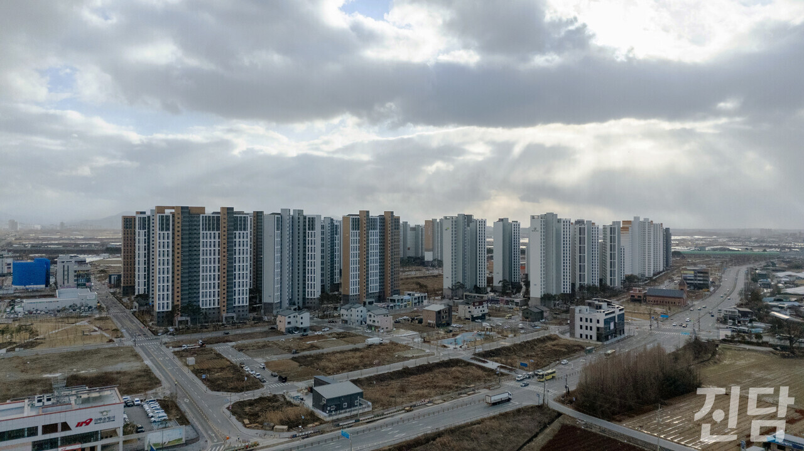

+++
title = '‘날개 없는 추락’ 속 완주의 도약'
date = 2024-03-11T00:33:08+09:00
categories = ["시사진담"]
tags = ["시사진담"]
keywords = ["완주", "삼봉지구", "인구감소", "지방소멸", "정주여건"]
description = "사라져가는 지역들완주의 인구는 왜 증가하는가‘5,405명’, 지난해 완주에서 증가한 인구 수다. 2023년 11월 전북도가 공개한 주민등록인구 현황에 따르면 전북 14개 지자체 중 13곳에서 인구가 줄었다. 오직 완주만이 인구 증가세를 보였다. 삼봉·운곡지구 등 대규모 주택단지 입주,"
thumbnail = "1.jpg"
creator = "문준빈 기자"
draft = false
+++

<figure>
  
  <figcaption>전북 완주 삼봉지구 전경. 삼봉지구는 2020년 2월에 준공된 공공주택지구이다. 변준언 선임기자 byunjuneon@jindam.news</figcaption>
</figure>

사라져가는 지역들완주의 인구는 왜 증가하는가

사라져가는 지역들

완주의 인구는 왜 증가하는가

‘5,405명’, 지난해 완주에서 증가한 인구 수다. 2023년 11월 전북도가 공개한 주민등록인구 현황에 따르면 전북 14개 지자체 중 13곳에서 인구가 줄었다. 오직 완주만이 인구 증가세를 보였다. 삼봉·운곡지구 등 대규모 주택단지 입주, 산업단지 조성에 따른 일자리 창출 등이 인구 증가세의 가장 큰 요인으로 꼽힌다. 하지만 주거지역 조성 및 일자리 창출로만 끝낸다면 증가한 인구를 붙잡아 둘 수 없다. 전입해 온 인구가 잘 정착할 수 있도록 돕고, 양육에 적합한 환경을 마련해야 한다.

<figure>
  
  <figcaption>그래픽=변준언 선임기자 byunjuneon@jindam.news</figcaption>
</figure>

증가하는 인구에 맞춰 완주군은 어떤 인구정책을 펼치고 있는지 취재했다. 또 인구정책 및 정주여건의 만족도는 어떤지 군민 인터뷰를 통해 알아봤다.

완주군, ‘지방소멸’에 답하다

여타 지방정부에서도 지방소멸을 막기 위해 여러 정책을 시행하고 있다. ‘한 달 살기’나 ‘농촌 체험’과 같은 체류형 관광 방식이 대표적이다. 정주인구가 아닌 실제로 생활하며 지역의 활력을 높이는 생활인구를 확보하려는 정책이다. 하지만 이런 정책으로 생활인구를 유지하긴 어렵다. 잘 갖춰진 정주여건이 아닌 관광지로써의 매력을 기반으로 한 정책이기 때문이다. 정주여건을 충분히 갖추지 못한 채 그 지역에서 생활하기엔 어려움이 따른다.완주군 인구정책의 차별점은 여기서 나타난다. 완주에 실거주하는 인구를 늘리기 위해 전입해 온 인구를 지원하고, 정주여건을 마련한다. 완주군은 청년일자리 정책사업을 통해 청년 자립 및 정착을 지원하고, 청년문화, 복지여건 개선을 위해 노력했다. 완주군청 오순희 인구정책팀장은 “결혼과 출산 및 양육에 친화적인 환경을 조성하고, 건강한 노후생활과농촌지역의 기초 생활서비스를 확충하고 있다”며 모든 세대를 위한 인구정책을 추진하고 있음을 강조했다. 일자리 창출, 주택단지 조성 그리고 정주여건 마련까지. 완주군이 여러 방면에서 노력한 결과가 인구증가로 나타나게 되었다.

전입부터 노후까지,

세대를 아우르는 인구정책

이러한 정책을 통해 10만 인구가 눈앞으로 다가오며 시 승격 이야기까지 나오는 상황이다. 하지만 삼봉지구나 운곡지구와 같은 소위 ‘신도심’이 발전하며 신도심이 아닌 농촌 중심 지역과의 정주여건 격차가 커지는 점이 우려된다.

중앙대 서원석 교수(도시계획부동산학과)는 “도시 기능 대부분이 신도심으로 집중돼, 농촌 중심 지역은 더욱 쇠퇴하는 현상이 일어날 수 있다”며 통계상 인구 증가를 긍정적으로만 바라보기 어렵다고 전했다. 실제로 완주 고산면은 지난해 166명의 인구가 감소했다. 지역이 발전하는 단계에서도 소외되는 이들이 발생할 수 있는 것이다. 이에 오 팀장은 “도심 접근이 제한된 주민들을 위해 기반 시설을 지원하여 쾌적하고 안전한 주거환경을 조성하고 있다”며 완주군이 신도심 외의 농촌 쇠퇴에도 대응하고 있음을 알렸다.  

글=문준빈 기자 moonready@jindam.news  
사진·그래픽=변준언 선임기자 byunjuneon@jindam.news

