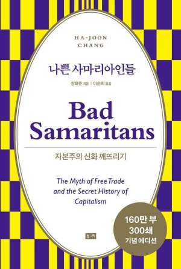

+++
title = '[책임진담] 세계화에도 정답이 없는데 인생에 정답이 있을 리가'
date = 2024-03-15T23:46:05+09:00
categories = ["문화"]
tags = ["문화"]
keywords = ["나쁜 사마리아인들", "신자유주의", "세계화"]
description = "‘영국과 미국은 자유 무역의 발상지가 아니’라며 일반적인 통념을 뒤엎고 시작하는『나쁜 사마리아인들』은 편협했던 시각에 거센 일격을 가한다. 작가는 대중이 굳게 믿고 있는 소위 ‘세계화의 근간’이 얼마나 부분적인 진실에 불과한 것인지 비판하며 이론을 위해 입맛대로 역사를 끼워맞출 때의"
thumbnail = "1.jpg"
creator = "김지현 선임기자"
draft = false
+++

<figure>
  
  <figcaption>『나쁜 사마리아인들(리커버)』(장하준, 2023) 표지. 부키 제공</figcaption>
</figure>

‘영국과 미국은 자유 무역의 발상지가 아니’라며 일반적인 통념을 뒤엎고 시작하는『나쁜 사마리아인들』은 편협했던 시각에 거센 일격을 가한다. 작가는 대중이 굳게 믿고 있는 소위 ‘세계화의 근간’이 얼마나 부분적인 진실에 불과한 것인지 비판하며 이론을 위해 입맛대로 역사를 끼워맞출 때의 위험성을 경고한다. 한 마디로 풍부한 역사적 사실-앞서 말한 부분적 역사에 가려졌던-을 가지고 ‘주류’를 비틀며 새로운 시각을 제시한다. 이러한 이유만으로도『나쁜 사마리아인들』을 읽을 이유는 충분하다.

신자유주의는 번영을 가져올 수 있나? 이른바 ‘나쁜 사마리아인’들은 ‘성공한 경제가 번영하는 동안 입었던 옷을 입는 것’이 세계화 속에서 살아남는 유일한 대안이라고 말한다. 이에 작가는 반박하며 성공한 경제는 세계 경제로의 무조건적 통합이 아니라 선택과 전략을 통해 현재의 위치에 도달했다고 주장한다. 실제로 개도국이 선진국의 식민 지배로 정책 자율성을 박탈당했을 때보다 상대적으로 정책 자율성을 가졌던 ‘형편없던 옛날’에 국가적 성과는 더욱 도드라지기도 했다. 유일한 대안이라는 말이 무색하게도 세계화에 불가항력적인 것은 없다. 세계화의 주된 추진력은 기술의 발전이 아니라 결국 인간의 의지와 결정에 의해 작동한다.

저자가 하고 싶은 말은 선진국이 걸어간 길을 개도국에서 무조건적으로 따를 필요가 없다는 것이다. 한 선진국이 현재의 발전을 이룩하기까지 걸어간 길이 정답도 아니란 말이다. 이처럼 세계화에는 정답이 없다. 국가별로 국가의 상황, 환경 등에 맞춰 제각각인 정책이 필요하다. 큰 발전에는 시대적 흐름도 배제할 수 없다. 각 국가에 들어맞는 발전 방향과 계획을 수립할 때 성공적인 발전도 가능하다.

비슷한 맥락에서 우리네 인생을 떠올릴 수 있다. 서점에만 가도 성공한 이들의 이야기가 책으로 나와 있다. 물론 그들을 본받을 수 있다. 그러나 따라 할 필요는 없다. 각자의 삶이 있다. 저마다의 방식대로 살아가면 되는 거다. 인생은 ‘나의 정답’을 찾는 무수한 과정이라 재밌는 게 아닐까.

김지현 선임기자 likeblue@jindam.news

