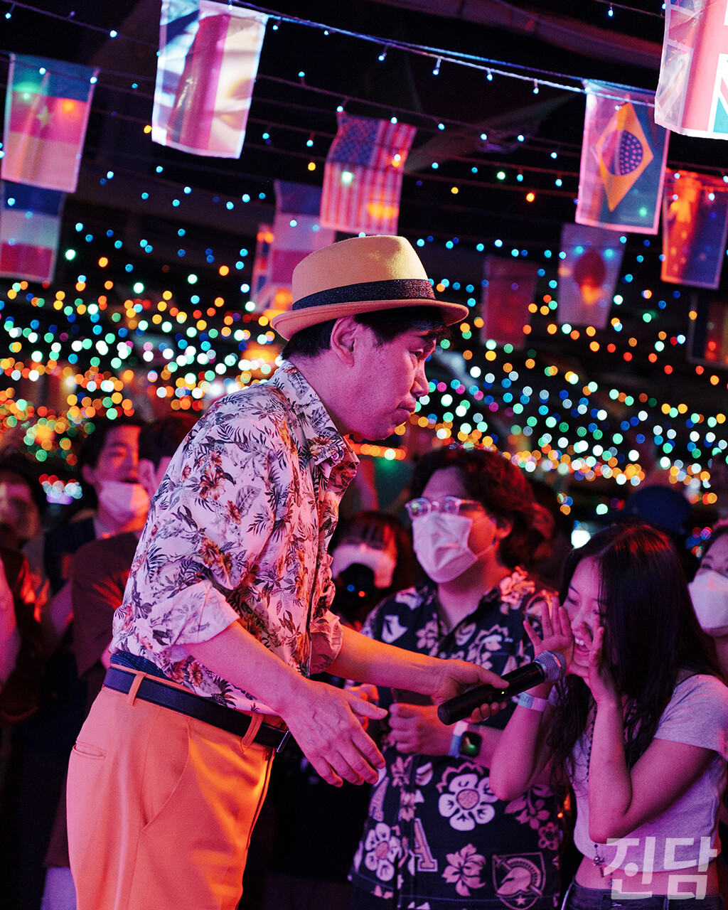
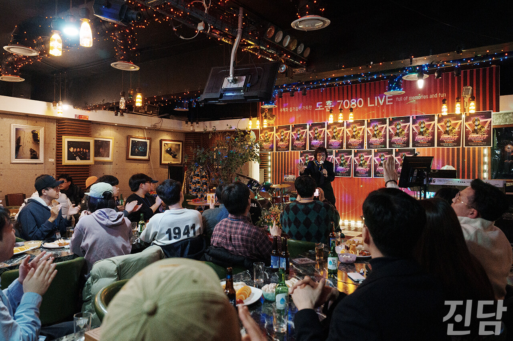
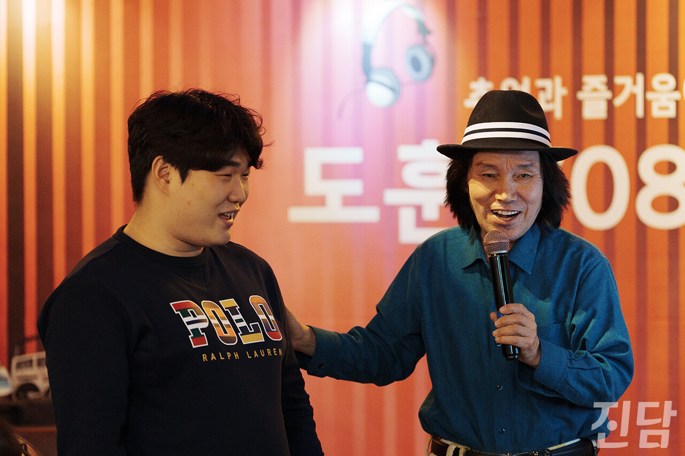
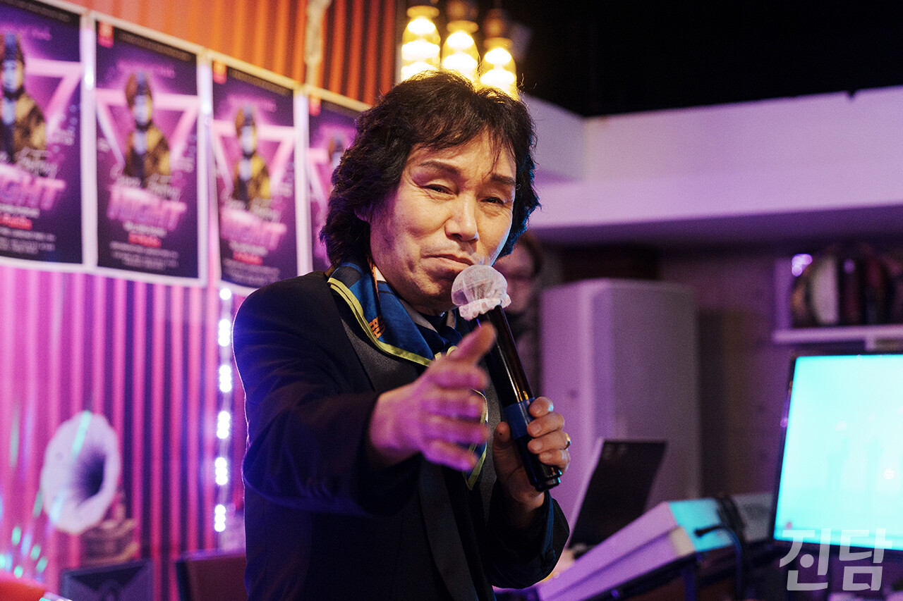

+++
title = '[취중진담] 뽕짝의 붐은 오는가'
date = 2024-03-15T23:46:05+09:00
categories = ["문화"]
tags = ["문화"]
keywords = ["뽕짝", "트로트", "이박사", "신바람 이박사", "250", "뽕", "음악", "취중진담"]
description = "“손가락질 받아도 언제나 뽕짝” - 이박사  中뽕짝이란 트로트를 낮추어 부르는 말로 시작된 속어다. 트로트 중에서도 주로 전자올겐(신디사이저)으로 연주되는 빠른 박자의 음악을 뽕짝이라 부른다. 고속도로 휴게소, 콜라텍, 관광버스 하면 떠오르는 바로 그 음악이다. 뽕짝은 ‘촌스럽다’며"
thumbnail = "1.jpg"
creator = "이종수 기자"
draft = false
+++

<figure>
  
  <figcaption>서울 종로의 콜라텍 '국일관'에서 열린 '퓨쳐관광메들리'에서 이박사가 공연하는 중 청년들이 호응하고 있다. 이종수 기자 rhiejongsu@jindam.news 2022.08.27</figcaption>
</figure>

“손가락질 받아도 언제나 뽕짝” - 이박사 <스페이스 판타지> 中

뽕짝이란 트로트를 낮추어 부르는 말로 시작된 속어다. 트로트 중에서도 주로 전자올겐(신디사이저)으로 연주되는 빠른 박자의 음악을 뽕짝이라 부른다. 고속도로 휴게소, 콜라텍, 관광버스 하면 떠오르는 바로 그 음악이다. 뽕짝은 ‘촌스럽다’며 청년들에게 외면 받아왔다.

이랬던 뽕짝을 청년들이 주목하고 있다. 그리고 그 중심엔 ‘신바람 이박사(69)’가 있다. <몽키매직>을 부른 웃긴 가수 정도로 알려졌던 이박사는 사실 원조 한류스타다. 그는 1995년 일본 소니 뮤직에 스카웃 되어 다음해 앨범 <뽕짝 대백과>를 발매했다. 일본 가수들에게 ‘꿈의 무대’로 불리는 부도칸(武道館)에서 데뷔 무대를 가졌다. 이박사는 컬트적인 인기를 얻으며 그해 일본에서 신인상을 받았다. <중앙일보>는 1996년 기사에서 ‘현재 일본에서 가장 인기 있는 한국 가수는 조용필도, 김연자도 아닌 이박사’라고 전했다.

이박사의 과거 행적과 앨범을 인터넷으로 뒤늦게 접한 청년들은 그를 재평가하기 시작했다. 오디션 프로그램 <트로트엑스>에 이박사가 참가자로 출연한 영상은 유튜브에서 조회수 571만 회(2월 25일 기준)를 기록했다. 댓글엔 “가우스를 평가하는 구몬 선생들”, “시대를 앞서간 천재”라는 반응이 주를 이뤘다.

뉴진스의 프로듀서로 알려진 250(본명 이호형)은 뽕짝을 재해석한 앨범 <뽕>을 제작하며 이박사를 찾아가 조언을 구했다. 수록곡 <사랑이야기>에는 이박사가 피처링으로 참여하기도 했다. 250은 <뽕>으로 한국대중음악상 4관왕을 석권해 화제를 모았다. 영국 일간지 <더 가디언>은 250과 이박사를 소개하며 뽕짝 혹은 뽕짝을 재해석한 콘텐츠가 한국의 새로운 수출 아이템이 될 가능성이 있다고 평했다.

2022년과 2023년, 서울 종로의 콜라텍 ‘국일관’에서는 뽕짝을 주제로 기획된 공연 <퓨쳐관광메들리>가 세 차례 열려 청년들이 몰렸다. 공연에는 이박사, 250을 비롯해 뽕짝과 관련된 다양한 뮤지션들이 출연했다. 지난 12월 열린 공연에 참석한 김상윤씨(27)는 “이박사의 공연은 놀라울 정도로 에너지가 가득했다”며 “뽕짝의 레트로, 빠른 템포 등의 특징이 청년들에게 매력적으로 다가오는 것 같다”고 관람 소감을 밝혔다.

<figure>
  
  <figcaption>이박사가 서울 동대문구 한 7080 라이브 카페에서 열린 팬미팅 현장에서 노래하고 있다. 이날 팬미팅에는 30명 이상의 인원이 참석했다. 이종수 기자 rhiejongsu@jindam.news 2024.02.23</figcaption>
</figure>

<figure>
  
  <figcaption>지난 11월 27일 서울 동대문구 한 7080 라이브 카페에서 이박사와 팬클럽 부회장 류승현씨가 팬미팅을 진행하고 있다. 이종수 기자 rhiejongsu@jindam.news 2023.11.27</figcaption>
</figure>

“부모님도 이해 못 해요” 20대 청년의 뽕짝 사랑···이박사 팬클럽 부회장 류승현씨 인터뷰

“부모님도 이해 못 해요” 20대 청년의 뽕짝 사랑···

이박사 팬클럽 부회장 류승현씨 인터뷰

청년들의 이박사 재평가는 지난해 팬클럽 창단으로 이어졌다. 운영진은 20·30대이며 회원은 고등학생부터 장년층까지 폭넓은 연령대로 이루어져 있다.

작년 11월과 지난 2월 서울 동대문구의 한 7080 라이브 카페에서는 이박사 팬미팅이 열렸다. 남녀노소가 어우러져 관광버스 춤을 추며 다같이 뽕짝을 떼창했다. 현장에서 이박사는 “저보다 젊은 여러분들이 있기에 앞으로도 열심히 활동해야 할 것 같다”고 소감을 밝혔다. <진담>은 두 번째 팬미팅을 앞둔 지난 2월 19일, 팬클럽 부회장 류승현씨(26)를 만나 이박사와 뽕짝에 대한 그의 생각을 들어봤다.

-자기 소개를 부탁한다.세대를 따지기 싫다만, 소위 말하는 'MZ세대'에 속해있다. 음악 듣는 것을 좋아하고, 잘 하지는 못하지만 음악을 한다. 이박사 팬클럽 부회장을 맡고 있으며 현재 한 언론사에서 인턴기자로 근무하고 있다.

-자기 소개를 부탁한다.

-이박사 팬클럽 창단 과정이 궁금하다.디시인사이드 이박사 갤러리라는 곳이 있는데, 이곳에 회장이 현재 팬클럽이 쓰는 오픈톡 링크를 올려뒀다. 그곳에 들어가 회장과 둘이서 시작했다.

-이박사 팬클럽 창단 과정이 궁금하다.

지난해 5월에 시작해서 11월까지 30명 규모가 됐는데, 이때서야 팬미팅을 주최하게 됐다. 이후로는 여러 회원들의 도움으로 이렇게 성장했다.

-팬클럽이 만들어진 것에 이박사님의 반응은 어땠나?처음 박사님(팬들은 이박사를 ‘박사님’으로 부른다.)에게 '팬클럽을 만들었고, 저는 부회장이다' 는 소식을 전했을 때, 박사님은 약간 시큰둥했다. 그래? 하고 마셨던 걸로 기억한다. 근데 20명을 모아서 팬미팅을 한다고 하니까 '얘들이 이제 진짜 뭘 하나 보네' 하는 느낌이셨다. 아마 그간 인생의 굴곡이 커서 믿기 어려우셨을지도 모르겠다.

-팬클럽이 만들어진 것에 이박사님의 반응은 어땠나?

지금은 두 번째 팬미팅을 앞두고 기대가 크신 걸로 알고 있다. 나한테 '몇 명 오는지 정확히 알려주면 내가 수건 몇 장 찍어 팬클럽에 돌리겠다'고 하시더라. 극구 사양하기는 했으나 감사할 따름이다.

-청소년부터 장년층까지 팬클럽의 연령대가 다양한데?박사님이 젊은 사람에게나 나이든 사람에게나 똑같은 이미지로 다가오기 때문인 것 같다. 바로 '웃기다'는 이미지다. 그 점 때문에 박사님의 음악이 고평가받지 못하긴 하지만, 세대를 아우를 수 있다는 것은 대단한 일이긴 하다. 어린이와 노인을 함께 웃기는 건 쉬운 일이 아니다.

-청소년부터 장년층까지 팬클럽의 연령대가 다양한데?

-첫 팬미팅을 성공적으로 마치고 두 번째 팬미팅을 앞두고 있는 소감은?솔직히 말하면 이제야 마음 맞는 사람들을 만나 반갑다. 지금 우리 부모님도 내가 박사님을 좋아하는 걸 이해 못 한다. 근데 팬클럽에는 나 말고도 박사님을 좋아하는 회원이 많다. 박사님의 노래 이야기를 할 때 답변이 돌아오는 게 반갑다. 가끔씩은 내가 모르는 것도 알아갈 때가 있다. 팬들이 아는 자신만의 명곡 공유할 때가 제일 좋았다.

-첫 팬미팅을 성공적으로 마치고 두 번째 팬미팅을 앞두고 있는 소감은?

물론 다른 유명 가수의 팬클럽처럼 스케줄에 맞춰 커피차를 보내고 하는 수준은 아니지만, 난 이 정도로도 크게 만족한다. 박사님도 만족하시는 것 같고.

-이박사 팬클럽의 활동 계획은?박사님이 신곡 <사우나>를 발매하시면서 새 소속사를 찾으셨다. 여름쯤에 깜짝 놀랄 만한 콜라보가 예정된 걸로 알고 있다. 거기에 맞춰 팬클럽도 뛰어야 할 것 같다. 우선 이런 행사를 1~2달에 한번씩 주최해서 팬들한테 '팬클럽 가입하면 이런 게 있구나' 하는 인상을 주고 싶다. 포토카드나 굿즈 같은 것도 만들어서 돌릴 계획이다. 그리고 박사님이 팬클럽 회원에게만 우선적으로 곡을 공개하는 방식도 생각해보자고 하셨다.

-이박사 팬클럽의 활동 계획은?

그리고 박사님이 방송이라도 출연하면, 우리가 다같이 가서 박사님 응원해드리는 그림도 좋을 것 같고.

-여러 청년들이 뽕짝에 열광하는 이유는 무엇일까?나훈아가 <월간조선>이랑 인터뷰할때 말한 게 있는데, 사람들이 자동차를 타고 다니다 보니 자동차 속도에 맞게 빠른 리듬의 노래를 찾는다고 하더라. 그 외에도 사람들이 점점 도파민에 중독되다 보니 뽕짝에 열광하게 된 거 아닌가 싶다. 난 뽕짝 플레이리스트가 있는데 원곡을 뽕짝으로 리믹스해둔 걸 들으면 웃기기도 하고 신나기도 하고 복합적인 감정이 든다.

-여러 청년들이 뽕짝에 열광하는 이유는 무엇일까?

그리고 무엇보다 우리에게는 '뽕끼'가 있기 때문이다. 블랙핑크 노래에도 뽕끼가 있고, 동네에서 춤추는 아저씨에게도 있다. 우린 어렸을 때부터 뽕짝을 들으면서 살아왔고 뽕끼가 있을 수밖에 없다고 생각한다. 그것은 일종의 문화적 유전 같은 것이다.

-뽕짝이 최근 새로운 콘텐츠의 소재가 되는 이유는 무엇이라고 생각하나?애석하지만 주류 문화에서 뽕짝을 등장시키는 경우는 백이면 백 '웃겨서'다. 나 같은 경우 웨이브라는 OTT를 통해 박사님이 나온 방송을 모두 검색해 시청한 적이 있는데, 그곳에서도 박사님은 '웃긴 사람'으로만 나올 뿐이었다. 나 역시 박사님과 함께 제작한 뽕짝 곡을 학교 과제로 제출했었는데, 그 곡은 비웃음거리가 되었고 학점은 C+을 받았다.

-뽕짝이 최근 새로운 콘텐츠의 소재가 되는 이유는 무엇이라고 생각하나?

하지만 내가 뽕짝에 대한 관심을 기대하는 이유는, 뽕짝을 재해석해 한국대중음악상 4관왕이라는 업적을 이룬 250 같은 사람이 있기 때문이다. 뽕짝이 우리들에게 익숙하기 때문에 웃음의 소재로 삼고 싶고, 익숙하기 때문에 재해석하고 싶은 것이다.

-마지막으로 하고 싶은 말이 있다면?이 인터뷰를 봤다면 뽕짝을 웃기게 생각하는 것에 대해 약간의 죄의식을 느낄 수도 있을 텐데, 그럴 필요 없다. 박사님이 내게 해주셨던 말씀이 있다. '공연하고 즐겼는데 웃겼건 진지했건 무슨 상관이냐.'

-마지막으로 하고 싶은 말이 있다면?

뽕짝은 마당놀이, 판소리 같은 우리의 거리예술이다. 해학과 익살이 있을 수밖에 없다고 생각한다. 다만 뽕짝이 하찮은 예술로만 평가받지 않았으면 한다. 조금 더 여러 분야에서 뜰 수 있고 붐이 올 수 있다면 좋겠다.

글·사진=이종수 기자 rhiejongsu@jindam.news

<figure>
  
  <figcaption>이박사가 서울 동대문구의 한 7080 라이브 카페에서 열린 팬미팅 현장에서 노래하고 있다. 이종수 기자 rhiejongsu@jindam.news 2024.02.23</figcaption>
</figure>

