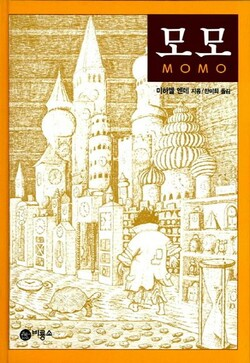

+++
title = '[책임진담] 공허한 교류에서 벗어나라'
date = 2024-03-12T21:26:08+09:00
categories = ["문화"]
tags = ["문화"]
keywords = ["모모", "미하엘 엔데", "책임진담", "인터넷"]
description = "독자 여러분, 인터넷 자주 쓰시나요 ?한국지능정보사회진흥원의 2022년 통계에 따르면, 대한민국 인터넷 사용자는 평균 주 22.1시간 동안 인터넷을 쓴다고 합니다. 1주일 중 하루를 꼬박 인터넷을 하며 지내는 셈이죠.저 역시 많은 시간을 인터넷 사용에 투자하고 있죠. 가끔은 인터넷에"
thumbnail = "1.jpg"
creator = "문준빈 기자"
draft = false
+++

<figure>
  
  <figcaption>『모모』 (미하엘 엔데·1973) 표지. 비룡소 제공</figcaption>
</figure>

한국지능정보사회진흥원의 2022년 통계에 따르면, 대한민국 인터넷 사용자는 평균 주 22.1시간 동안 인터넷을 쓴다고 합니다. 1주일 중 하루를 꼬박 인터넷을 하며 지내는 셈이죠.

저 역시 많은 시간을 인터넷 사용에 투자하고 있죠. 가끔은 인터넷에 너무 몰두한 나머지 주변인과의 관계는 뒷전이 되곤 합니다. 예시를 들어볼까요. 밥을 먹을 땐 밥에 집중하라는 어머니의 호통에도 아랑곳 않고 스마트폰을 사용했던 적은 물론, 친구들과 만나서도 하루 종일 스마트폰 화면만 붙잡고 있기도 했죠. 인터넷 세상에 시간을 빼앗겨 현실의 교류를 소홀히 하는 모습, 마치 소설 『모모』에 등장하는 주민 같습니다.

『모모』속 등장인물들은 어느 날부턴가 시간 절약에 집착하기 시작합니다. 이들은 더 효율적으로 행동하고, 더 많은 것을 가져야 한다는 강박에 빠져 타인과의 교류를 거부하게 됐죠. 화목했던 마을 전체가 상호작용을 혐오하는 단절상태에 이르게 됩니다. 마을 주민들은 절약에 광적으로 집착하며 더 큰 부, 지위를 이뤄가고 있다고 생각하죠. 하지만 실상은 달랐습니다. 악역 ‘회색 신사’들이 주민들의 ‘행복한 시간’을 훔쳐 가고 있었습니다. 삭막한 시간 속에서 주민들은 갈수록 불행해져 갔습니다.

기술의 발전에 따라 우리는 점점 더 많은 이와 교류합니다. 지구 건너편에 위치한 사람들과도 소통할 수 있습니다. 하지만, 정작 바로 우리 옆의 현실과는 점점 단절되고 있는 건 아닐까요. 인터넷은 마치 ‘회색 신사’처럼 행복한 시간을 앗아가고 있습니다. 물론 인터넷, 나아가 커뮤니티에서의 교류가 즐거울 수 있죠. 하지만 이는 실체가 없는 공허한 교류에 불과합니다.

인터넷을 이용하지 말자는 것은 당연히 아닙니다. 기자 또한 인터넷에 꽤 많은 시간을 쏟아 붇고 있죠. 단지 회색 신사가 우리의 행복한 시간을 앗아가지 못하도록, 현실에서의 교류를 우선시할 필요가 있습니다.

문준빈 기자 moonready@jindam.news

