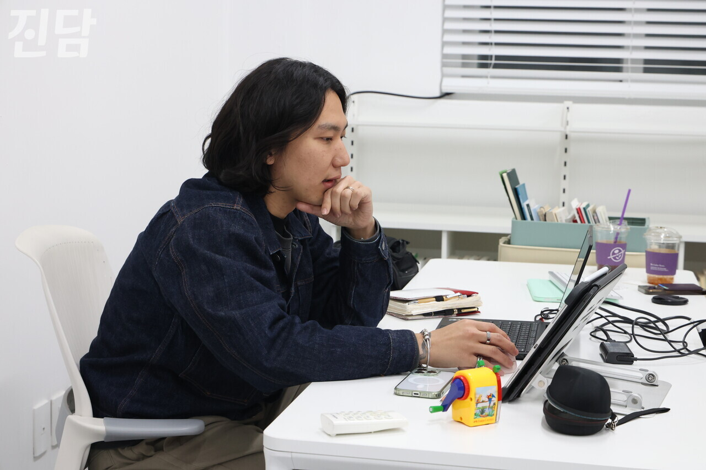
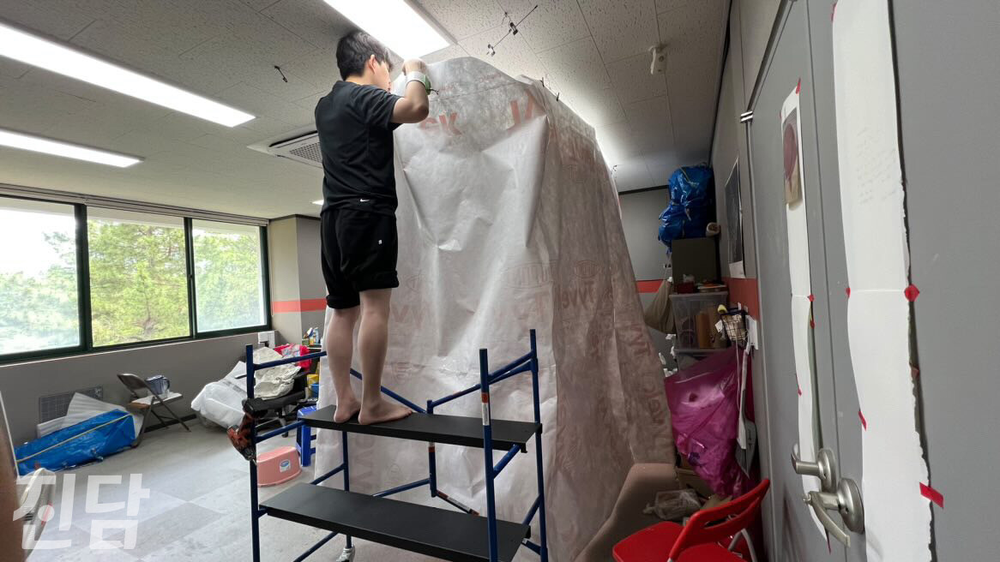
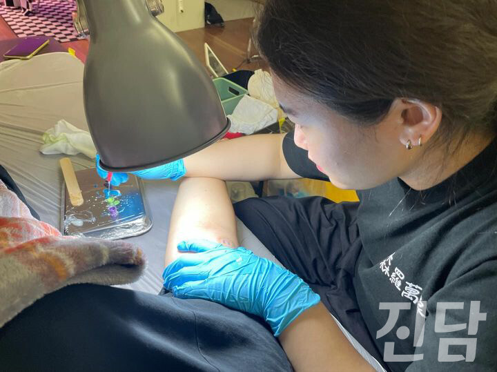
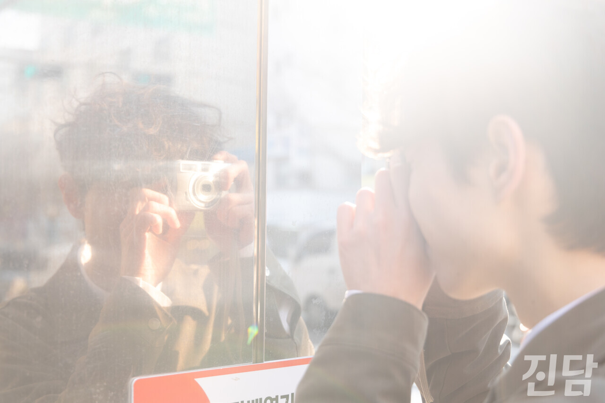

+++
title = "'그래도' 라는 예술이 있다."
date = 2024-03-11T21:03:31+09:00
categories = ["문화"]
tags = ["문화"]
keywords = ["예술가", "작가", "타투이스트", "배우", "공예가", "이수진", "최도혁", "김문기", "최지인", "시인"]
description = "‘배고픈 직업’.많은 이들이 예술가를 바라보는 시선이다. 문화체육관광부의 2021 예술인 실태조사에 따르면 예술인 연평균 수입은 2014년 기준 1,255만 원, 2017년 기준 1,281만 원이었다. 팬데믹을 겪었던 2020년엔 695만 원이었다. 나날이 높아지는 물가, 그리고 물가"
thumbnail = "1.jpg"
creator = "이진숙 기자"
draft = false
+++

**코로나 이후 반토막으로 급감한 예술인의 연평균 수입 
예술가로 생계 유지하려면 'N잡러' 돼야··· 
정부, 예술가의 독립된 활동 보장해야**

 

‘배고픈 직업’.

많은 이들이 예술가를 바라보는 시선이다. 문화체육관광부의 2021 예술인 실태조사에 따르면 예술인 연평균 수입은 2014년 기준 1,255만 원, 2017년 기준 1,281만 원이었다. 팬데믹을 겪었던 2020년엔 695만 원이었다. 나날이 높아지는 물가, 그리고 물가 상승은 반영될 리 없는 수입. 미래의 포만감을 확신할 수 없음에도, 그럼에도 예술을 하는 이들이 있다. 연기, 문학 등 다양한 분야에서 활동하는 생계형 예술가 4명을 만나봤다.

<figure>
  
  <figcaption>지난 1월 23일 경기 파주 작업실에서 최지인 시인을 만났다. 이진숙 기자 newjinsook@jindam.news 2024.01.23</figcaption>
</figure>

예술이 생업이 됐을 때··· 'N잡러' 된 예술가들

2022년 이수진씨는 학교를 다니며 타투 작업을 했다. 타투로 벌어들인 수입만으로 생계를 유지하기는 힘들어 학업과 카페 아르바이트를 병행하며 작업실 월세를 감당했다. 약 2년이 지났지만 수진씨의 경제적 어려움은 여전하다. “고정적으로 사용하고 있는 작업실이 없다 보니 시술 예약이 들어와야 그 작업실을 다시 이용할 수 있어요. 예약이 들어와 수익이 생겨도 월세를 부담하기에는 모자랄 때도 있죠.”

최도혁씨는 연기와 무용을 병행하고 있다. 연기 특성상 활동이 고정적이지 않아 빈 시간에 일일 알바를 하며 생계를 유지한다. “꾸준히 월급이 들어오는 게 아니라는 점이 고민이예요. 운이 좋아서 작업을 시작한다고 해도, 그 이후에 잡힌 일정이 없어서 다음 작업을 기다리는 동안 어떤 일을 해야 할지 항상 고민할 수밖에 없어요.”

공예가 김문기씨도 생계를 유지하기 위해 ‘N잡러’를 자처한다. 개인 작업뿐만 아니라 대학 강의, 미술 교육 등 생계를 위한 활동을 병행하며 예술활동을 이어가는 중이다. 그는 경제적 어려움에 노출되기 쉬운 예술가의 현실을 지적했다. “대단한 창작물이 재화로 변환되는 과정은 매우 복잡하죠. 예술가의 전반적 현실은 비루한 것 같아요.”

<figure>
  
  <figcaption>김문기 작가가 개인 작업실에서 테이프로 작품제작을 하고 있다. 김문기 제공</figcaption>
</figure>

그럼에도 불구하고 그들의 예술이 계속되는 이유

예술가는 누구보다도 예술계의 어려운 현실과 문제를 잘 알고 있다. 그럼에도 그들이 예술을 놓지 않는 이유는 무엇일까. 수진씨는 본인의 그림을 타인의 몸에 새기는 것을 매력으로 꼽았다. 그의 타투는 점자와 한자 등을 이용하는 것이 특징이다. 수진씨는 타투의 ‘시차’도 언급했다. “그 당시 담았던 타투의 의미가 시간이 흐르면 또 다른 의미를 만들어내요. 비록 그림이지만 그 때의 제 생각이나 의도가 담겨 있다는 게 나중에 봤을 때는 제 가치관이 기록되는 거 같아 의미가 더 깊어지죠.”

도혁씨는 연기가 가장 재밌다. “(후회한 적은) 단호하게 없어요. 전 그런 생각이 들면 안 할 것 같거든요. 연기에 흥미를 느낀다는 것 자체가 제가 놓을 수 없는 이유죠. 그리고 아직 너무 신인이라서요." 최지인 시인은 이 질문은 곧 ‘왜 사는가’라는 질문과 같다고 답했다. 삶이 곧 예술이기에 따로 동기에 대해 생각하지 않았기 때문이다. 최 시인은 그저 삶을 살아가려는 관성처럼 시를 쓴 것이다. “누구나 좋은 삶을 살고 싶은 것처럼 시인 또한 좋은 시를 쓰고, 좋은 문학을 하고 싶은 거죠.”

<figure>
  
  <figcaption>이수진 타투이스트가 2022년 공유 작업실에서 타투 작업을 하고 있다. 이수진 제공</figcaption>
</figure>

그들의 예술이 계속되기 위해서는

그들에게 필요한 건 예술가들은 정부 및 지자체의 지원 정책의 중요성을 강조했다. 최도혁씨는 더 많은 지원 기회와 정책에 대한 접근성 향상을 원했다. 작년 문체부에서는 ‘제1차 예술인 복지 정책 기본계획(2023~2027)을 발표했다. 문화부는 창작준비금 대상은 22년 대비 2,000명이 늘어난 총 2만 3천 명으로 확대됐다. 그러나 정부 등 국가 기관에서 지원하는 정책인 만큼 예술 행위의 변질을 우려하는 목소리도 있었다. ‘국가가 원하는’ 예술에 맞춘 작업이 될 수도 있다는 말이다. 김문기 공예가는 “국가 기금으로부터 독립할 수 있는 환경으로의 투자도 필요하다”고 말했다. 지원 정책의 잦은 변화도 문제로 언급됐다. 최지인 시인은 “2,3년이 넘는 긴 호흡의 작업도 있는데 1년마다 바뀌는 정책도 있다”며 “단발성 지원 사업은 큰 작업을 하기엔 한계가 있을 수밖에 없다”고 했다.

이진숙 기자 newjinsook@jindam.news

<figure>
  
  <figcaption>최도혁 배우가 1월 26일 서울 중구에서  ‘진담’과 인터뷰 후 카메라를 들고 포즈를 취하고 있다. 이진숙 기자 newjinsook@jindam.news 2024.01.26</figcaption>
</figure>

