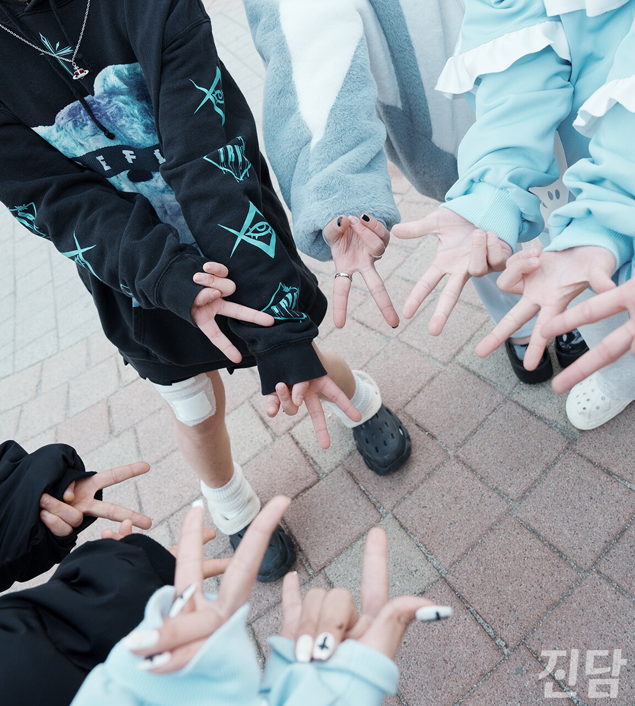
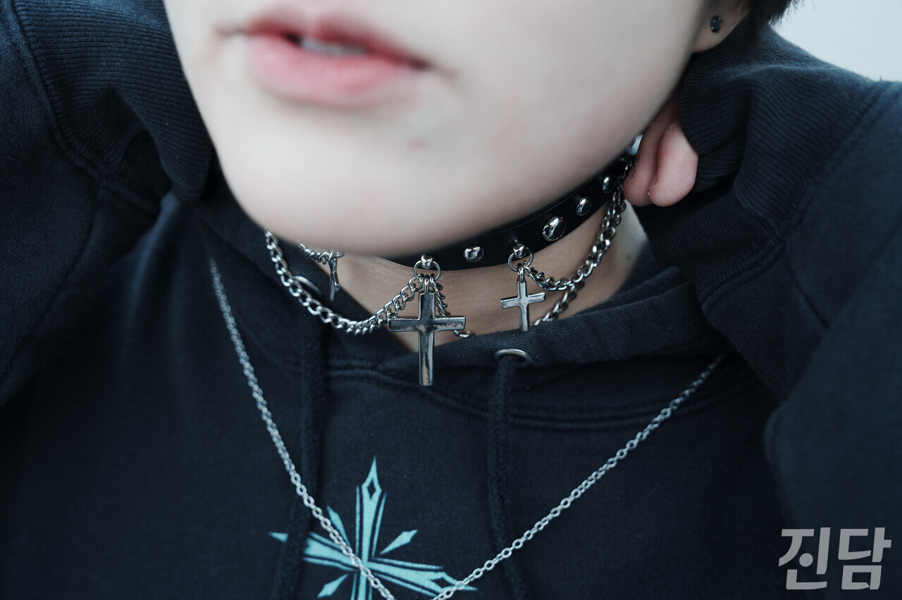
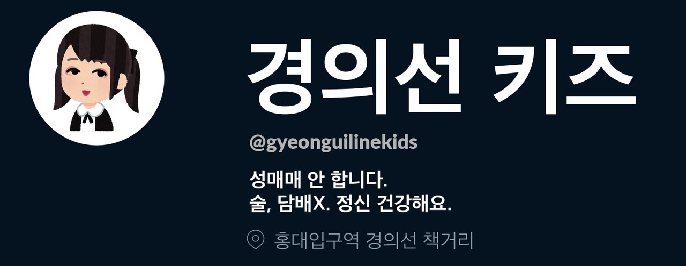
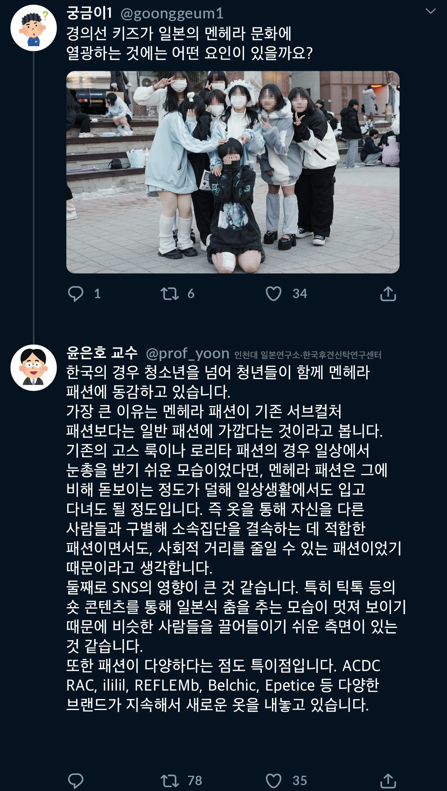
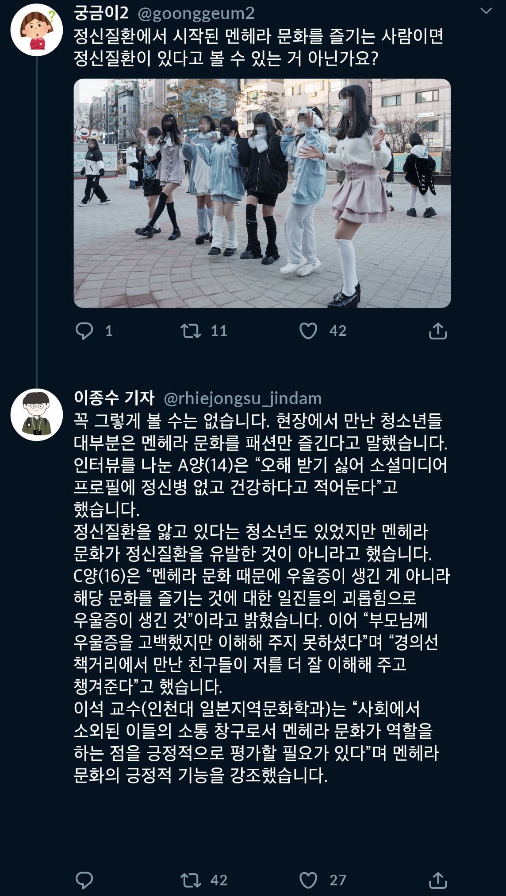
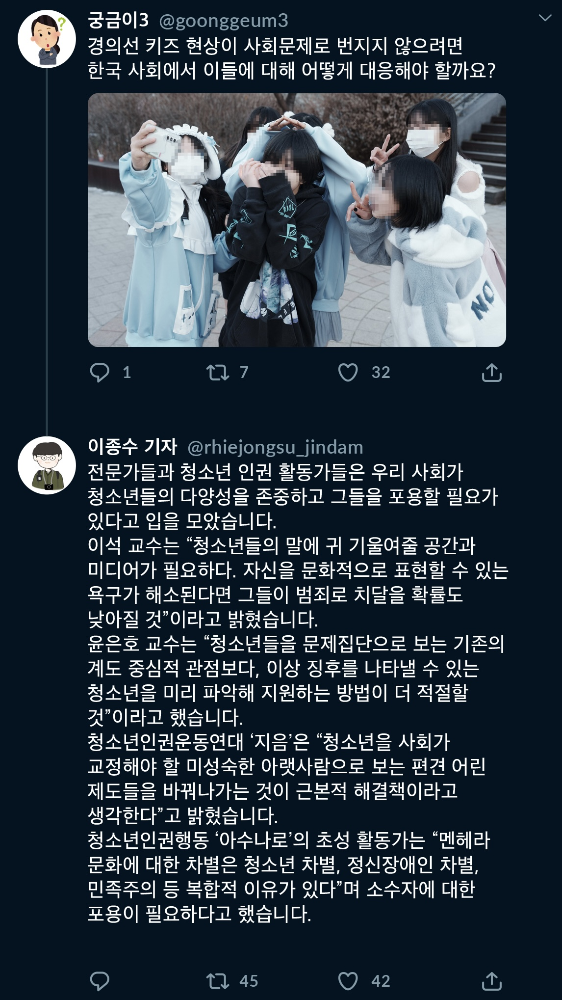
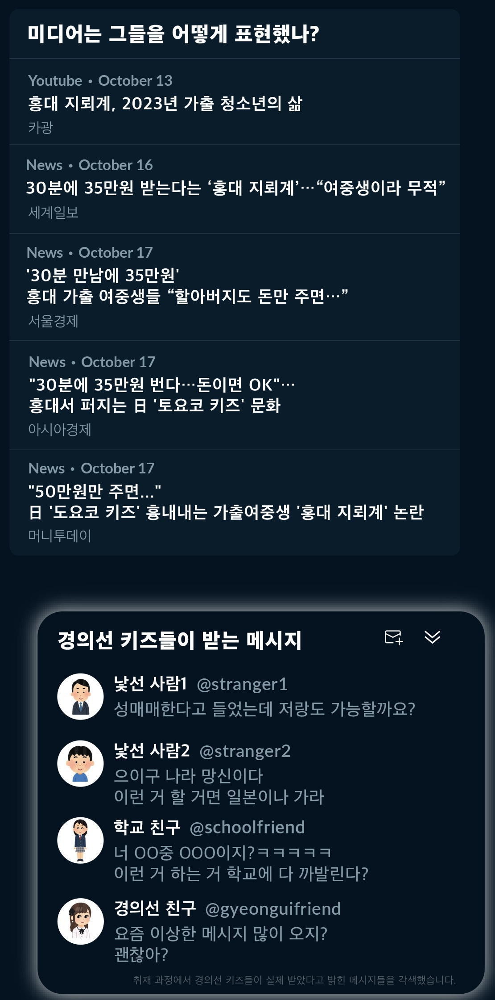

+++
title = '[취중진담] 미디어가 만든 ‘경의선키즈=문제아’ 프레임'
date = 2024-03-11T04:10:02+09:00
categories = ["문화"]
tags = ["문화"]
keywords = ["경의선키즈", "경의선책거리", "멘헤라공원", "멘헤라", "토요코키즈", "서브컬처", "일본", "홍대", "지뢰계", "청소년"]
description = "서울 홍대입구역 앞 경의선책거리는 온라인에서 다른 이름으로도 불린다. ‘멘헤라공원’이다. ‘멘헤라’란 일본 인터넷 신조어로 '정신질환이나 우울증을 앓는 사람'을 뜻한다. 단어 등장 후 멘헤라를 자처하는 청소년들이 자기 심리와 어울리는 패션·화장·음악을 즐기며, 단어를 넘어 문화로 자리"
thumbnail = "1.jpg"
creator = "이종수 기자"
draft = false
+++

**홍대 인근에서 서브컬처 즐기는 청소년들··· 자극적 보도에 피해 호소**

<figure>
  
  <figcaption>1월 13일 경의선 키즈 6명이 일본 패션 문화에서 비롯된 ‘갸루피스’ 포즈를 취하고 있다. 이종수 기자 rhiejongsu@jindam.news 2024.01.13</figcaption>
</figure>

서울 홍대입구역 앞 경의선책거리는 온라인에서 다른 이름으로도 불린다. ‘멘헤라공원’이다. ‘멘헤라’란 일본 인터넷 신조어로 '정신질환이나 우울증을 앓는 사람'을 뜻한다. 단어 등장 후 멘헤라를 자처하는 청소년들이 자기 심리와 어울리는 패션·화장·음악을 즐기며, 단어를 넘어 문화로 자리 잡았다. 경의선책거리에는 멘헤라 문화를 즐기는 청소년들이 모인다. 그러나 다수의 미디어는 이들을 문제아 취급하고 있다.

이들은 '경의선 키즈'라 불리는데, 이 단어는 일본 유흥가 가부키초의 토호시네마 근처서 멘헤라 문화를 즐기는 '토요코 키즈'에 빗대어 만들어졌다. 일부 토요코 키즈는 노숙·성매매·가출·고성방가·패싸움 등 사회적 문제에 연루됐다. 그러나 경의선 키즈가 이들처럼 사회적 문제를 야기한다고 보는 건 지나친 일반화의 오류다. 윤은호 교수(인천대 일본연구소·한국후견신탁연구센터)는 일본선 멘헤라 정체성을 지닌 청소년들이 모여 자신들을 집단으로 드러내고자 멘헤라 패션을 추구했는데, 한국선 멘헤라 패션에 관심 있는 불특정 다수가 모여 경의선 키즈가 됐다며 한국과 일본의 차이를 설명했다. 이석 교수(인천대 일본지역문화학과)는 "경의선 키즈는 토요코 키즈에 비해 훨씬 범죄에 덜 노출돼 있고 가출 청소년이나 비행 청소년 비율도 적다고 생각한다"며 "그저 서브컬처를 즐기고 싶어 홍대에 오게 돼 경의선 키즈가 되는 경우도 많은 것으로 안다"고 밝혔다.

경의선 키즈가 본격적으로 입방아에 오른 것은 2023년 10월 경이었다. 유튜버 '카광'의 영상에는 경의선 책거리에 있는 청소년 두 명과의 인터뷰가 담겼다. 그들은 가출 경험이 있고, 조건만남을 하고 있다고 밝혔다. 그 영상이 화제가 된 후 여러 언론은 경의선 키즈를 자극적인 키워드와 연관 지으며 앞다퉈 보도하기 시작했다.

<figure>
  
  <figcaption>1월 13일 한 경의선키즈가 멘헤라 복장을 하고 있다. 멘헤라 패션 중 ‘지뢰계’는 십자가 등 고딕 양식의 모티브와 어두운 계열의 색이 주로 사용된다. 이종수 기자 rhiejongsu@jindam.news 2024.01.13</figcaption>
</figure>

<진담>은 두 청소년 사례가 전체 경의선 키즈를 대표할 수 있는지 의문이 들었다. 이에 지난 1월 13일 오후 4시 경의선책거리를 찾았다. 20명 이상의 청소년이 눈에 띄는 복장을 하고 모여 있었다. 그들은 같이 음악에 맞춰 춤추거나 대화하며 시간을 보내고 있었다.

현장에 있던 경의선 키즈 중 6명과 인터뷰했다. 그들은 미디어로 잘못된 인식이 퍼졌다고 했다. 중학생 A양(14)은 “뉴스서 경의선 키즈를 자극적으로 나타내서 조건만남 하는 애로 만들어버렸다”며 “영상 속 두 명만 그런 것을 모두가 그랬단 식으로 하니까 경의선 키즈를 경멸하는 눈빛이 생겼다"고 했다. 이어 "부모님이 뉴스 보고 걱정 많이 하셨다. 패션으로만 즐기는 거라 말씀드렸지만, 걱정이 많으시다"고 전했다.

중학생 B양(12)은 "한 친구가 내가 멘헤라 문화를 좋아한다는 걸 알게 됐다"며 "그 후 그에게 뭔가를 안 해주면, 다른 친구들한테 다 말한다고 협박했다"고 멘헤라 문화를 즐기는 게 약점이 됐던 사례를 전했다. 학교 밖 청소년 C양(16)은 “카광 영상 탓에 학교 애들에게 안 좋은 시선으로 비치게 돼 자퇴하게 됐다”며 미디어 보도가 자퇴의 결정적 원인이 되었다고 말했다.

자극적 보도에 보호 받지 못하는 청소년, 비주류 청소년은더 쉽게 문제아로 낙인 찍혀...

자극적 보도에 보호 받지 못하는 청소년, 비주류 청소년은

더 쉽게 문제아로 낙인 찍혀...

청소년인권행동 ‘아수나로’의 초성(활동명·17) 활동가는 경의선 키즈가 “언론 보도 후 소셜미디어로 성매매 제안 메시지가 온 것을 직접 보여준 적이 꽤 있었다”고 피해를 목격한 경험을 말했다. 청소년인권운동연대 '지음'은 "청소년은 비청소년에 비해 정치적 권리·발언권이 제한되는 경우가 많다. 또 청소년을 대상화하는 보도가 이뤄질 때 항의할 수 있는 사회적 세력화 또한 돼있지 않아, 더 쉽게 자극적 소재로 활용하기 쉬워진다고 생각한다"는 의견을 냈다.

비주류 서브컬처가 빈약한 한국 사회에서 경의선 키즈는풀어야 할 숙제가 아닌 경색된 사회를 푸는 새로운 가능성이 될 수도- 이석교수(인천대)

이석 교수는 “현재 언론서 경의선 키즈 이야기를 일종의 정신질환과 관련지어 지나치게 자극적으로 다루고 있다. 문제가 심각하다고 느낀다”고 언론 보도에 우려를 표하며 "멘헤라 문화는 비주류 문화로써 당연히 존중받아야 한다. 그런데 이를 품어줄 역량이 사회에 없다 보니 이들을 "이해할 수 없는 이상한 사람들"이나 "범죄자가 될 가능성이 있는 문제아"로서 쉽게 낙인찍어 버리는 것이다. 이런 사회 분위기가 조성되면 경의선 키즈뿐 아니라 주류와 조금만 다른 생각을 하고 싶어 하는 사람들도 자기 검열에 빠져서 새로운 문화도 나타나기 어려워진다. 이는 정말 위험한 사회 분위기라 생각한다"고 밝혔다.

<figure>
  
  <figcaption></figcaption>
</figure>

<figure>
  
  <figcaption></figcaption>
</figure>

<figure>
  
  <figcaption></figcaption>
</figure>

<figure>
  
  <figcaption></figcaption>
</figure>

<figure>
  
  <figcaption></figcaption>
</figure>

글·사진=이종수 기자 rhiejongsu@jindam.news디자인=조연수 디자이너 jsworking@jindam.news

