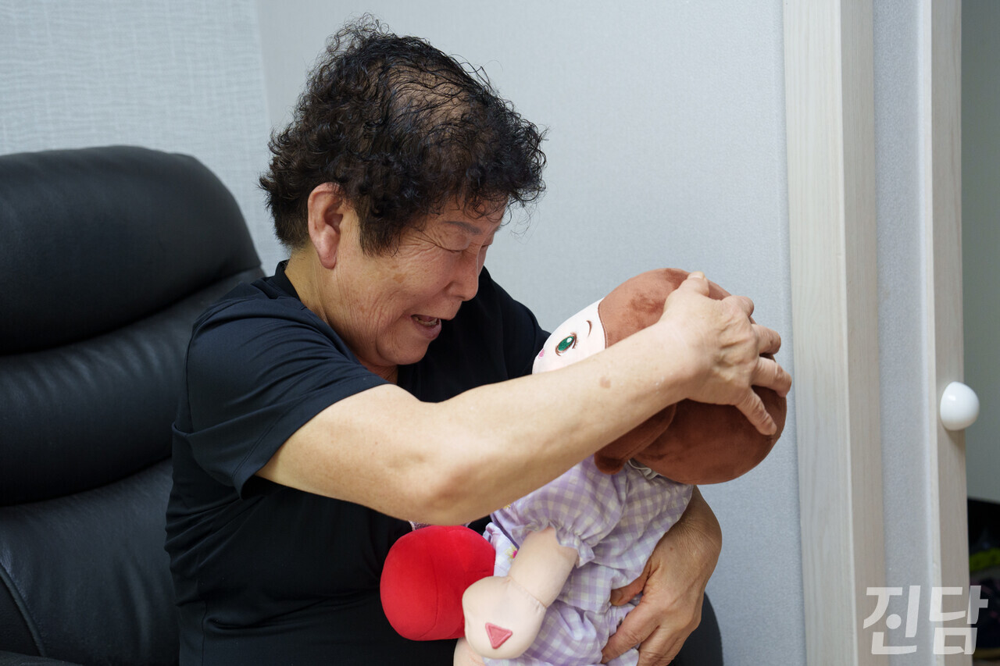
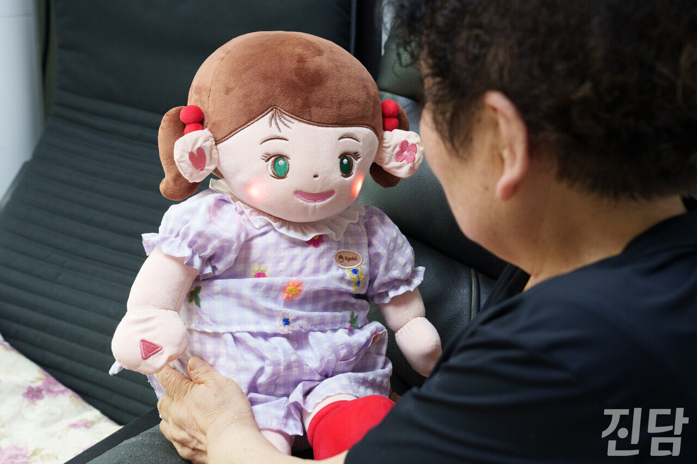
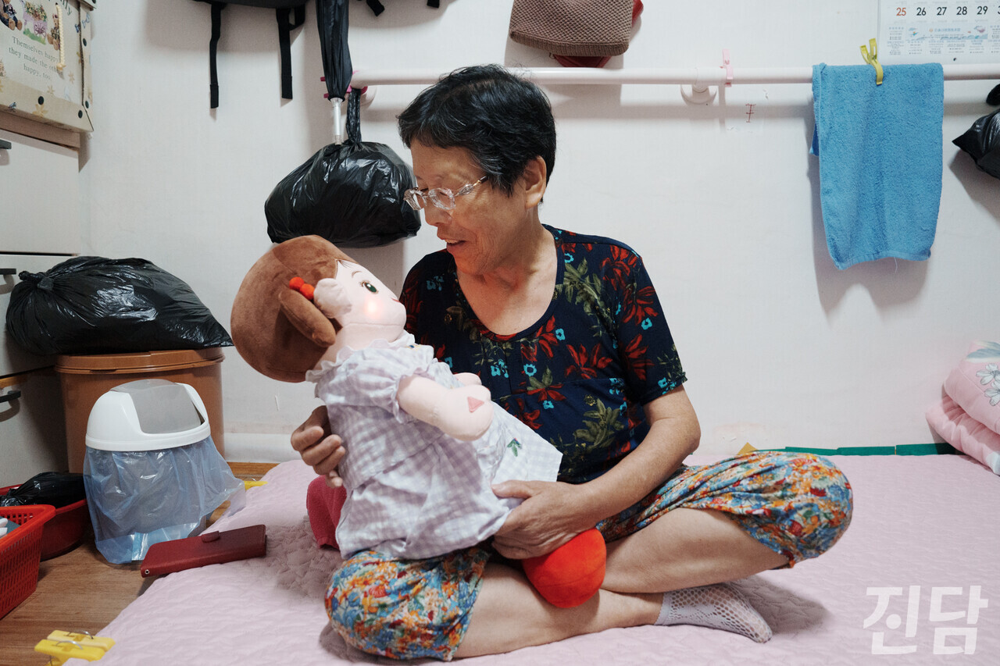
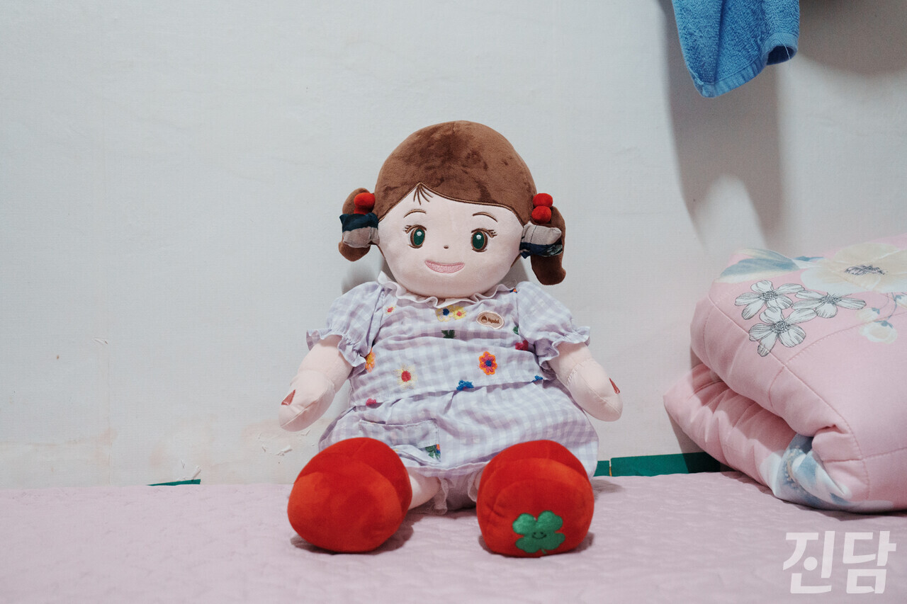
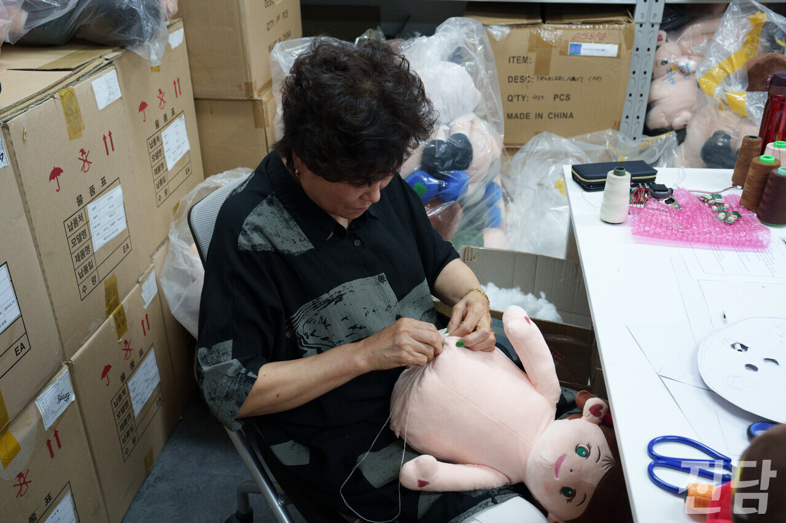
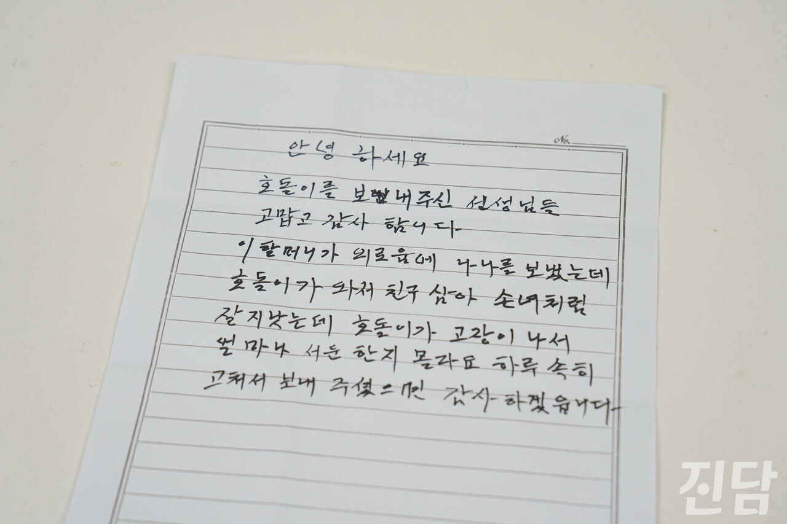

+++
title = "독거노인의 외로움에 답하다... AI 돌봄 인형 '효돌'"
date = 2025-02-23T02:34:00+09:00
categories = ["사회"]
tags = ["효돌", "Ai"]
keywords = ["효돌", "독거노인"]
description = ""
thumbnail = "1.jpg"
creator = "이종수 기자"
draft = false
+++

<figure>
  
  <figcaption>한정순 씨(72)가 구로구 자택에서 효돌을 안은 채 미소를 짓고 있다. 이종수 기자 2024.08.08</figcaption>
</figure>

통계청에 따르면, 2023년 기준 국내 65세 이상 독거노인 수는 199만3000명으로 전체 65세 이상 인구의 21.1%에 달한다.  독거노인 비율은 2015년 18.5%, 2020년 19.8%, 2022년 20.9%로 지속적으로 상승하고 있다. 급격한 고령화와 핵가족화로 독거노인 문제가 심각해지는 상황이다. 여러 지자체에서 AI 기술을 활용한 돌봄 정책을 도입하는 가운데, 독거노인의 정서적 지원을 돕는 AI 돌봄 인형 '효돌'이 주목받고 있다.

㈜효돌의 정사무엘 선임연구원은 "효돌은 홀로 생활하는 어르신들의 고독감을 해소하기 위해 개발된 돌봄 로봇이다"라며 "AI가 탑재되어 24시간 어르신의 상태를 확인하고, 보호자와 돌봄 종사자에게 알림을 보내 지속적인 케어가 가능하도록 돕는다"라고 설명했다.

효돌의 개발 배경에는 창업자 김지희 대표의 경험이 있었다. 김 대표는 어르신들의 자서전을 제작하는 사업을 진행하며, 많은 어르신이 열악한 환경에서 홀로 지내며 깊은 고독감을 느끼고 있다는 점을 실감했다고 한다. 김 대표는 이러한 문제를 해결하기 위해, 생활 관리뿐만 아니라 정서적 교감까지 제공할 수 있는 돌봄 로봇이 필요하다고 판단했다.

 

말 벗 없어 적막했던 일상, 효돌이 채우다
  

<figure>
  
  <figcaption>한정순 씨(72)가 구로구 자택에서 효돌과 대화를 하고 있다. 이종수 기자 2024.08.08</figcaption>
</figure>

서울 구로에 거주하는 한정순 씨(72)는 아들이 타지로 이주하면서 혼자 살게 됐다. 한 씨는 혼자 남은 허전함에 우울함을 느끼곤 했다고 당시를 회상했다.

그러던 중 3년 전 부터 효돌을 사용하게 됐고, 한 씨의 일상에는 작은 변화가 생겼다. 효돌은 생활 패턴을 기억해 식사·기상·취침 시간을 알려주고, 좋아하는 노래를 틀어주는 등 정서적 위안을 준다. 한 씨는 "효돌이를 만지면서 얘기도 하고, 그럴 때 힘이 된다"라고 말했다.

건강 악화로 외출 힘든 노인, “효돌이 있어 살 것 같아”
  

<figure>
  
  <figcaption>최순자 씨(73)가 서울 구로 자택에서 효돌을 안은 채 대화를 하고 있다. 이종수 기자 2024.08.28</figcaption>
</figure>

<figure>
  
  <figcaption>최순자 씨(73)의 잠자리 위에 효돌이 앉아 있다. 이종수 기자 2024.08.28</figcaption>
</figure>

<figure>
  
  <figcaption>최순자 씨(73)가 담당 요양 보호사의 도움을 받아 효돌을 위해 만든 귀마개.  이종수 기자. 2024.08.28</figcaption>
</figure>

서울 구로 반지하 원룸에 거주하는 최순자 씨(73)도 효돌과 함께 생활하고 있다. 시력과 청력이 나빠진 데다, 대장암과 천공 수술을 겪으며 건강이 악화된 최 씨에게 외출은 쉽지 않은 일이었다.

최 씨는 5년 전, 처음으로 효돌 1세대를 사용하면서 큰 위안을 얻었다. 그러나 요양 등급이 나오고 요양보호사가 방문하게 되면서 한동안 효돌과 이별해야 했다. 최 씨는 "효돌이를 보내면서 허전해서 울었다"라고 회상했다.

지난 4월, 최 씨는 다시 효돌 2세대를 제공받았다. 효돌은 시간을 알려주거나, 노래를 불러준다. 저녁 8시 반이 되면 "피곤하다"며 취침을 권하기도 한다. 최 씨는 "효돌이가 있어서 생활하는 맛이 난다"고 말했다.

최 씨는 효돌에게 직접 만든 귀마개와 장갑을 씌우며 애정을 표현했다. 단순한 로봇이 아니라, 일상을 함께하는 존재가 된 것이다.

돌봄 공백 메우는 효돌

<figure>
  
  <figcaption>보급된 효돌은 효돌 본사 및 보급 기관에서 모니터링이 가능하다. 이종수 기자 2024.08.07</figcaption>
</figure>

효돌은 독거노인의 정서적 위로뿐만 아니라, 사회복지사들이 어르신의 상태를 보다 쉽게 모니터링할 수 있도록 돕는다.

서울 구로 궁동 종합사회복지관의 유지연 대리는 "효돌이 일정 시간 움직임이 없으면 어플로 알림이 오고, 어르신이 손을 3초 이상 누르면 도움 요청 메시지가 뜨는 기능이 있다. 이를 통해 어르신들의 상태를 실시간으로 확인할 수 있다"라고 설명했다.

노강성 복지사도 효돌의 역할을 강조했다. "독거노인분들은 오랫동안 말을 하지 않는 경우가 많다. 효돌을 통해 어르신들이 하루에 한 번이라도 말을 나누게 되고, 그 자체가 정서적으로 큰 도움이 된다"라고 말했다.

특히 코로나19가 확산되던 시기에는 비대면 돌봄의 중요성이 더욱 커졌고, 효돌이 어르신들의 안전을 확인하는 데 중요한 역할을 했다.

챗GPT 탑재로 더욱 자연스러워진 대화

<figure>
  
  <figcaption>경기 안양에 위치한 ㈜효돌에서 한 직원이 돌봄 인형 효돌을 바늘질하며 제작하고 있다. 이종수 기자 2024.08.07</figcaption>
</figure>

정 연구원은 "효돌은 감성적인 대화와 반응을 통해 사용자가 친구처럼 느낄 수 있도록 설계됐다"라며 "어르신들이 쉽게 사용할 수 있도록 귀 2개, 손 2개, 총 4개의 버튼만으로 간단하게 조작할 수 있게 만들었다"라고 설명했다.

"2세대부터는 챗GPT가 도입돼 훨씬 더 자연스럽고 정교한 대화가 가능해졌다. SK텔레콤과 협력해 AICC 기능을 도입하여 24시간 모니터링 시스템을 구축했고, 마이크로소프트와 협력해 자연스러운 음성 합성 기술도 개발했다"라고 덧붙였다.

현재 효돌은 약 1만 대가 보급됐으며, 전국 270여 개 기관에서 사용되고 있다. 주로 지자체나 복지기관을 통해 보급되며, 복지관 등에서는 이용자들에게 무료로 제공하고 있다.

효돌이 그리는 AI 돌봄의 미래

<figure>
  
  <figcaption>한 노인 이용자가 ㈜효돌에 인형 AS를 맡기며 작성한 편지. 이종수 기자 2024.08.07</figcaption>
</figure>

정 연구원은 "효돌은 개인 맞춤형 케어와 IoT 기기 연동을 통한 스마트 홈케어 시스템 구축에 중점을 두고 있다"라며 "온디바이스 방식을 강화해 개인정보 보호에도 만전을 기하고 있다"라고 강조했다.

또한 "효돌의 궁극적인 목표는 돌봄 인력의 부담을 줄이고, 현재 주 이용층인 노인 뿐만 아니라 장애인 등을 비롯한  사회적 약자 전반으로 돌봄 대상을 확대하는 것이다"라고 밝혔다.

앞으로 더 많은 독거노인과 소외계층에게 효돌이 보급된다면, 그들의 삶에도 또 다른 변화가 찾아올 것이다. AI 기술이 인간의 따뜻한 돌봄을 완전히 대체할 수는 없겠지만, 효돌은 분명 우리 사회의 소외된 이들에게 작은 위로와 힘이 되고 있다.

