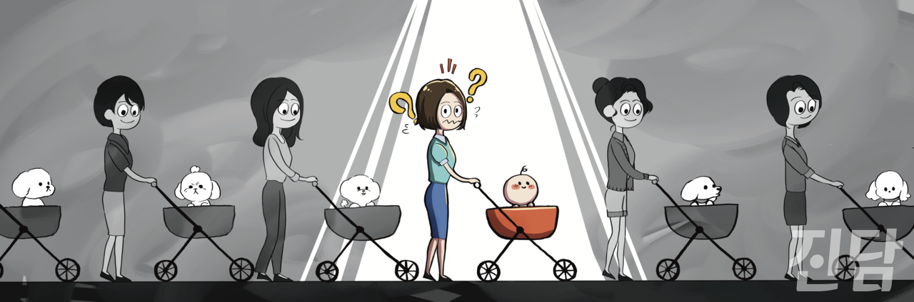

+++
title = '[오피니언] 함께 미는 유모차에 아기를 태우자'
date = 2024-03-21T16:14:59+09:00
categories = ["오피니언"]
tags = ["오피니언"]
keywords = ["저출생", "공동육아", "반려견", "개모차", "오피니언"]
description = "요즘엔 강아지가 탄 유모차, 일명 ‘개모차’를 거리에서 흔히 볼 수 있다. KB금융지주 경영연구소가 발표한 「2021 한국반려동물보고서」에 따르면 2020년도 말 기준 반려인은 1,448만명인 것으로 조사됐다. 국민 4명 중 1명 꼴로 동물을 반려하고 있는 셈이다.나도 반려인이다. 데"
thumbnail = "1.jpg"
creator = "김고원 기자"
draft = false
+++

<figure>
  
  <figcaption>요즈음 거리에는 아기를 태운 유모차 못지않게 반려견을 태운 '개모차'가 많이 보인다. 일러스트레이션=조연수 디자이너 jsworking@jindam.news</figcaption>
</figure>

요즘엔 강아지가 탄 유모차, 일명 ‘개모차’를 거리에서 흔히 볼 수 있다. KB금융지주 경영연구소가 발표한 「2021 한국반려동물보고서」에 따르면 2020년도 말 기준 반려인은 1,448만명인 것으로 조사됐다. 국민 4명 중 1명 꼴로 동물을 반려하고 있는 셈이다.

나도 반려인이다. 데리고 온 지 약 10개월이 된 시바견 유자는 우리 집의 막내 아들이다. 사납고 입질도 심해 곤란할 때도 많지만, 집에 올 때마다 반겨주며 혀를 내밀고 헤헤거리는 모습을 바라보고 있자니 그쯤은 아무것도 아니게 느껴진다. 내게도 ‘양육 본능’이 있는 것이 분명하다. 그래서 요즈음은 개모차를 끌고 다니는 사람들에게 동질감을 느낀다. 그들이 끄는 ‘개모차’ 또한 양육 본능에서 비롯된 것이 아닐까 하는 생각이 들기 때문이다.

이러한 감정을 나만 느끼는 것은 아니다. 많은 반려인들이 경험한다. 그들은 서로의 경험을 기꺼이 나누기도 한다. 초보 반려인인 우리 가족도 유자에 대해 알아가고자 인터넷에서 다른 반려인들의 도움을 받았다. 시바견을 키우는 견주들이 모인 카페에 가입해서 정보를 얻기도 하고 유튜브를 통해 강아지를 기르는 방식에 대해 공부하기도 했다. 반려견을 키운다는 교집합 하나만으로 반려인 여럿이 머리를 맞댄다는 사실은 놀랍다.

이처럼 양육 본능이 넘치는 사람들끼리 모여 육아를 함께 한다면 어떨까? 내가 공동 육아에 관심을 갖게 된 이유다. 현재 공동 육아 방식은 다양한 형태를 띠고 있다. ▲동네 이웃끼리 함께하는 공동육아 모임 ▲조합 결성으로 운영되는 공동육아 어린이집 ▲주민의 자발적인 마을 공동체가 각각 공동육아를 실천하고 있다.

서울 서초구 보육정책팀 김성희 팀장은 <연합뉴스>와의 인터뷰에서 “과거에는 부모가 자리를 비우면 조부모가 돌봄 공백을 채웠지만, 지금은 외동 자녀를 키우는 데에도 집에 양육자가 부족한 경우가 많다”고 지적한다. 공동육아는 이러한 돌봄 공백 문제의 대안이 될 수 있다. 김보영 교수(한양여대 아동보육과)는 양육자들이 공동체 안에서 서로 부족한 점을 채워주며 위로와 힘을 얻고 행복하게 양육한다면 저출생 문제도 자연스럽게 해결될 것이라고 말했다. ‘함께 미는’ 공동육아의 힘을 믿어보는 건 어떨까.

김고원 기자 gofirst@jindam.news

