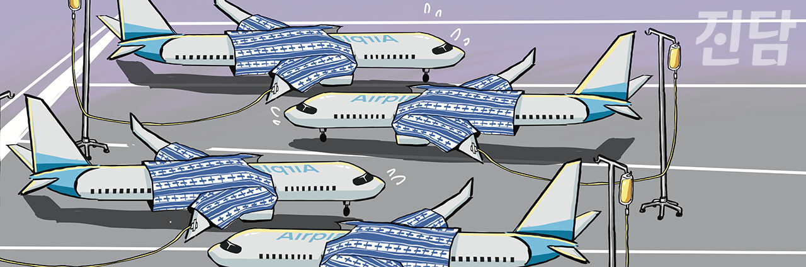

+++
title = '[오피니언] 최고의 전략 ‘원칙 지키기’'
date = 2024-03-16T10:25:19+09:00
categories = ["오피니언"]
tags = ["오피니언"]
keywords = ["보잉", "항공기", "비행기", "737맥스", "원칙", "737MAX"]
description = "전 세계 상업용 항공기 시장은 미국 보잉과 유럽 에어버스 두 회사가 양분하고 있습니다. 보잉은 1916년 창립됐고 에어버스는 그보다 54년 늦은 1970년 창립됐습니다. 그런데 요즘 실적을 보면 한참 후발주자인 에어버스가 더 잘 나갑니다. 에어버스는 지난해 2천 319대의 항공기를 확"
thumbnail = "1.jpg"
creator = "변준언 선임기자"
draft = false
+++

<figure>
  
  <figcaption>보잉 737 MAX가 기체결함으로 인해 운항중단돼 있는 모습을 재구성한 일러스트레이션. 일러스트레이션=조연수 디자이너 jsworking@jindam.news</figcaption>
</figure>

전 세계 상업용 항공기 시장은 미국 보잉과 유럽 에어버스 두 회사가 양분하고 있습니다. 보잉은 1916년 창립됐고 에어버스는 그보다 54년 늦은 1970년 창립됐습니다. 그런데 요즘 실적을 보면 한참 후발주자인 에어버스가 더 잘 나갑니다. 에어버스는 지난해 2천 319대의 항공기를 확정 주문 받았지만 보잉은 1천 456대를 주문받는데 그쳤습니다. 이렇게 에어버스가 보잉보다 실적에서 앞선지도 올해로 5년째입니다.

그런 에어버스가 한 때 전략 실패로 보잉에게 밀린 적이 있었습니다. 최대 좌석 수 853석의 초대형 비행기 A380을 출시하던 2005년의 일입니다. 에어버스 경영진은 대형 비행기 수요가 늘어날 것이라 판단했습니다. 반면 보잉 경영진은 각 지역을 직항으로 이어줄 중형 비행기 수요가 늘어날 것이라 판단했습니다. 그래서 보잉은 2011년 242~330석 규모의 787을 출시합니다. 결과적으로는 보잉의 판단이 옮았습니다. 787이 2024년 1월까지 총 2천 355대의 주문을 받은 것에 비해 A380은 2021년까지 불과 251대만 생산된 채 단종됐습니다.

에어버스는 이러한 전략 실패에도 불구하고 이를 만회해 보잉보다 좋은 실적을 내고 있습니다. 그 이유는 보잉이 기본을 지키지 않다가 사고를 쳤기 때문입니다. 2017년 상업운항을 시작한 보잉의 100~200석대 규모의 비행기 737 MAX는 출시 약 3년 만에 두 차례의 추락사고를 일으켜 346명의 사망자를 냈습니다. 원인은 설계 결함이었는데요. 보잉은 737 MAX를 만들면서 개발 비용 절감을 위해 공기역학적 특성을 무시한 기체 설계를 했습니다. 그리고 그로 인해 생길 문제는 소프트웨어로 ‘땜질’했습니다. 문제는 이 소프트웨어조차도 원칙을 지키지 않고 만들었다는 것입니다. 비행기의 모든 시스템은 고장을 대비해 이중 삼중으로 설계해야 한다는 원칙이 있는데 이를 무시하고 하나의 센서에서 들어온 정보로만 소프트웨어가 작동하게 설계했습니다.

빠르게 변화하는 세상에서 살아남기 위해서는 시대의 흐름을 따르는 전략이 중요하다고들 이야기 합니다. 그렇지만 전략보다 중요한 것은 반드시 지켜야 할 원칙을 지키는 것입니다. 제3의 기업이 항공기 제작 시장에 쉽사리 뛰어들지 못하는 이유는 그만큼 항공기 제작에서 신뢰성이 중요하기 때문입니다. 이는 항공기 제작사가 지향해야 할 최고의 가치는 돈이나 실적이 아닌 안전이라는 것을 보여줍니다. 때로는 돈이나 실적을 포기하고 원칙을 지키는 것이 손해처럼 느껴질 때가 있습니다. 그러나 원칙이 무너지면 돈주고 살 수 없는 신뢰를 잃게 된다는 것을 보잉 737 MAX는 보여주고 있습니다.

변준언 선임기자 byunjuneon@jindam.news

