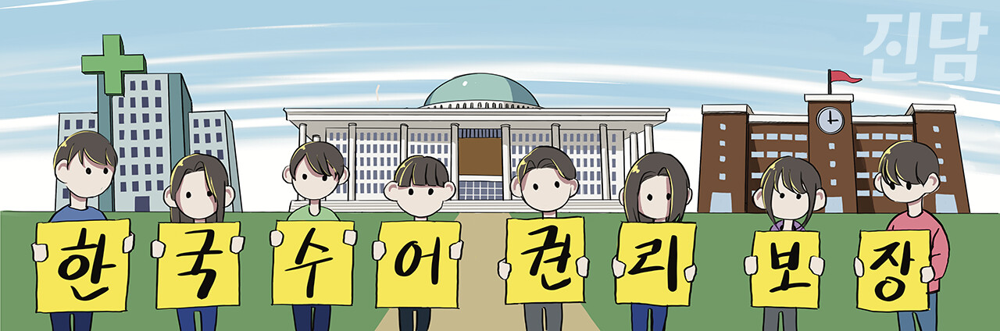

+++
title = '[오피니언] 「한국수화언어법」 8년, 이제는 정말 바뀌어야 한다'
date = 2024-03-13T09:39:11+09:00
categories = ["오피니언"]
tags = ["오피니언"]
keywords = ["수어", "한국수어", "손끝사이", "수어동아리", "한국수화언어법", "양해인", "오피니언"]
description = "지난 2월 3일은 「한국수화언어법」이 제정된 지 8년째 되는 날이었다. 이 법은 한국수어를 대한민국의 공용어로 처음 인정했다는 의미가 있다. 특히 한국수어를 이유로 차별받지 않을 권리, 한국수어로 정보를 제공받고 교육받을 권리 등 한국수어 사용에 관한 권리를 명시하고 있다. 한국수어"
thumbnail = "1.jpg"
creator = "진담 편집부"
draft = false
+++

<figure>
  
  <figcaption>일러스트레이션=조연수 디자이너 jsworking@jindam.news</figcaption>
</figure>

지난 2월 3일은 「한국수화언어법」이 제정된 지 8년째 되는 날이었다. 이 법은 한국수어를 대한민국의 공용어로 처음 인정했다는 의미가 있다. 특히 한국수어를 이유로 차별받지 않을 권리, 한국수어로 정보를 제공받고 교육받을 권리 등 한국수어 사용에 관한 권리를 명시하고 있다. 한국수어 언어권을 보장하는 것은 곧 농인들의 기본권 보장인 셈이다. 때문에 사람들은 한국수어의 날을 기념하여 축하한다. 하지만 정말 한국수어의 날은 축하받을 경사스러운 날일까.

서울대·숭실대·중앙대의 수어동아리가 마주한 농인사회의 현실은 축하라는 긍정적 언어로만 포장하기엔 절실했다. 농인들은 「한국수화언어법」에 실린 권리들도 실질적으로 보장받지 못하고 있었다. 법이 제정된 지 8년, 우리는 그동안 마주하기 무서워 숨어오던 실상을 마주하고 목소리를 내야한다고 결론지었다. 그렇게 80·90년대 전국 대학교에 대거 설립된 수어동아리 중 세 대학 동아리가 최초로 뭉쳐 제22대 국회의원 선거를 앞두고 정치권 행동을 촉구하는 성명서를 발표하고, 정책제안서를 각 당에 전달했다. 농인의 기본권 보장 및 한국수어 활성화를 위해 요구한 정책은 총 세 가지이다.

첫째, 농학교 교사의 한국수어 자격을 의무화하라. 농학교는 문자 그대로 농인들을 위한 학교이다. 하지만 법적으로 농학교 교사는 한국수어 자격을 소지할 의무가 없다. 따라서 농학생들은 농학교에서 제1언어인 수어가 아니라 제2언어인 음성언어로 수업 받고 있으며, 이는 마치 한국의 청인이 영어로 수업 받는 것과 같다. 농학생들은 교사의 수업을 이해하지도, 교사에게 질문하지도 못하는 채로 교육권을 부정당하고 있다. 농학교 교사들에게 한국수어로 소통하고 교수할  있는 자격 소지를 의무화하여야 하는 이유이다.

둘째, 의료기관 내 수어통역사 및 문자통역사 배치를 의무화하라. 농인들은 의료기관에서도 기본권을 보장받지 못하고 있다. 수어통역센터를 통해서 출장 통역을 받을 수 있지만, 밤이나 주말에 긴급한 사정으로 통역이 필요할 경우에는 거의 불가능하다. 입원환자의 경우 이마저도 불가능하다. 의사나 간호사가 수시로 방문하여 건강상태를 확인하거나 검사에 대해 안내하더라도 이를 이해하거나 질문할 수도 없으며, 통역을 요청할 수도 없다. 따라서 농인 수요가 많은 상급종합병원 및 공공보건의료기관에 수어통역사 및 문자통역사가 배치될 수 있도록 법적 의무화가 절실하다.

셋째, 초·중등 교육과정에 한국수어를 포함하라. 현재 초·중등 교육과정에 한국수어는 포함되어 있지 않아서 한국수어에 대한 국민적 인식이 저조한 상태이다. 따라서 공교육 과정에 한국수어를 포함시킴으로써 한국수어에 대한 인식 개선 등을 유도하여야 한다.

이 정책들은 제22대 국회의원 선거에서 공약으로 반영되는 것뿐만 아니라 이행으로 뒷받침돼야 한다. 실제로 수어통역사 배치에 관한 법률 개정안은 수년 째 국회에서 계류 중이다. 정치권이 농인을 포함한 국민의 대변인이라는 점을 자각하고 농인의 기본권 보장을 위해 책임감 있게 나서주기를 촉구한다. 세 수어동아리도 탈정치화된 과거를 반성하고, 농인들의 목소리가 정치적으로 대표될 수 있도록 힘쓸 것이다.

양해인 중앙대 수어동아리 '손끝사이' 회장

[오피니언] 기고 문의는 외부기고담당자(변준언 선임기자 byunjuneon@jindam.news)로 연락 바랍니다.

