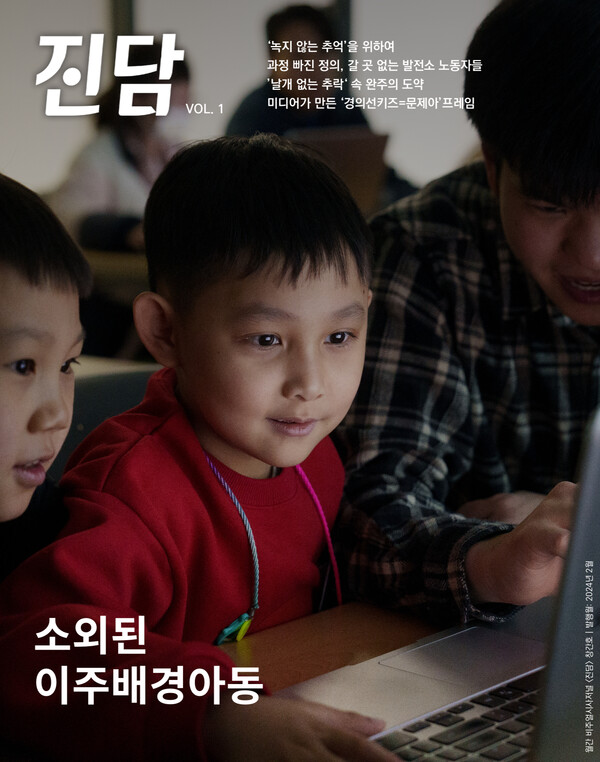

+++
title = '[from. 4726] 먼 길 돌아 담아낸 이야기'
date = 2024-03-11T04:10:02+09:00
categories = ["오피니언"]
tags = ["오피니언"]
keywords = ["from. 4726", "대학언론", "자치언론", "진심", "현장"]
description = "한번은 학보사에서 일했을 때 ‘시급’이 궁금해져 계산해 본 적이 있었다. 받은 ‘근로 장학금’을 편집국 책상에서 미친 듯이 키보드를 두드리며, 회의실에서 꾸벅꾸벅 졸며, 지하철에서 노트북과 한 몸이 된 채, 현장에서 비바람을 맞아가며 보낸 시간들로 나눴더니 글쎄 (자세한 것은 말 못"
thumbnail = "1.jpg"
creator = "임은재 선임기자"
draft = false
+++

<figure>
  
  <figcaption>'진담' 창간호 표지</figcaption>
</figure>

한번은 학보사에서 일했을 때 ‘시급’이 궁금해져 계산해 본 적이 있었다. 받은 ‘근로 장학금’을 편집국 책상에서 미친 듯이 키보드를 두드리며, 회의실에서 꾸벅꾸벅 졸며, 지하철에서 노트북과 한 몸이 된 채, 현장에서 비바람을 맞아가며 보낸 시간들로 나눴더니 글쎄 (자세한 것은 말 못 하지만) 시급이 2,000원도 채 되지 않는 것이었다!

안타깝게도 자치언론 기자들에게는 그마저도 없다. <진담> 창간호를 마감하며 꼼짝없이 책상에 앉아 ‘주 120시간 노동’을 했지만 ‘근로 장학금’은 커녕 통장에서 잔고 빠져나가는 소리에 한숨만 나온다.

“며칠 전에 방송국에서 와 갖고 이미 다 찍어 갔어.” 사건이 끝난 후 기자들이 한바탕 휩쓸고 지나간 자리를 훑는다. 사람들의 반응은 차다. 아무래도 우리가 헛수고를 하고 있다고 생각하는 것 같다. 사실 늦고 싶어서 늦은 건 아니다. 학업과 언론 활동을 병행하는 대학 언론인들에게 사건의 중심에 서기란 쉽지 않은 일이다. 정보력도 당연히 떨어질뿐더러 대중교통을 이용하기에 늘 발만 동동 구른다. 기자 취급을 받지 못해 쫓겨나는 경우도 많다.

그럼에도 우리가 카메라와 펜을 놓지 않는 이유는 하나다. 속보와 특종이 휩쓸고 간 곳에는 언제나 남겨진 이야기가 있다. 먼 길 돌아가며 만난 이들은 뜻밖의 인연이 되고, 누군가는 미련한 진심을 알아보고 마음의 문을 연다. 느리고 더디기에 볼 수 있는 것들이 있다. 뻔한 것도 한 번 더 묻고, 사람들을 진심으로 설득하고, 기다리고, 걷고 또 걷다 보면 현장은 반드시 못다 한 이야기를 들려준다. 우리의 더딘 진심이 독자들에게 닿길 바란다.

임은재 편집국장 when@jindam.news

* [from. 4726]은 편집국장이 <진담> 발행 때마다 호별로 쓰는 칼럼입니다.

