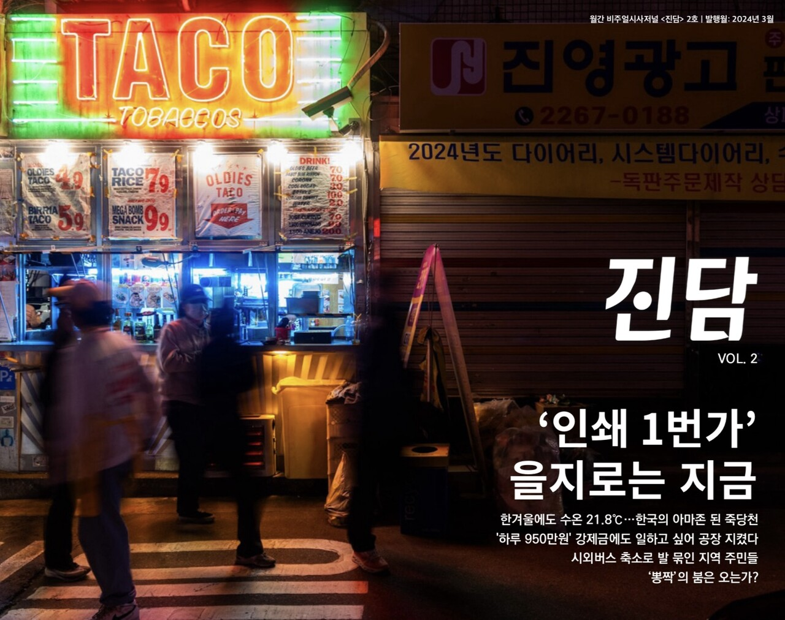

+++
title = '[from. 4726] 무엇이, 왜 뭉치고 흩어지나'
date = 2024-03-11T11:01:59+09:00
categories = ["오피니언"]
tags = ["오피니언"]
keywords = ["from. 4726", "한국옵티칼하이테크", "을지로 인쇄골목", "소외"]
description = "어떤 회사들은 때로 한 몸처럼 움직인다. 이번 호에 등장하는 ‘쌍둥이 회사’ 한국옵티칼하이테크와 한국닛토옵티칼이 그렇다. 한국옵티칼하이테크 공장에 화재가 발생해 더 이상 물건을 생산할 수 없게 되자 물량은 신속히 한국닛토옵티칼로 옮겨졌다. 두 회사가 마치 한 몸인 것처럼 손발이 척척"
thumbnail = "1.jpg"
creator = "임은재 선임기자"
draft = false
+++

**진담 2호, 편집국장의 말**

<figure>
  
  <figcaption>'진담' 2호 표지</figcaption>
</figure>

어떤 회사들은 때로 한 몸처럼 움직인다. 이번 호에 등장하는 ‘쌍둥이 회사’ 한국옵티칼하이테크와 한국닛토옵티칼이 그렇다. 한국옵티칼하이테크 공장에 화재가 발생해 더 이상 물건을 생산할 수 없게 되자 물량은 신속히 한국닛토옵티칼로 옮겨졌다. 두 회사가 마치 한 몸인 것처럼 손발이 척척 맞는다.

그렇지만 이들은 법적으로 엄연히 다른 회사다. ‘법인이 달라서’. 한국옵티칼하이테크가 직원들을 해고하고 공장 철거를 선언할 수 있었던 이유다. 이 법적인 장벽을 넘는 것은 ‘사람’이 아닌 ‘물건’뿐이다. 직원들은 일자리를 잃었지만 물건은 정상적으로 생산된다. 한 몸이었다가, 남이었다가. 자본은 필요에 따라 뭉치고 흩어지기를 자유자재로 반복한다.

“뭉치면 살고 흩어지면 죽는다!” 한편 서울에서는 을지로 인쇄골목을 지키려는 인쇄인들이 거리로 나섰다. 영세 인쇄업체들은 생존을 위해 을지로에 옹기종기 뭉쳤다. 공정에 필요한 시설을 모두 갖출 돈이 없어서다. 안타깝게도 돈이 없어 뭉친 이들의 삶은 또 돈이 없어 흩어질 위기에 놓였다. 제도는 그들이 아슬아슬하게 이어온 삶의 방식을 존중하지 않는다.

사람들이 자꾸만 흩어진다. 한국옵티칼하이테크 노동자들은 젊음을 바친 공장을 등져야만 했고, 얼마 남지 않은 인쇄인들의 터전은 네온사인 불빛에 자꾸만 밀려난다. 흩어지고 뭉치며 무엇이 소외되나. 법과 제도는 누구의 손을 들고 있나.

임은재 편집국장 when@jindam.news

* [from. 4726]은 편집국장이 <진담> 발행 때마다 호별로 쓰는 칼럼입니다.

