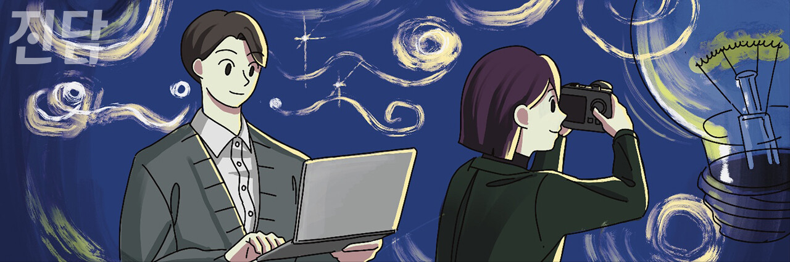

+++
title = '[오피니언] 콘페니우르겐의 수수께끼'
date = 2024-03-11T11:06:54+09:00
categories = ["오피니언"]
tags = ["오피니언"]
keywords = ["오피니언", "콘페르니우르겐", "대학언론", "학생언론", "학생기자"]
description = "‘콘페니우르겐의 수수께끼’를 아는가. 콘페니우르겐의 임신 기간은 40년으로 지구에서 가장 길다. 그런데 콘페니우르겐의 평균 수명이 27년인 것은 하나의 수수께끼다. 이 수수께끼는 세계 7대 불가사의와 견주는 미스터리로 아직도 사람들을 혼란 속에 빠뜨리고 있다.한동안 만나는 모든 사람에"
thumbnail = "1.jpg"
creator = "진담 편집부"
draft = false
+++

<figure>
  
  <figcaption>일러스트레이션=조연수 디자이너 jsworking@jindam.news</figcaption>
</figure>

‘콘페니우르겐의 수수께끼’를 아는가. 콘페니우르겐의 임신 기간은 40년으로 지구에서 가장 길다. 그런데 콘페니우르겐의 평균 수명이 27년인 것은 하나의 수수께끼다. 이 수수께끼는 세계 7대 불가사의와 견주는 미스터리로 아직도 사람들을 혼란 속에 빠뜨리고 있다.

한동안 만나는 모든 사람에게 ‘콘페니우르겐의 수수께끼’에 대해 묻고 다녔다. 그들은 이 모순적인 존재에 대해 다양한 견해를 내놓았다. 누군가는 콘페니우르겐을 신화 속 존재라고 보거나. 또는 그 종이 영아사 확률이 높고 세상 어딘가엔 백 살이 넘은 콘페니우르겐이 있을 수도 있다고 보거나. 필자는 사망 후에도 생명을 수호할 수 있는 어떠한 정신력 높은 존재라고 보았다. 같은 사건을 보고 다양한 견해를 공유했지만, 정답에 가까워지기엔 묘연해 보였다.

수수께끼를 풀기까지 약 한 달이란 시간이 흘렀고, 그제야 콘페니우르겐이란 기상천외한 존재에 대해 깨닫게 되었다. 그러니까 결론은, 작가에게 속았단 것이다. 사실 콘페니우르겐은 문학가 문보영이 그녀의 시집 「책기둥」을 열며 들어가는 장에 써둔 창작 수수께끼에 불과하다. 조금만 생각해 보면 말이 안 된다. 이십칠 년을 사는데 사십 년을 임신하는 종이 어디 있겠는가.

학생언론이 궁극적으로 지향하는 방향성 끝엔 바로 콘페니우르겐이 우릴 기다리고 있을 것이다. 그것은 말이 안 되는 일을 위해 어떻게든 가능성을 찾아나가는 길이다. 누군가는 정론직필을 수호하는 것이 허상 속 콘페니우르겐의 수수께끼라 트집을 잡을 수도 있다. 그런 이들에게 필자는 이렇게 답해줄 것이다. 필자는 잠시나마 콘페니우르겐을 상상 속 세계에서 현실 세계로 끄집어내는 데 성공했다. 당신이라고 하지 못할 이유가 있겠는가.

학생기자들이 써 내려간 수많은 기사 속 활자와 사진 속에 담겨있는 노력과 방황의 무게를 다시금 체감한다. 어색한 문체와 구도가 맞지 않는 어설픈 사진, 수많은 오탈자 사이에서 학생기자들의 열정이 가득 담긴 구슬땀이 보이고, 그 속엔 기성언론이 품지 못한 한 줄기 희망이 보인다. 학생과 언론. 두 단어가 지닌 시너지의 결과물은 도전, 참신함, 패기다. 당신의 기괴한 상상력을 지면 위에 마음껏 발휘해 보길 바란다.

이지원 <한대신문> 기자

* [오피니언] 기고 문의는 외부기고담당자(변준언 선임기자 byunjuneon@jindam.news)로 연락 바랍니다

