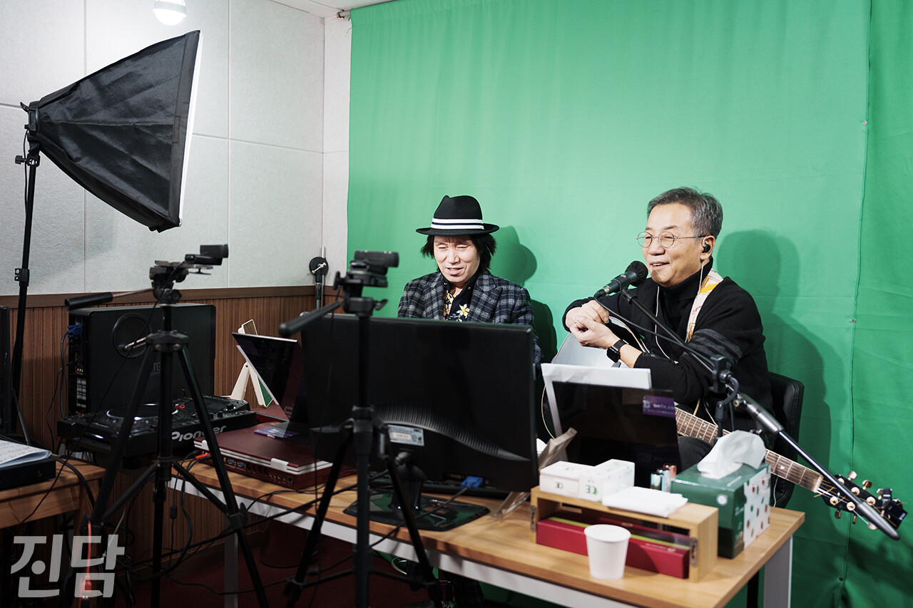

+++
title = "[취재 뒷 이야기] 이박사, '복면가왕' 대결 상대 위일청과 재회"
date = 2024-03-21T11:05:25+09:00
categories = ["진담+"]
tags = ["진담+"]
keywords = ["이박사", "위일청", "복면가왕", "신바람 이박사", "뽕짝", "뽕", "트로트", "음악"]
description = "이박사 인터뷰를 위해 지난 2월 22일 그의 소속사 사무실을 찾았다. 현장에서는 가수 위일청의 유튜브 라이브 촬영이 진행되고 있었다. 위일청은 “이박사와 에서 맞붙었다. 목소리를 듣는 순간 ‘이박사구나’라고 생각했다”며 이박사와의 인연을 소개했다.이종수 기자 rhiejongsu@jin"
thumbnail = "1.jpg"
creator = "이종수 기자"
draft = false
+++

<figure>
  
  <figcaption>이종수 기자 rhiejongsu@jindam.news 2024.02.22</figcaption>
</figure>

이박사 인터뷰를 위해 지난 2월 22일 그의 소속사 사무실을 찾았다. 현장에서는 가수 위일청의 유튜브 라이브 촬영이 진행되고 있었다. 위일청은 “이박사와 <복면가왕>에서 맞붙었다. 목소리를 듣는 순간 ‘이박사구나’라고 생각했다”며 이박사와의 인연을 소개했다.

이종수 기자 rhiejongsu@jindam.news

