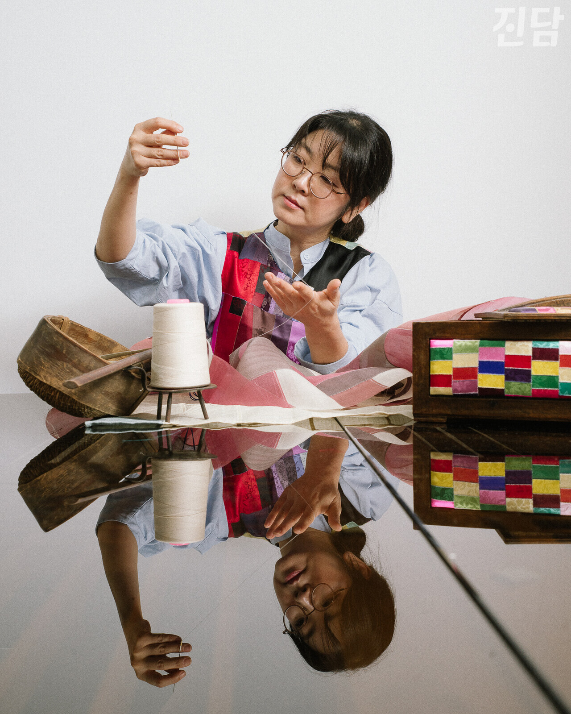
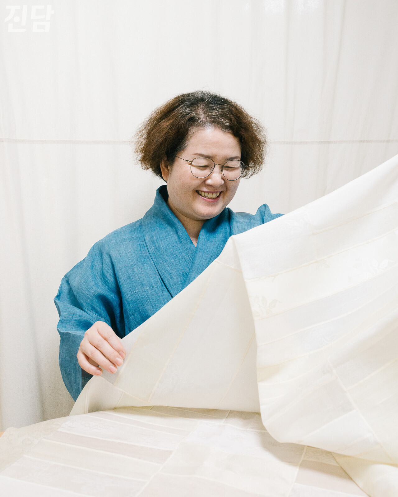
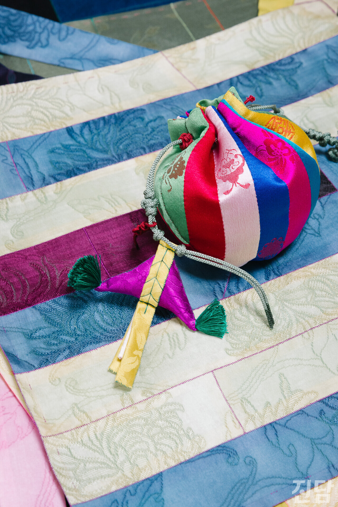
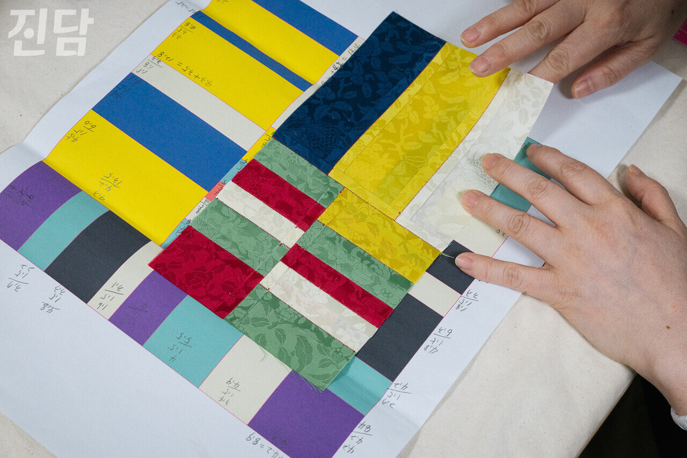

+++
title = "전통 공예에 신선함을 더하다… 규방공예에 새로운 색채 수놓는 작가들"
date = 2024-09-05T15:31:00+09:00
categories = ["취중진담"]
tags = ["전통예술", "공예"]
keywords = ["공예", "전통예술"]
description = ""
thumbnail = "1.jpg"
creator = "진담"
draft = false
+++

<figure>
  
  <figcaption>3월 25일, 서울 종로에 위치한 쌈지사랑규방공예연구소에서 문조희 작가(48)가 규방공예 시연을 보이고 있다. 윤기강 수습기자 2024.03.25</figcaption>
</figure>

조선시대 양반집 여성들의 문화인 규방공예가 중년 여성을 중심으로 인기를 끌고 있다. 규방공예 커뮤니티 중 가장 규모가 큰 쌈지사랑규방공예연구소(쌈지사랑)의 가입자 수는 3만 8천여 명에 달한다. 이곳에서 약 20년간 진행해온 온·오프라인 강의를 통해 규방공예를 배운 사람 수만 1만 명을 넘어섰다. “주로 중년 주부들이 아이를 키우고 나서 오랫동안 해보고 싶었던 것들 중 하나로 이곳에 찾아오는 경우가 많아요.” 쌈지사랑의 문조희 작가(48)가 말한다. <진담>이 만난 쌈지사랑 소속 규방공예가들은 전통을 잇는 것에서 한 단계 더 나아가 새로운 예술 세계를 펼치고 있었다.

 

가치있는 ‘한 땀’… 질리지 않는 매력
  

<figure>
  
  <figcaption>7월 12일, 박미애 작가(53)가 서울 성북에 위치한 작업실에서 조각보 작품을 펼쳐보고 있다. 윤기강 수습기자 2024.07.12</figcaption>
</figure>

서울 성북 정릉 근처에 있는 박미애 작가(53)의 규방공예 작업실. 들어서자마자 조각보, 복주머니, 바늘꽂이 등 형형색색의 규방공예품들이 취재진을 반겼다. 모두 박 작가가 17년 동안 수놓은 작품들이다. 그가 취미로 시작한 규방공예를 직장까지 그만두고 계속해 온 이유는 단순했다. “바늘과 실이 움직이며 수놓아지는 한 땀. 그 작은 한 땀을 보는 것이 너무 기쁘고 만족스러워서, 결국 작품 전체를 수놓는 원동력이 돼요.”

<figure>
  
  <figcaption>7월 12일, 박미애 작가(53)가 만든 두루주머니가 조각보 위에 올려져 있다. 두루주머니는 복주머니의 대표적인 형태로, ‘두루두루 다양한 물건을 담을 수 있다’는 의미를 가진다. 매듭 한편에는 괴불(삼각형 모양의 전통 노리개)이 달려 있다. 박 작가는 “괴불에는 나쁜 기운을 물리쳐준다는 의미가 있다”며 “규방공예품은 단순히 예쁜 모양으로 만드는 것이 아니고 다 의미가 들어가 있다”고 소개했다. 윤기강 수습기자 2024.07.12</figcaption>
</figure>

박 작가는 가족을 위하는 선조들의 따뜻한 마음씨가 담겨있다는 점을 규방공예의 매력으로 꼽았다. “딸아이 주위의 나쁜 기운을 물리치고자 하는 바람, 남편이 과거 시험에 합격하기를 바라는 마음, (가족들의) 무병장수를 바라는 마음… 이런 것들이 아름다움을 주는 것 같아요.” 예쁜 모양의 공예품을 만드는 것도 중요하지만, 삶의 의미를 생각하며 염원을 담은 ‘한 땀’에는 또 다른 가치가 있다.

6년째 규방공예가로 활동하는 문 작가는 규방공예가 눈길을 사로잡으면서도 과하지 않아 더 매력적이라고 말한다. “(규방공예품의) 선명한 톤과 색채들이 너무 매력적이면서도, 봐도 봐도 질리지 않는 무언가가 있는 거예요. 그게 뭘까 생각했을 때 과하지 않은 디자인에서 오는 편안함이었던 거 같아요. 여기에 더해진 세월의 향기는 포근함까지 건네주죠.”

CG로 밑그림 그리고, 바느질로 꿰매고…

‘신세대 규방공예’ 만드는 사람들

<figure>
  
  <figcaption>7월 12일, 박미애 작가(53)가 서울 성북에 위치한 작업실에서 조각보를 구상하고 있다. 박 작가는 컴퓨터 그래픽 프로그램을 통해 만든 조각보 구상도를 종이에 출력하여 실제 조각보를 만들 때 참고한다. 윤기강 수습기자 2024.07.12</figcaption>
</figure>

박 작가와 문 작가는 전통 규방공예에 매료된 공예가이자 동시에 새로움을 추구하는 예술가이기도 하다. 박 작가는 과거 컴퓨터그래픽(CG) 디자이너로 일하며 배웠던 기술을 조각보에 활용한다. 실제 조각보를 바느질하기 전에 CG 프로그램을 통해 색상과 디자인을 미리 구성해 보는 것이다. “이렇게 작업하면 시행착오도 줄일 수 있고 다양한 색 조합도 시도해 볼 수 있어요.” 박 작가는 CG 활용의 장점에 대해 설명했다.

<figure>
  
  <figcaption>문조희 작가(48)가 타래버선을 소재로 만든 미니어처 노리개. 문조희 작가 제공</figcaption>
</figure>

<figure>
  
  <figcaption>문조희 작가(48)의 '비단으로 빚은 우리 도자기' 작품 사진. 비단으로 도자기 모양 오브제를 수놓았다. 제54회 서울시 공예품대전 서울시 예선 입상작. 문조희 작가 제공</figcaption>
</figure>

문 작가는 규방공예 소재와 기법을 사용해서 새로운 작품을 만든다. 타래버선으로 만든 노리개, ‘비단으로 빚은’ 도자기가 문 작가의 대표작이다. 비단 도자기에는 술을 담을 수 없으므로 이 작품은 도자기 본래의 용도에서 벗어나 오로지 미적 가치만 갖는 순수 예술이 된다. “전통 규방공예가 실제로 생활 속에서 행해졌다면 오늘날의 규방공예는 더 예술화됐어요.” 서울공예박물관 이효선 학예사는 현대 규방공예의 예술성에 대해 이와 같이 설명했다. 과거 생활 속 쓰임을 전제로 만들던 규방공예는 이제 시각 예술의 영역으로 나아가는 중이다.

현대 규방공예가들이 창작을 이어가는 열정은 규방공예에 대한 애정으로부터 나온다. “저뿐만 아니라 여러 작가가 다양한 가능성을 시도하고 있어요. 규방공예가 공예품에서 한발 더 나아가 영역이 넓혀지기를 바라는 마음이죠.” 문 작가가 말한다.

**윤기강 수습기자 imagelover@kakao.com**
