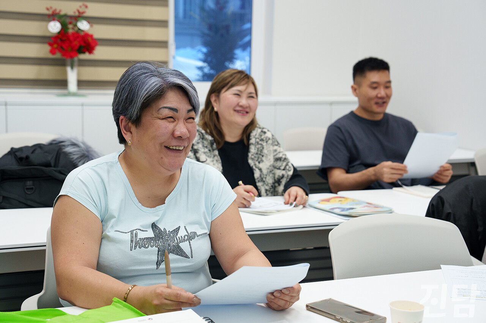

+++
title = "[취재 뒷 이야기] 고려인들, 우리말 되찾기 위해 '늦깎이 한글 공부'"
date = 2024-03-11T21:03:31+09:00
categories = ["진담+"]
tags = ["진담+"]
keywords = ["이주자", "고려인", "이주민", "다문화", "이주노동자", "안성", "내리", "내리안 다문화가족지원센터"]
description = "지난해 12월 17일, 경기 안성 내리안 다문화가족지원센터에서 고려인 이주자들이 한글교실 수업을 듣고 있다. 이번 호에서는 내리의 이주배경아동에 대해 다루게 되면서 성인 이주자 관련 내용은 들어가지 못했다. 추후 내리의 성인 이주자에 관한 기사를 기획하고 있다.이종수 기자 rhiejo"
thumbnail = "1.jpg"
creator = "이종수 기자"
draft = false
+++

<figure>
  
  <figcaption>이종수 기자 rhiejongsu@jindam.news</figcaption>
</figure>

지난해 12월 17일, 경기 안성 내리안 다문화가족지원센터에서 고려인 이주자들이 한글교실 수업을 듣고 있다. 이번 호에서는 내리의 이주배경아동에 대해 다루게 되면서 성인 이주자 관련 내용은 들어가지 못했다. 추후 내리의 성인 이주자에 관한 기사를 기획하고 있다.

