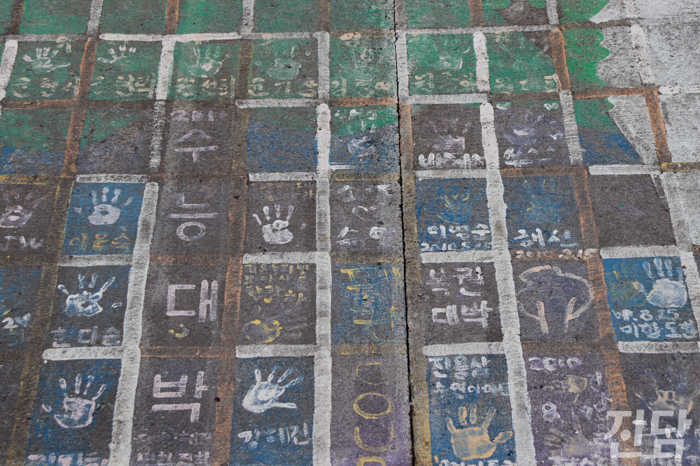

+++
title = '[취재 뒷 이야기] 소원이 이루어지는 발전소 앞 바다'
date = 2024-03-11T21:03:31+09:00
categories = ["진담+"]
tags = ["진담+"]
keywords = ["태안화력발전소", "방조제", "벽화", "소망"]
description = "충남 태안화력발전소는 몇 년 전까지만 해도 바다가 보이는 관광명소였다. 이제는 바다 앞에 화력발전소가 위치해있고, 2010년에 이곳을 다녀간 사람들이 남긴 소망과 손바닥만이 담벼락에 남았다.홍지원 기자 ziwonzip@jindam.news"
thumbnail = "1.jpg"
creator = "홍지원 기자"
draft = false
+++

<figure>
  
  <figcaption>홍지원 기자 ziwonzip@jindam.news 2023.12.17</figcaption>
</figure>

충남 태안화력발전소는 몇 년 전까지만 해도 바다가 보이는 관광명소였다. 이제는 바다 앞에 화력발전소가 위치해있고, 2010년에 이곳을 다녀간 사람들이 남긴 소망과 손바닥만이 담벼락에 남았다.

홍지원 기자 ziwonzip@jindam.news

