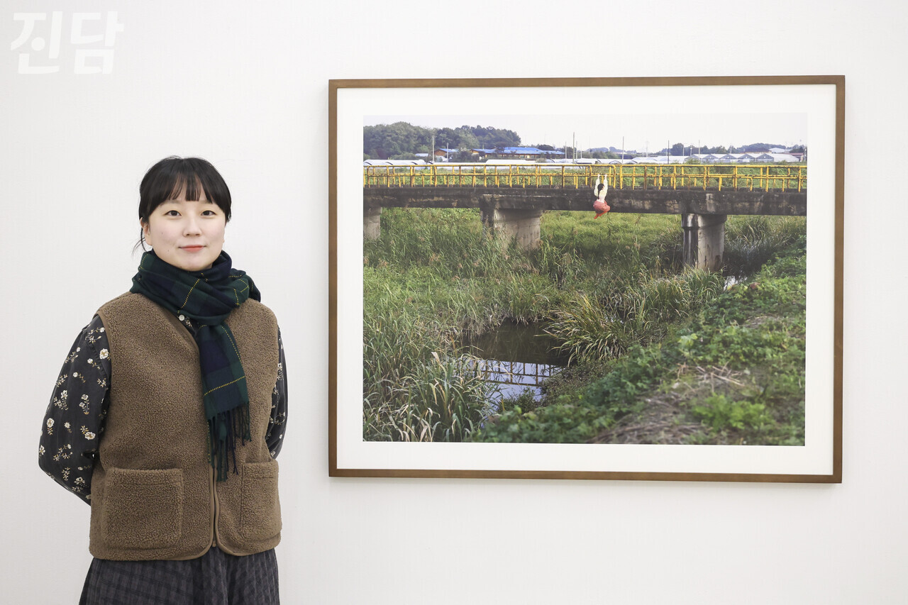
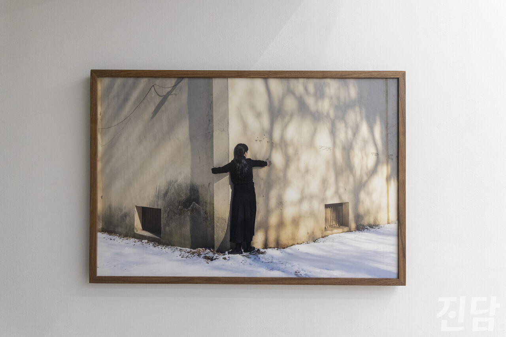

+++
title = '[이달의 콘텐츠] 이예은 작가의 "산을 옮기는 겨자씨"'
date = 2024-03-11T21:03:31+09:00
categories = ["진담+"]
tags = ["진담+"]
keywords = ["이예은", "사진가", "실내온도 높이기"]
description = "서울 종로의 한 전시장.  전시가 한창이다. 이예은 작가는 한 명의 노동자로서 작업에 임한다. 사회가 요구하는 노동의 시스템이 잘못됐지만 별다른 대안을 찾지 못한다는 그. 하지만 작가는 이러한 상황을 받아들이지 않고 자신만의 시선으로 재해석했다. 그가 대중에게 전하고자 하는 말은 무엇"
thumbnail = "1.jpg"
creator = "이진숙 기자"
draft = false
+++

<figure>
  
  <figcaption>이예은 작가의 '높이재기'. 그는 해당 작품을 전시의 메인 작품으로 꼽았다. 이진숙 기자 newjinsook@jindam.news 2024.01.17</figcaption>
</figure>

서울 종로의 한 전시장. <산을 옮기는 겨자씨> 전시가 한창이다. 이예은 작가는 한 명의 노동자로서 작업에 임한다. 사회가 요구하는 노동의 시스템이 잘못됐지만 별다른 대안을 찾지 못한다는 그. 하지만 작가는 이러한 상황을 받아들이지 않고 자신만의 시선으로 재해석했다. 그가 대중에게 전하고자 하는 말은 무엇일까. 그의 세상으로 빠져보자.

<figure>
  
  <figcaption>이예은 작가의 '실내온도 높이기'. 그는 개인과 개인이 만들어내는 연대의 힘을 믿는다. 이진숙 기자 newjinsook@jindam.news 2024.01.17</figcaption>
</figure>

- 이번 전시에서 가장 전시 주제를 잘 드러냈다고 생각되는 작품이 있다면 소개 부탁드립니다.<실내 온도 높이기>인데요. 아직 판단하긴 어렵지만 제 짧은 사진 인생 중 가장 중요한 지점이라고 생각하는 작품이에요. 제게 낙심 대신 희망을 준, 그리고 제 사진의 방향성을 잡게 해준 작업이기도 하죠. 또 이 작품을 마주한 대중에게는 이렇게 실내 온도를 높이는 사람이 있다는 것을 보여주고 싶었고요. 저 또한 그런 사람을 만나고 싶고, 혼자가 아닌 우리기에 힘을 내자는 위로의 말도 전하고 싶었죠.

- 이번 전시에서 가장 전시 주제를 잘 드러냈다고 생각되는 작품이 있다면 소개 부탁드립니다.

- 작업을 통해 가장 표현하고 싶었던 메시지는 무엇인가요사진을 통해 제가 사는 세계 속 사람들의 이야기를 전하는 매개체가 되고 싶었어요. 저는 대화 과정에서 답이 나오지 않는다며 중단된 대화를 많이 경험했어요. a와b 뿐만 아니라 a-1, b-1 같은 다양한 선택지가 있다고 생각해요. 저는 더 나은 선택을 위해서라도 끝까지 계속 대화를 해야 된다는 생각으로 작업해요. 제 작업은 전시를 했으니 작업이 끝난 것이 아닌, 전시를 함으로써 작업이 시작이 되는 거예요. 대화를 시도하는 거죠

- 작업을 통해 가장 표현하고 싶었던 메시지는 무엇인가요

- 작업 소개에서 노동환경에 대해 부조리한 시스템을 언급하셨습니다. 어떠한 부분이 부조리한지 알고 싶습니다.우리가 살아가는데 물질과 돈은 당연히 필요하죠. 다만 그 안에서 작동하는 시스템이 잘못됐다고 생각해요. 다만 어떤 것이 부조리하다, 고 꼬집어는 말할 수 없죠. 일을 시키는 사람과 일을 하는 사람, 그 모두가 각자 다른 생각을 하잖아요. 각 개인들이 얽혀있는 일이니까요. 그래서 그 안의 늘 석연치 않은 점들이 발생한다고 생각해요. 노동에 대한 우리의 인식 자체를 바꿔야 되지 않을까 싶어요. 예컨대 노동은 필수적인 일이라는 인식을 넘어 신성시하는 것처럼요. 결국 ‘이게 정답’이라는 식의 사회가 좀 바뀌어야 될 거 같아요.- 작업의 맥락이 소모되는 개인에서 개인 간의 연대로 확장됩니다. 이렇게 생각하신 이유를 알고 싶습니다.제가 일했던 공장의 언니, 이모, 학교에서 조교로 함께 일했던 동료와 선생님들. 결국 모두 다 다른 개인이지만 자연스럽게 연대를 해요. 전시를 하며 만나는 또 다른 형태의 노동자들도 마찬가지죠. 정말 자연스럽게, ‘너도 이렇게 느꼈구나’ 공감하며 연대가 형성되는 것이죠. 개인의 연대가 이 사회에서 가지는 가치가 있다면 무엇이라고 생각하시는지 궁금합니다. 타인과 ‘함께한다’는 것을 아는 게 중요한 것 같아요. 너만 그렇게 사는 게 아니라, 우리 모두 이렇게 살고, 나도 너와 함께 실내온도를 높이고 있다. 그러니까 곧 따뜻해질 것이라는 말이요. 그렇게 소통을 하다보면 외로움이 덜 해지게 되니까요. 혹은 더 나아가서 어떤 문제의 해결 방법을 알려주는 사람이 등장하기도 하고, 그러면 우리가 버티는 힘을 넘어 나아갈 힘이 생기죠.

- 작업 소개에서 노동환경에 대해 부조리한 시스템을 언급하셨습니다. 어떠한 부분이 부조리한지 알고 싶습니다.

- 작업의 맥락이 소모되는 개인에서 개인 간의 연대로 확장됩니다. 이렇게 생각하신 이유를 알고 싶습니다.

- 일상생활 속 연대와 관련해 직접적 또는 간접적 경험을 겪은 적이 있나요전시를 통해 많이 느껴요. 한번은 사진을 전공하시는 분이었는데, 저와 일면식도 없는 4분이 말을 거셨어요. 작가시냐고, 작업 이야기를 해보고 싶다고요. 작업 이야기를 듣고 제게 큰 공감을 표해주시더라고요. ‘우리도 저렇게 벽을 안고 있다’고 말씀하셨는데 그것만으로도 제겐 너무나 큰 힘이 됐죠. 또 ‘우리 함께 실내 온도를 높이자’고 하시는데 제가 앞으로 나아갈 원동력이 됐고요. 가끔은, 그렇게 제가 느꼈던 힘듦을 또 다른 누군가도 느끼고 있다는 사실만으로도 위안이 되더라고요. 타인으로부터 받은 위안처럼 누군가에게 제가 위안이 되고 싶어요.

- 일상생활 속 연대와 관련해 직접적 또는 간접적 경험을 겪은 적이 있나요

글·사진 = 이진숙 기자 newjinsook@jindam.news

