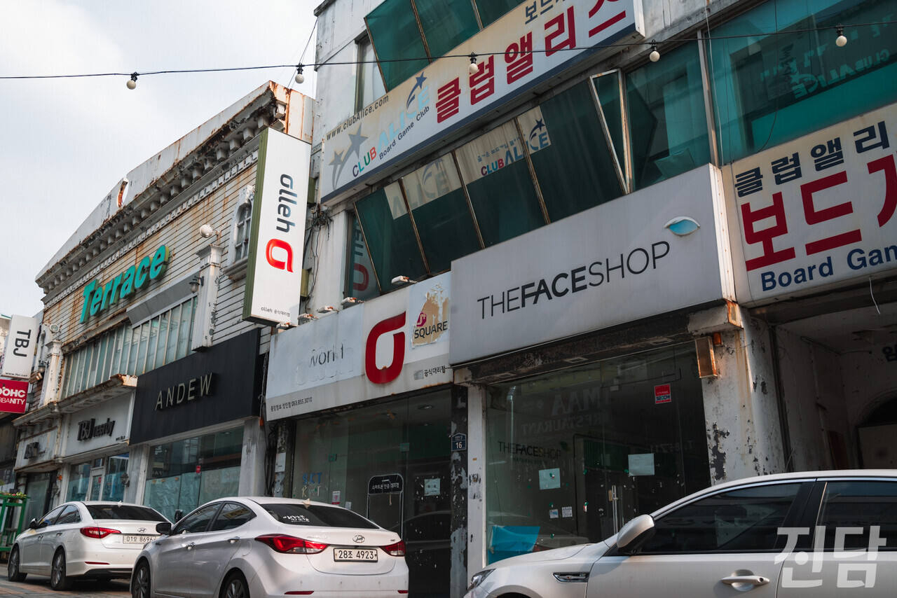

+++
title = '[취재 뒷 이야기] 젊음없는 젊음의 거리'
date = 2024-03-12T21:25:45+09:00
categories = ["진담+"]
tags = ["진담+"]
keywords = ["익산", "지방소멸", "전북"]
description = "전북 익산 중앙동에 위치한 젊음의 거리. 젊음의 거리는 과거 익산의 명동이라 불렸을 정도로 붐볐지만 현재는 황량하기만 하다. 본래 익산의 인구감소를 한눈에 보여주기 위한 사진이었다. 하지만 지방소멸에 대한 완주군의 대응을 보여주려는 기사의 방향과 맞지 않아 실리지 못했다. 기자의 마음"
thumbnail = "1.jpg"
creator = "문준빈 기자"
draft = false
+++

<figure>
  
  <figcaption>문준빈 기자 moonready@jindam.news 2024.01.26</figcaption>
</figure>

전북 익산 중앙동에 위치한 젊음의 거리. 젊음의 거리는 과거 익산의 명동이라 불렸을 정도로 붐볐지만 현재는 황량하기만 하다. 본래 익산의 인구감소를 한눈에 보여주기 위한 사진이었다. 하지만 지방소멸에 대한 완주군의 대응을 보여주려는 기사의 방향과 맞지 않아 실리지 못했다. 기자의 마음도 황량하기만 하다.문준빈 기자 moonready@jindam.news

문준빈 기자 moonready@jindam.news

