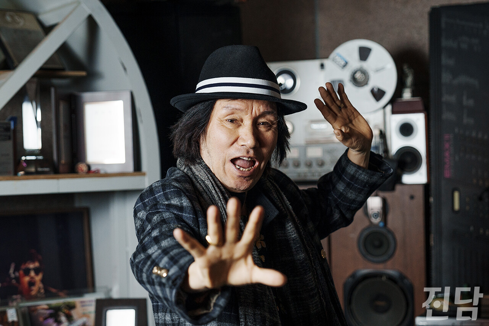

+++
title = "[이달의 콘텐츠] 신곡 '사우나'로 돌아온, 신바람 이박사를 만나다."
date = 2024-03-13T09:36:48+09:00
categories = ["진담+"]
tags = ["진담+"]
keywords = ["이박사", "뽕짝", "뽕", "250", "트로트", "사우나", "이달의콘텐츠"]
description = "뽕짝의 대명사 ‘신바람 이박사’가 지난 1월, 신곡 로 돌아왔다. 1989년 데뷔한 후, 약 35년 동안 계속 활동해 온 이박사는 “예술엔 끝이 없다”고 말한다. 서울 강남 삼성동에 위치한 시노엔터테인먼트 사무실에서 이박사를 만났다. 그의 근황과 과거 등에 관해 이야기를 나눴다.-최근"
thumbnail = "1.jpg"
creator = "이종수 기자"
draft = false
+++

<figure>
  
  <figcaption>이박사가 서울 강남 시노엔터테인먼트 사무실에서 포즈를 취하고 있다. 이종수 기자 rhiejongsu@jindam.news 24.02.22</figcaption>
</figure>

뽕짝의 대명사 ‘신바람 이박사’가 지난 1월, 신곡 <사우나>로 돌아왔다. 1989년 데뷔한 후, 약 35년 동안 계속 활동해 온 이박사는 “예술엔 끝이 없다”고 말한다. 서울 강남 삼성동에 위치한 시노엔터테인먼트 사무실에서 이박사를 만났다. 그의 근황과 과거 등에 관해 이야기를 나눴다.

-최근 새 소속사도 찾으시고, 신곡 <사우나>도 발표하셨어요. 근황이 어떠신가요?코로나19 전에는 직접 노래를 만들어 매주 공연을 다녔었죠. 그러다 코로나가 있어서 쉬다가 근래에 <사우나>라는 노래가 나왔어요. 신곡 나왔으니 음악 공부도 하고 있죠. 팝송도 많이 듣고 우리나라 노래도 많이 듣고. 항상 그래요. 요즘엔 미국 가수를 많이 들어요. 특히 척 베리(Chuck Berry)라는 로큰롤 뮤지션을 많이 들어요.

-최근 새 소속사도 찾으시고, 신곡 <사우나>도 발표하셨어요. 근황이 어떠신가요?

-신곡 <사우나>를 소개한다면?모두가 좋아하는 사우나를 소재로 EDM을 결합해 특별하게 만든 곡이에요. 소속사 대표인 한용진 DJ가 처음 사우나라는 아이템을 제안했고 작곡가, 작사가와 의논하면서 이박사에 맞는 ‘맞춤곡’을 만들어줬어요.

-신곡 <사우나>를 소개한다면?

-다양한 장르를 섭렵하신 것 같아요. 민요도 하셨다고.주한미군 방송을 통해 팝송을 듣고 따라 연습하다가 그다음엔 국악을 하게 되고 가요를 하게 되고. 이렇게 세가지를 이어서 했어요. 민요는 70년대부터 했죠. KBS <민속백일장>에서 본선까지 올라갔다가 결승에서는 기악 부분에서 떨어졌어요. 그 후 정식으로 국악 쪽 유명한 분을 찾아가기도 했어요.

-다양한 장르를 섭렵하신 것 같아요. 민요도 하셨다고.

-이박사 특유의 추임새가 굉장히 많아요. ‘좋아 좋아’, ‘아싸’, ‘후루히’ 등의 추임새들은 어떻게 하게 되신 거예요?즉흥적으로 만든 추임새가 한 10가지 되는 것 같아요. 추임새는 그때그때 다르게 하죠. ‘좋아 좋아’가 제일 빨리 나왔어요. 옛날에 관광가이드 했던 80년도부터 썼을 거예요. ‘후루히’도 그때 나왔어요. 버스 여러 대를 타고 가서 손님들을 불러야 하는데 호루라기도 없고 방법이 없는 거예요. 그래서 호루라기처럼 ‘후루히~ 빨리 와요’하면서 그 아이템이 나온 거죠.

-이박사 특유의 추임새가 굉장히 많아요. ‘좋아 좋아’, ‘아싸’, ‘후루히’ 등의 추임새들은 어떻게 하게 되신 거예요?

-1995년부터 몇 년간 일본에서 활동하셨는데요. 그때 일본 가요도 한국어로 리메이크를 많이 하셨죠?일본에 가서도 난 한국말로 노래했어요. 내가 평소에 쓰던 말이니까. 한국어로 가사를 쓰면 외우기도 좋고, 발음도 좋고. 그래서 내가 한국어 가사를 많이 썼죠.

-1995년부터 몇 년간 일본에서 활동하셨는데요. 그때 일본 가요도 한국어로 리메이크를 많이 하셨죠?

-일본 활동은 어떠셨나요?소니뮤직 전속으로 활동했는데 한국에서 전속으로 활동하는 것보다 까다로워요. 일본 사람들은 상품 값어치를 먼저 생각하기 때문에 음악도 최고로 만들어야 해요. 또 방송, 행사, 콘서트로 바빠서 개인 시간도 없었어요. 덴키그루브라는 유명한 그룹이랑 같이 작업을 하게 됐는데 그 친구들도 나를 좋아하고 나도 좋아해서 코드가 잘 맞았죠. 메이와덴키라는 2인조 그룹과 작업을 했을 땐 <나는 우주의 환타지>라는 곡을 만들었는데 그건 일본어 가사였어요. 내가 일본어 발음이 안 좋고 가사가 어려워서 한국에 와서는 다시 쉽게 가사를 써서 <스페이스 판타지>로 만들었죠.

-일본 활동은 어떠셨나요?

-최근 250(본명 이호형)의 <뽕>이라는 앨범이 상도 여러 개 받고 매우 화제가 됐죠. 거기서 <사랑이야기>라는 곡에 참여하셨는데 앨범을 들어보셨나요?예전에 피처링인가 한 번 한 적이 있어요. 앨범은 다 못 들어봤는데 잘 돼서 유명해졌다고 하더라고요.

-최근 250(본명 이호형)의 <뽕>이라는 앨범이 상도 여러 개 받고 매우 화제가 됐죠. 거기서 <사랑이야기>라는 곡에 참여하셨는데 앨범을 들어보셨나요?

-최근 1~2년간 <퓨쳐관광메들리>라는 젊은 관객이 많이 오는 공연에 여러 번 나가셨어요. 청년들이 열광하는 것에 대한 소감이 어떠셨나요?좀 더 열심히 해야 되겠다는 것을 느꼈어요. 요즘 <미스트롯>, <미스터트롯> 등에도 트로트 가수가 많은데 나를 찾아주니까 대단히 감사한거예요. 한마디로 말해서 ‘고맙습니다’죠.

-최근 1~2년간 <퓨쳐관광메들리>라는 젊은 관객이 많이 오는 공연에 여러 번 나가셨어요. 청년들이 열광하는 것에 대한 소감이 어떠셨나요?

-작년엔 이박사 팬클럽도 생겼죠?팬클럽이 예전에도 있었는데 다리를 다치고 활동을 오랫동안 못하게 되면서 없어졌어요. 다시 자진해서 팬들이 모여주니까 나한텐 고마운 거예요. 많은 가수가 있는데도 나를 택해서 팬이 돼주니까 무지하게 감사하죠.

-작년엔 이박사 팬클럽도 생겼죠?

-청년들이 다른 트로트 가수보다 특히 이박사를 좋아하는 이유가 뭘까요?글쎄. 나는 있는 그대로 솔직하게 사는데, 가식도 모르고. 노래를 하거나 공연에서 멘트를 할 때도 표현을 솔직하게 하니까. 청년들이 그런 걸 좋아하는 건가 싶어요.

-청년들이 다른 트로트 가수보다 특히 이박사를 좋아하는 이유가 뭘까요?

-평소 젊은 팬들에게 ‘공연에 너무 자주 와서 응원하거나 하지 말라’는 말씀을 많이 하셨는데나도 팬들 좋아하고 공연에 와서 깃발 흔들어주고 하면 고맙긴 고맙죠. 하지만 청년들, 우리나라의 보물들이 바쁜 시기에 나한테 시간을 뺏긴다는 게 난 마음에 걸리는 거에요. 아들, 딸 같은 나이니까 아끼고 싶은 거지. 열심히 살다가 혹시 시간이 되면 오는 건 몰라도, 일부러 자주 멀리서 오는 건 좀 안 좋아해요. 부담을 주고 싶지 않은 거죠.

-평소 젊은 팬들에게 ‘공연에 너무 자주 와서 응원하거나 하지 말라’는 말씀을 많이 하셨는데

-<진담>은 중앙대학교에 기반을 두고 있습니다. 학생들에게 한마디 해주신다면?중앙대 하면 예술인들이 많이 나오잖아요. 내가 대학을 다녀보지는 않았지만 예술을 해보니까 배움이 무지하게 중요해요. 대학 다닐 때는 주어진 것을 분명히 열심히 할 것. 그럼 나와서 다 써먹을 데가 있다는 걸 내가 느꼈어요.

-<진담>은 중앙대학교에 기반을 두고 있습니다. 학생들에게 한마디 해주신다면?

글·사진=이종수 기자 rhiejongsu@jindam.news

