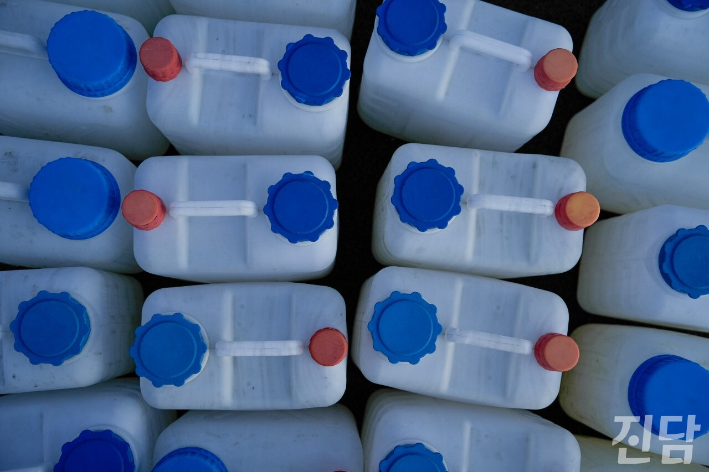

+++
title = '[취재 뒷 이야기] 단수에도 농성을 이어가다'
date = 2024-03-15T23:46:05+09:00
categories = ["진담+"]
tags = ["진담+"]
keywords = ["한국옵티칼하이테크", "노동자", "농성"]
description = "지난 2월16일, 구미에 위치한 한국옵티칼하이테크 노동조합 농성장 한편에는 물탱크들이 놓여있었다. 노동조합원들은 사측의 단수 조치에 외부에서 길어온 물을 사용하며 농성을 이어갔다.문준빈 기자 moonready@jindam.news"
thumbnail = "1.jpg"
creator = "문준빈 기자"
draft = false
+++

<figure>
  
  <figcaption>문준빈 기자 moonready@jindam.news 2024.02.16</figcaption>
</figure>

지난 2월16일, 구미에 위치한 한국옵티칼하이테크 노동조합 농성장 한편에는 물탱크들이 놓여있었다. 노동조합원들은 사측의 단수 조치에 외부에서 길어온 물을 사용하며 농성을 이어갔다.

문준빈 기자 moonready@jindam.news

