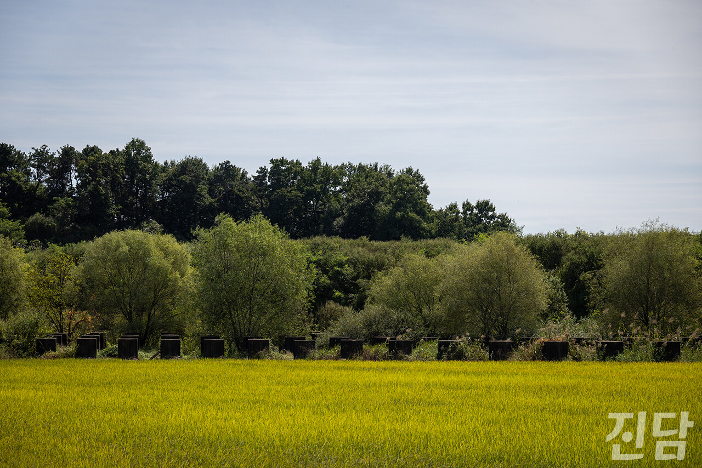
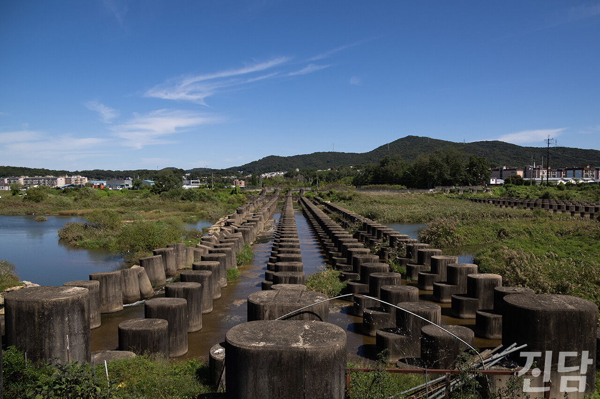
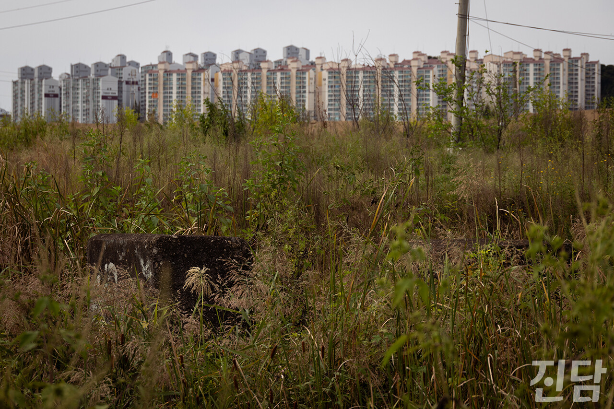
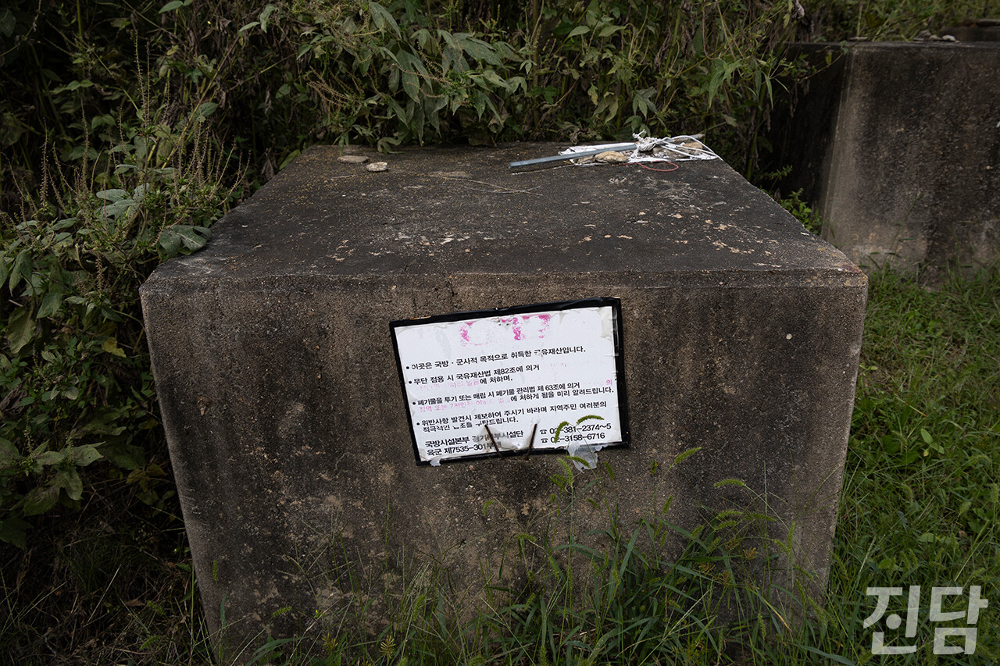
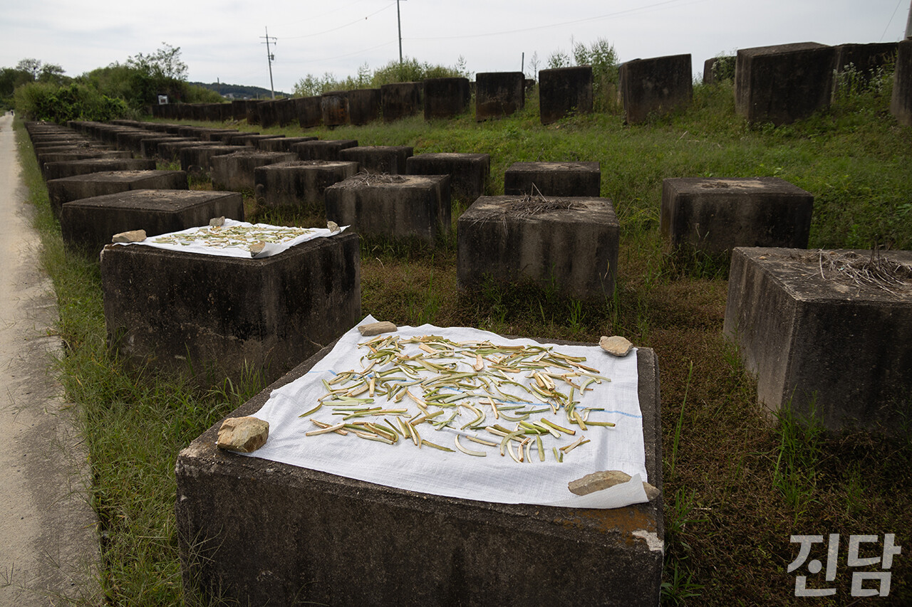

+++
title = '[암순응] 한반도에 자라난 콘크리트 이빨'
date = 2024-03-19T01:15:58+09:00
categories = ["진담+"]
tags = ["진담+"]
keywords = ["용치", "한국전쟁", "분단", "전쟁", "휴전", "암순응"]
description = "어느 날 기이한 풍경 사진을 보았다. 산책로에서 자전거를 타고 있는 사람의 뒤로 끝을 알 수 없는 콘크리트 블록들이 있었다. 동일한 크기의 구조물이 질서정연하게 서있는 모습은 오싹한 기분마저 들게 했다. 미처 처리하지 못하고 버려진 건축 자재들일까, 자연재해를 막기 위해 설치된 구조물"
thumbnail = "1.jpg"
creator = "진담 편집부"
draft = false
+++

<figure>
  
  <figcaption>경기 파주의 한 논을 따라 용치가 설치돼 있다. 신용주 객원기자 2023.09.24</figcaption>
</figure>

<figure>
  
  <figcaption>경기 고양 공릉천. 하천을 가로질러 용치가 설치돼 있다. 신용주 객원기자 2023.09.24</figcaption>
</figure>

어느 날 기이한 풍경 사진을 보았다. 산책로에서 자전거를 타고 있는 사람의 뒤로 끝을 알 수 없는 콘크리트 블록들이 있었다. 동일한 크기의 구조물이 질서정연하게 서있는 모습은 오싹한 기분마저 들게 했다. 미처 처리하지 못하고 버려진 건축 자재들일까, 자연재해를 막기 위해 설치된 구조물일까. 조사 끝에 내 예상과는 전혀 다른 용도의 구조물임을 알 수 있었다. 오랜 시간 동안 한반도를 지배한 전쟁 공포가 빚어낸 콘크리트 이빨, ‘용치’였다.

<figure>
  
  <figcaption>경기 파주 금촌3동에 위치한 군(軍) 방호벽 산책로의 풀숲 사이로 용치가 보인다. 신용주 객원기자 2023.09.24</figcaption>
</figure>

<figure>
  
  <figcaption>경기 파주 금촌3동 군(軍) 방호벽 산책로에서 마주한 용치. 표지판 일부 글씨가 지워져 내용을 알아보기 어렵다. 신용주 객원기자 2023.09.24</figcaption>
</figure>

‘용치’라는 이름이 붙은 이 구조물은 전차의 진입을 저지하기 위한 군사 시설 중 하나로, 적군의 기동성을 떨어뜨리기 위해 제작됐다. 용치는 제2차 세계대전 중에 처음 등장했다. 나치 독일이 자국과 네덜란드의 국경에 걸쳐 만든 요새선인 지크프리트선을 건설하면서 용치를 널리 사용했다. 이후에도 여러 국가에서 국경이나 해안선 등에 용치를 배치해 사용하고 있다.

우리나라에는 1968년 1·21사태로 불리는 북한 무장 공비 청와대 습격 사건 이후 북한과의 전면전을 대비해 설치됐다. 이 시설들은 주로 고양, 파주, 인제, 철원 등 남북 접경 지역의 하천이나 논 등 평지를 가로지르거나 해안선에 설치됐다.

우뚝 솟아 있는 콘크리트 이빨들을 직접 눈으로 담고 싶어 경기 고양 지영교 인근 용치와 경기 파주 금촌 3동에 위치한 군 방호벽 산책로를 찾았다. 용치 군데군데에서 세월의 흔적이 보였다. 무성하게 자란 풀 속에 숨어있는 것도 있었고, 세월의 풍파를 견디지 못해 쓰러진 것도 있었다. 적의 침입을 막기 위해 설치된 군사 시설이지만 표지판 글씨가 군데군데 지워진 채로 방치되어 있거나 농작물을 말리는 건조대로 사용되기도 했다. 이처럼 전쟁에 대한 공포가 옅어지면서 용치는 천덕꾸러기가 됐다. 방치된 채 흉물 취급을 받는가 하면 여름철 수해의 원인으로 지목돼 철거가 이루어지기도 한다.

언제 다시 전쟁이 일어날지 모른다는 불안감과 평화로운 일상이 순식간에 짓밟힐 수 있다는 공포감으로 우리나라 곳곳에 용치가 세워졌다. 다행히도 그것들이 제 역할을 수행한 적은 없지만, 휴전 상태가 지속되는 동안은 섣불리 없앨 수도 없다. 지속되는 남북의 대치 관계 속 자라난 콘크리트 이빨들은 아직 한반도 곳곳에 상흔처럼 남아 70여 년 전의 기억을 떠올리게 한다.

신용주 객원기자

<figure>
  
  <figcaption>경기 파주 금촌3동 군(軍) 방호벽 산책로. 용치 위로 건조 중인 농작물들이 올려져 있다. 신용주 객원기자 2023.09.24</figcaption>
</figure>

