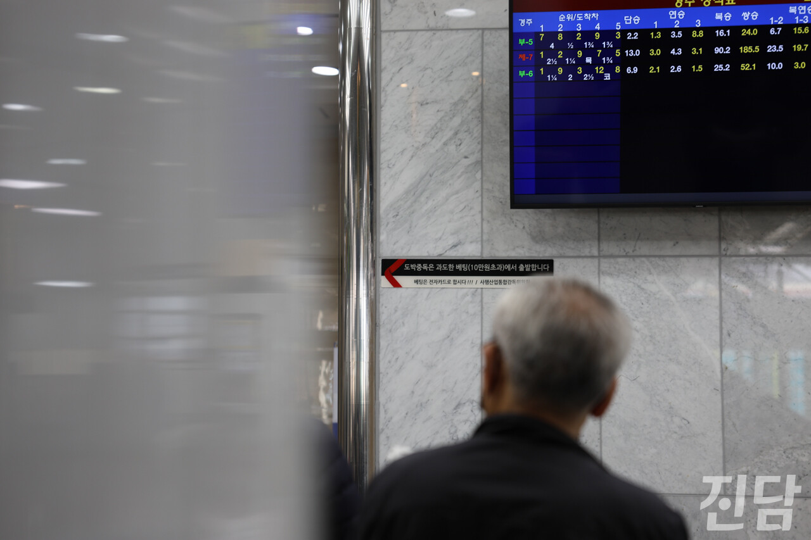

+++
title = "여가인가 도박인가... 마음만 먹으면 ‘무한 배팅'"
date = 2024-04-20T11:11:00+09:00
categories = ["사회"]
tags = ["경마", "경마공원", "렛츠런파크", "도박", "중독", "경마 중독"]
keywords = ["경마", "경마공원", "렛츠런파크", "도박", "중독", "경마 중독"]
description = ""
thumbnail = "1.jpg"
creator = "홍지원 기자"
draft = false
+++

‘한 방’ 노리려 매주 경마장 출석 도장  10만 원 베팅 상한선 사실상 무의미...국가가 허락한 도박
  

<figure>
  
  <figcaption>3월 17일 경기 과천 렛츠런파크 건물 내부에서 경마 잡지 '뉴월드'를 든 관객이 경마 경기를 지켜보고 있다. ‘뉴월드’는 경마 순위 예상 잡지로 지하철역, 건물 입구 등 현장에서 구매할 수 있다. 홍지원 기자 ziwonzip@jindam.news 2024.03.17</figcaption>
</figure>

수도권 전철 4호선 경마공원역 1번 출구로 나오면 한 손엔 경마 잡지, 다른 한 손엔 컴퓨터용 사인펜을 든 사람들이 인산인해를 이룬다. 대부분 고령자인 인파 뒤로는 ‘렛츠런파크’가 보인다. 경기 과천에 위치한 렛츠런파크의 개장 시간은 오전 9시 30분이지만 개장 30분 전부터 입장권을 사려는 줄이 길게 서 있다. 사람들은 입장 시간을 기다리며 똑같은 자세로 고개를 숙이고 경마 잡지를 정독한다. 그날 경마 경기의 승부를 예측하고 미리 관련 내용을 파악하기 위해서다.

<figure>
  
  <figcaption>관객들이 전광판을 통해 3월 10일 경기 과천 렛츠런파크에서 진행되는 경마 경기를 지켜보고 있다. 전광판은 실시간으로 경마 경기 진행 상황과 배당 현황을 보여준다. 홍지원 기자 ziwonzip@jindam.news 2024.03.10</figcaption>
</figure>

<figure>
  
  <figcaption>3월 10일 경기 과천 렛츠런파크 건물 외부에 위치한 전광판 앞에 관객들이 모여 있다. 일부 관객들은 경마 경기 결과가 나오자 욕이 섞인 탄성을 내뱉기도 했다. 홍지원 기자 ziwonzip@jindam.news 2024.03.10</figcaption>
</figure>

"제2경주 마권 발매가 시작되었습니다." 렛츠런파크 건물 안으로 들어가면 마권 발매기 수십 대가 줄지어 있다. 마권 구매표에 배팅할 경기 회차와 금액을 표시하고 자율 발매기에 넣은 후 결제하는 방식이다. 경기가 시작하면 약 1, 2분 만에 돈의 행방이 결정된다. 레인을 달리던 말이 결승선에 들어오면 사방에서 욕설이 난무한다. 말 그대로 '한 방'을 노리려는 사람들이 렛츠런파크에 매주 출석하는 것이다. 
 
비상계단에서 조용히 잡지를 보고 있던 A씨는 ‘국가가 허용한 도박’에 대한 씁쓸함을 내비쳤다. "오늘 20만 원 갖고 와서 20만 원 다 잃으면 다음 주에 또 와야 해. 생돈 잃은 거 생각나서. 그렇게 중독이 되는 거죠."

<figure>
  
  <figcaption>3월 10일 경기 과천 렛츠런파크 건물 내부에서 사람들이 경마 잡지를 보며 승부를 예측한다. 마권 구매표와 경마 잡지가 계단 여기저기 놓여있다. 홍지원 기자 ziwonzip@jindam.news 2024.03.10</figcaption>
</figure>

홀로 경마 경기를 보고 있던 B씨. 그는 1975년부터 경마장을 다녔다. 처음엔 친구와 함께 경마장을 방문했지만, 지금은 홀로 남았다. 그는 과거 3만 5천 원어치를 사서 7,500만 원도 따 본 적 있다. "(성공한 경험이 있다 보니 그 유혹을) 끊지 못해서 오는 거예요. 여긴 안 다니는 게 좋아요." 그는 경마 경기를 가벼운 마음으로 즐겨야 함을 누구보다 잘 안다. 그럼에도 중독을 쉽사리 끊어내지 못해 매번 일확천금을 기대하며 마권을 구매한다.

<figure>
  
  <figcaption>지난 3월10일 경기 과천 렛츠런파크를 찾은 한 시민이 예시장에서 말의 상태를 확인하고 있다. 예시장은 배팅에 참여하는 사람들이 경기를 앞둔 말의 건강, 심리상태 등을 관찰할 수 있는 공간이다. 변준언 선임기자 byunjuneon@jindam.news</figcaption>
</figure>

가까스로 도박 중독에서 벗어난 이도 있다. 건물 외부에서 만난 김상갑씨는 캐나다로 이민을 가며 경마장 도박을 자연스레 끊게 됐다고 했다. 그럼에도 잠깐 한국에 들어올 일이 있으면 경마 공원에 꼭 들른다. 예전만큼 돈을 베팅하지는 않지만, 그가 발걸음을 하는 이유는 '돈을 따는 재미' 때문이다. "베팅한 말이 (1등으로) 딱 들어와 봐. 환상이지." 그는 '쾌감'이 중독의 가장 큰 원인이라고 했다.

<figure>
  
  <figcaption>경기 과천 렛츠런파크 건물 내벽에 도박 중독 예방을 위한 문구가 적혀 있다. 렛츠런파크 곳곳에서 이러한 내용의 안내 문구를 볼 수 있다. 홍지원 기자 ziwonzip@jindam.news 2024.03.15</figcaption>
</figure>

렛츠런파크의 곳곳에는 중독 예방 상담 센터의 전화번호가 적혀있거나, "경마, 여가로 즐겨야 끝까지 달릴 수 있습니다"라는 포스터가 붙어 있다. 경마 중독을 막고자 1인 1회 마권 구매 상한선을 10만 원으로 제한하기도 한다. 하지만 기준은 '한 경기당'이다. 하루에 경기가 열댓 번 열리기 때문에 마음만 먹으면 10만 원이고 100만 원이고 말에 돈을 쓰는 게 가능하다. 이렇듯 실효성 없는 제도는 여전히 방치되고 있어 사람들이 쉽사리 도박 중독에서 빠져나오지 못하고 있다.

**글·사진=홍지원 기자 ziwonzip@jindam.news**

