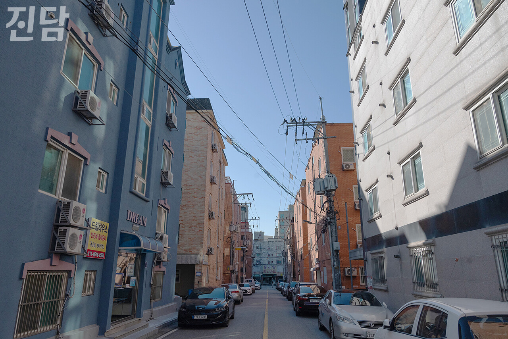

+++
title = '[진담_Lab] 1인 가구 전성시대, 안성의 경우는?'
date = 2024-03-11T04:10:02+09:00
categories = ["오피니언"]
tags = ["오피니언"]
keywords = ["진담랩", "진담_Lab", "1인가구", "오픈도어", "박민선", "안성시", "안성"]
description = "2023년 말 통계청 발표에 따르면 우리 사회에 홀로 살아가는 1인 가구는 750만에 달한다.전체 가구의 약 35%에 달하는 비율이다. 집계기준에 따라 더 많게 보기도 한다. 행정안전부 통계로는 천만 명에 달한다. 전 세계적으로 산업화가 심화하고 전통적 가족 의미와 역할이 축소되며 혼"
thumbnail = "1.jpg"
creator = "진담 편집부"
draft = false
+++

<figure>
  
  <figcaption>경기 안성 시내 항공사진. 안성시 제공</figcaption>
</figure>

2023년 말 통계청 발표에 따르면 우리 사회에 홀로 살아가는 1인 가구는 750만에 달한다.

전체 가구의 약 35%에 달하는 비율이다. 집계기준에 따라 더 많게 보기도 한다. 행정안전부 통계로는 천만 명에 달한다. 전 세계적으로 산업화가 심화하고 전통적 가족 의미와 역할이 축소되며 혼자 사는 사람들은 국내외에서 꾸준히 늘고 있다. 서구 유럽서는 이미 수십 년 전부터 1인 가구가 주요 인구집단으로 자리 잡았고 아시아서도 일본을 시작으로 우리나라와 중국 등 국가서 1인 가구 수가 늘어나고 있다. 이제 1인 가구는 변화의 중심에서 정치·경제·사회·문화를 막론하고 사회를 움직일 정도로 큰 영향을 미치는 집단이 됐다. 그에 따라 이들의 수요를 충족시키기 위한 노력도 이뤄지고 있다. 정부에서도 최근 청년 1인 가구 특위를 발족했고, 서울·경기·부산 등을 시작으로 1인 가구 지원을 위한 조례와 계획들이 세워지고 있다. 시장서도 1인 가구 라이프스타일에 맞춘 편하고 작은 가전·가구·소포장-소용량 제품들을 앞다투어 내놓고 있고, 1인 가구 겨냥 시장의 성장세도 가파르다.

매년 발표되는 통계청 1인 가구 관련 각종 통계 결과와 지방정부의 1인 가구 실태조사 결과들을 보면 1인 가구 소득은 꾸준히 증가하고 있고, 예전보다 마지못해 혼자 사는 게 아닌 자발적 선택으로 1인 가구가 된 비중 또한 늘어나고 있다. 예전엔 혼자 산다고 하면 사회와 주변의 따가운 편견의 시선과 차별이 힘들다는 의견들이 많았지만, 최근엔 차별이 없거나 느끼지 못한다는 경우가 절반을 넘어섰다. 특별한 일 없으면 앞으로 쭉 혼자 살 거라는 응답 또한 대다수를 차지한다. 이쯤 되면 1인 가구 전성시대 아닌가 싶다.

그러나 아직도 전체적인 1인 가구 삶의 환경은 그리 녹록지 못하다. 아직도 1인 가구 상당수가 일반적인 주거형태가 아닌 지옥고(반지하·옥탑방·고시원)에서 생활하고 있고, 1인 가구 밀집지역서는 평균보다 2~3배가량 강력범죄가 더 많이 발생한다. 지금도 주변에 아무도 없이 홀로 쓸쓸히 죽음을 맞이하는 고독사가 하루 평균 열 건 이상 발생하고, 1인 가구에 갑자기 응급상황이 생길 때 도움을 청할 수 있는 공식적 창구는 찾아보기 힘든 상황이다. 누군가의 가족으로, 집단 일원으로 함께 살아가다가 처음으로 혼자 취침과 취사를 감당하며 오롯이 홀로 지내게 되면 누구나 크고 작은 문제에 부딪힌다. 1인 가구로 살며 자유로움을 경험하기도 하지만 아직도 우리 사회의 법과 제도, 정책은 혼인한 부부와 두 자녀로 이루어진 4인 가족을 기본으로 전제하고 있다.

<figure>
  
  <figcaption>경기 안성 중앙대 다빈치캠퍼스 후문 쪽 자취촌 '내리.' 대부분의 건물이 1인 가구가 주로 사는 원룸이다. 문준빈 기자 moonready@jindam.news 2023.11.10</figcaption>
</figure>

많은 지방정부가 1인 가구를 위한 정책을 고민하고 있다. 경기도, 그중에서도 안성시는 어떨까? 경기에는 전국 지자체 중 가장 많은 1인 가구가 살고있다. 21년 기준 경기에 사는 1인 가구 수는 약 154만 명에 육박한다. 안성은 도 내에서도 1인 가구의 비율이 높은 지역에 속하며 그 수가 꾸준히 늘고 있다. 전통적인 도농복합형 도시이면서도 많은 수의 대학이 집중돼 있어 젊은이들의 유입이 많고, 공업지역이 많아 중장년과 외국인의 비율도 상당해 2030·4050·60세 이상이 골고루 3분의 1씩을 차지하고 있다.

전통과 현대, 청년과 노년이 공존하는 안성은 꾸준히 1인 가구가 유입되고 있다. 아직까진 지역 간 이동이 활발하지 않고 외부서 유입되는 청년이나 중장년 1인 가구가 일부 지역만 밀집돼 있는 편이다. 그러나 교통편이 활성화되고 안성전통시장 등 지역 문화 명소와 상업적 요충지가 식사·사회적 교류·안전·주거 등 1인 가구의 공통적 욕구와 필요를 채우도록 연결된다면 1인 가구 삶의 질도 높아질 뿐 아니라 도시 전체 활성화의 디딤돌이 될 수 있을 것이다. 유입된 1인 가구가 지역에 스며들어 도시 전체에 활력을 주고 정주인구화되는 선순환 또한 이줘져야 한다. 대학생, 직장인 등 1인 가구들이 가끔은 자신의 생활반경에서 벗어나 안성의 다른 식당, 명소, 자연을 들여다볼 수 있도록 다양한 동아리 활동을 활성화하고 지역 내 청년 문화생활을 지원하는 노력도 좋은 성과를 볼 수 있을 것이다. 안성에서부터의 1인 가구 전성시대? 노력한다면 얼마든지 가능하다.

박민선 사단법인 오픈도어 이사장

* [진담_Lab]은 외부 전문가의 기고로 만들어가는 코너입니다.기고 문의는 외부기고담당자(변준언 선임기자 byunjuneon@jindam.news)로 연락 바랍니다.

