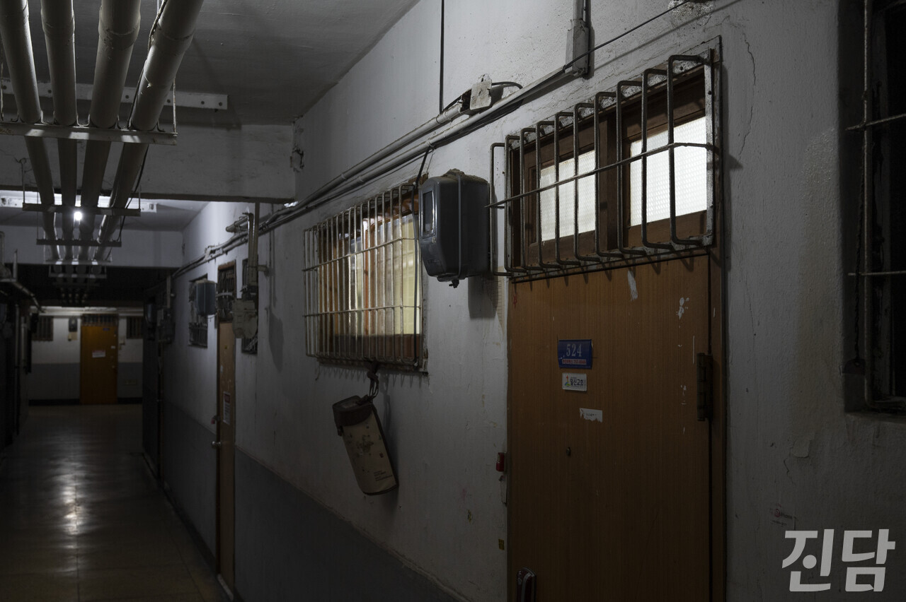
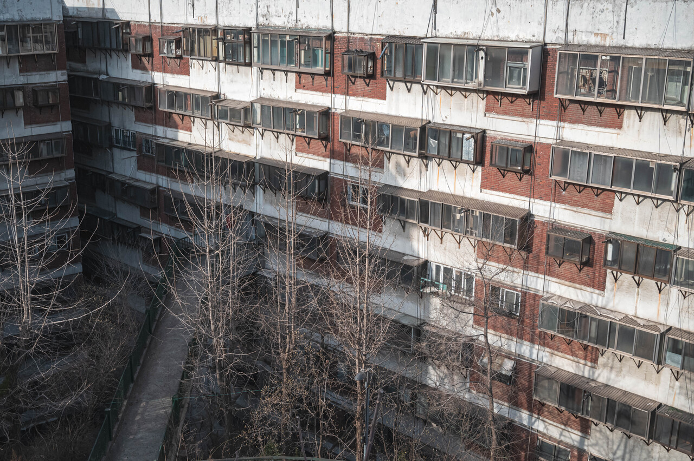
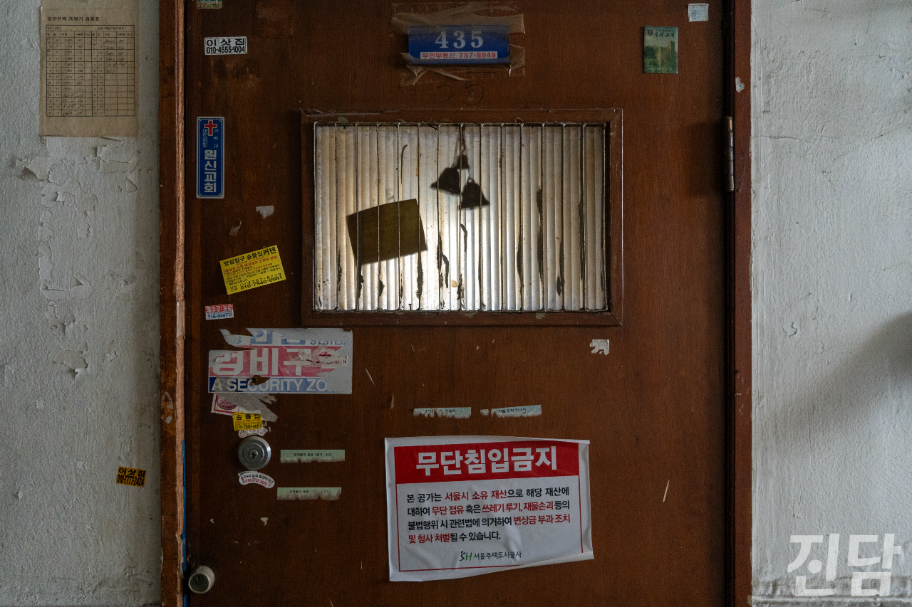
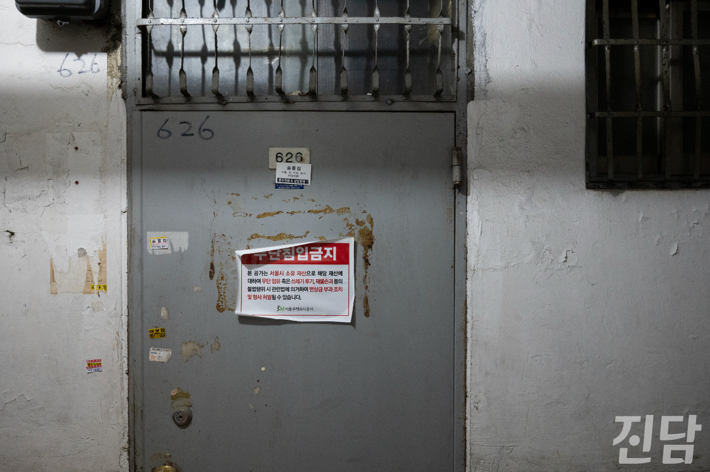
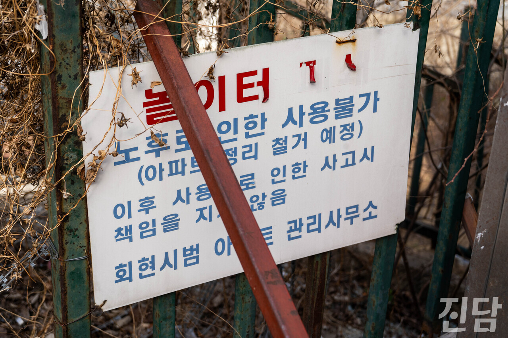
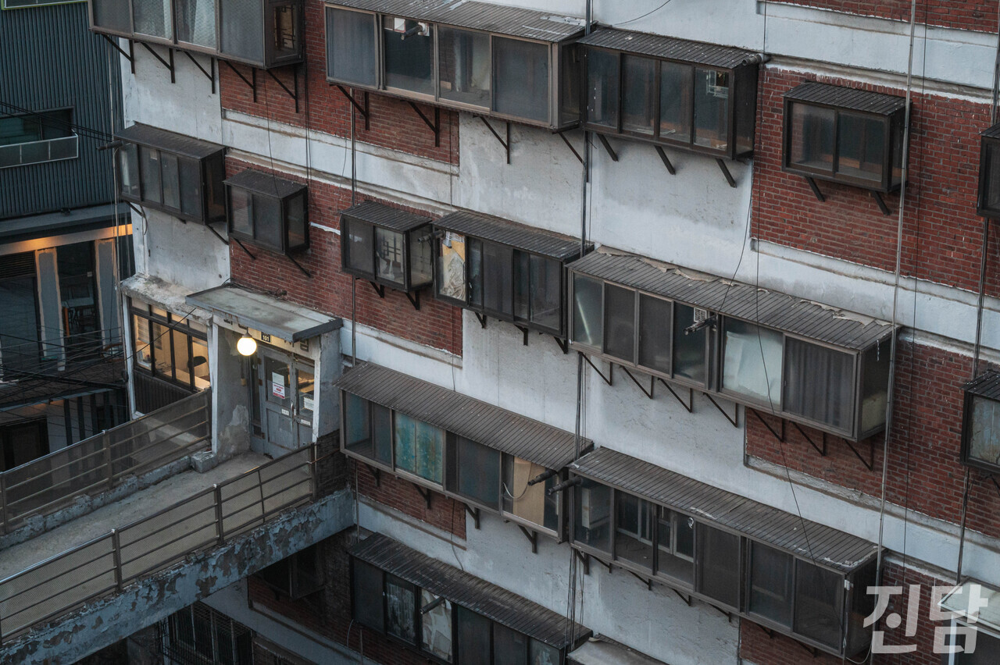
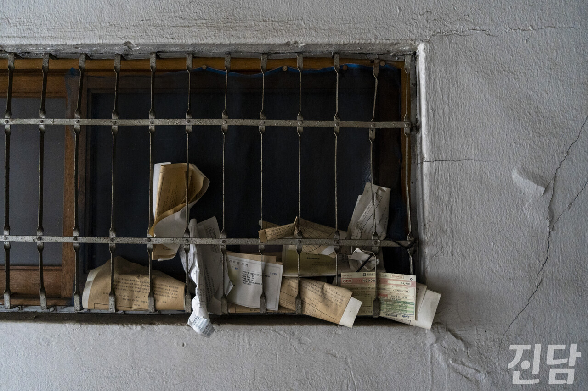

+++
title = '관리비 미납 300여 세대··· 집 주인은 서울시'
date = 2024-04-15T23:17:13+09:00
categories = ["시사진담"]
tags = ["시사진담"]
keywords = ["회현시민아파트", "회현시범아파트"]
description = "회현아파트는 1960년대 서울시가 아파트 대중화를 위해 진행한 시민아파트 정책의 일환으로 지어졌다. 400곳이 넘는 시민아파트가 모두 철거되는 수십 년 동안 회현아파트는 그 자리를 지켰다. 그런 회현아파트 역시 재개발 이야기가 나온 후 많은 주민이 떠나가기 시작했다. 현재는 곳곳에서"
thumbnail = "1.jpg"
creator = "문준빈 기자"
draft = false
+++

<figure>
  
  <figcaption>서울 중구 회현 제2시민아파트는 건립된지 54년이 지난 오래된 아파트이지만 여전히 사람들이 거주하고 있다. 해질녘 524호의 창문을 통해 전등 블빛이 새어나오고 있다. 문준빈 기자 moonready@jindam.news 2024.03.24</figcaption>
</figure>

<figure>
  
  <figcaption>서울 중구 회현 제2시민아파트 전경 문준빈 기자 moonready@jindam.news 2024.03.24</figcaption>
</figure>

회현아파트는 1960년대 서울시가 아파트 대중화를 위해 진행한 시민아파트 정책의 일환으로 지어졌다. 400곳이 넘는 시민아파트가 모두 철거되는 수십 년 동안 회현아파트는 그 자리를 지켰다. 그런 회현아파트 역시 재개발 이야기가 나온 후 많은 주민이 떠나가기 시작했다. 현재는 곳곳에서 빈집 출입을 금지하는 스티커를 볼 수 있다. 조명이 켜지지 않은 복도는 한낮에도 고요하고 어둡다.

<figure>
  
  <figcaption>지난 3월17일 서울 중구 회현 제2시민아파트의 공실 중 한 곳인 435호 현관문 모습. 희미한 창틀 내부의 종, 교회와 경비구역을 알리는 스티커 등이 과거 435호에 어떤 사람들이 살았는지에 대한 단서처럼 남아있다. 가운데에는 해당 공실이 서울시 소유이므로 무단출입을 금지한다는 경고문이 붙어있다. 변준언 선임기자 byunjuneon@jindam.news 2024.03.17</figcaption>
</figure>

<figure>
  
  <figcaption>서울 중구 회현 제2시민아파트 전체 352세대 중 300세대가 넘는 공가들을 서울시가 소유하고 있다. 해당 공가들은 관리받지 못한 채 방치된 상태이다. 문준빈 기자 moonready@jindam.news 2024.03.24</figcaption>
</figure>

하지만 아직 30여 세대가 보금자리를 떠나지 않았다. 이들은 왜 회현아파트에 남아 생활하고 있을까. 아파트 입구에서 박용수(42) 회현아파트 비상대책위원장 겸 관리운영위원회장을 났다. 박 위원장은 “일곱 살 때부터 뛰놀던 추억의 공간이다”라며 “오랫동안 관리되지 않아 지저분하더라도 이곳을 떠나고 싶지 않다”며 아파트에 대한 애정을 드러냈다. 다른 주민들의 마음도 다르지 않다는 말도 덧붙였다. 평생 살아왔던 삶의 터전을 떠나기란 쉽지 않은 일이다.

불편 감수하고 생활 이어가는 회현시민아파트 주민들

회현아파트 전체 352세대 중 약 90퍼센트가 빈집이다. 그중 300세대 이상의 빈집들을 서울시가 소유하고 있다. 개별 세대의 관리는 아파트 전체 관리와도 밀접한 관계가 있으며 이는 주민의 생활에 직접적인 영향을 미친다. 하지만 빈집에 대한 관리가 제대로 이루어지지 않아 주민들은 많은 불편을 감수하며 생활하고 있다.

겨울이 되면 빈집 배관에 동파가 일어난다. 배관이 터져 발생한 누수는 보일러 고장으로 어지며 는 하나의 보일러가 여러 세대의 난방을 담당하는 중앙난방 특성상 아파트 전체에 영향을 미친다. 남은 주민들까지 보일러를 이용하지 못하는 상황이 수시로 일어나게 되는 것이다. 박 위원장은 “보일러 배관을 막은 채 전기장판으로 겨울을 나거나 겨울마다 친척 집으로 대피하는 주민들도 있다”며 생활의 고됨을 강조했다. 또 남은 주민들이 갹출한 관리비로는 인건비 충당이 턱없이 부족해 경비원과 직원 등 관리 인력이 해고되기도 했다. 전문인력이 없기에 보안과 같은 기본 관리조차 제대로 이루어지지 못하고 있다.

<figure>
  
  <figcaption>지난 3월17일 서울 중구 회현 제2시민아파트에 시설 노후화로 인한 놀이터 폐쇄를 알리는 안내판이 설치돼 있다. 안내판도 노후돼서 일부 글자가 떨어져 나간 상태이다. 변준언 선임기자 byunjuneon@jindam.news 2024.03.17</figcaption>
</figure>

계속되는 논쟁, 이젠 소통이 필요할 때

회현아파트 철거 논의는 2000년대 이후 계속되고 있지만 모두가 만족할 만한 합의안이 도출된 적은 없다. 서울시가 제시한 보상안으로는 현재 거주지와 비슷한 수준의 주택을 마련하기 어렵기에 입주민들의 반발이 있었다. 결국 2016년 서울시는 리모델링 계획을 발표했다. 그러나 이 역시 시장이 바뀌며 이루어지지 못했다. 새로 취임한 오세훈 서울시장의 정책 기조에 따라 회현아파트 철거 소식이 다시 수면위로 떠올랐다.

<figure>
  
  <figcaption>서울 중구 회현 제2시민아파트에는 고층에 거주하는 주민을 위해 6층에 구름다리가 설치 됐다. 일반 건축물로서는 최초로 구름다리를 적용한 사례이다. 문준빈 기자 moonready@jindam.news 2024.03.17</figcaption>
</figure>

<figure>
  
  <figcaption>지난 3월17일 서울 중구 회현 제2시민아파트의 한 공실 복도쪽 창틀에 우편물들이 쌓여있다. 그중 한 우편에는 약 11년 전인 2013년을 안내하는 내용이 적혀있어 해당 호실이 오랜 기간 방치됐음을 보여주고 있었다. 변준언 선임기자 byunjuneon@jindam.news 2024.03.17</figcaption>
</figure>

지난해 <파이낸셜뉴스>, <비즈한국> 등 여러 언론에선 회현시민아파트 2023년 내 철거 계획이 보도됐지만 철거는 이루어지지 않았다. 박 위원장은 “철거 일정을 안내하거나 이주를 요구하는 말은 전혀 없었다”라며 “주민들도 언론을 통해 처음 들은 사실이다”라고 당혹스러움을 드러냈다. 지난 8월 서울시는 거주 중인 세대와 원만한 협의를 진행 중이라는 입장을 밝힌 바 있다. 그러나 박 위원장은 지난 3월 15일 취재진과의 인터뷰에서 “서울시는 주민들을 일방적으로 내보내기에만 급급해 한다”고 불만을 드러냈다. 서울시의 입장과는 달리 주민과 서울시의 협의는 좀처럼 답이 보이지 않고 있다. 취재진이 회현아파트 관리 및 철거에 대한 서울시의 입장을 듣기 위해 수차례 연락을 취하고 2주 넘게 답변을 기다렸지만 서울시는 묵묵부답이었다. 박 위원장은 “서울시는 소통을 통해 문제를 해결해 나갈 필요가 있다”고 강조했다.

문준빈 기자 moonready@jindam.news

